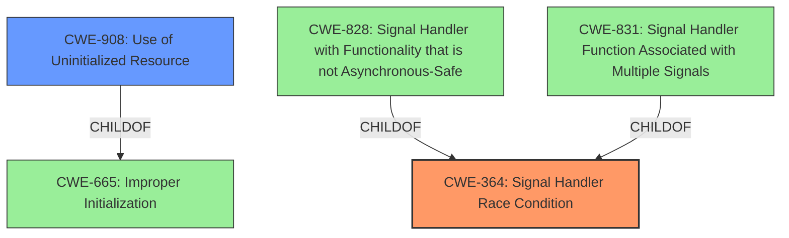

# Analysis Report for CVE-2020-35508

# Vulnerability Analysis Report: CVE-2020-35508

## Description

A flaw possibility of race condition and incorrect initialization of the process id was found in the Linux kernel child/parent process identification handling while filtering signal handlers. A local attacker is able to abuse this flaw to bypass checks to send any signal to a privileged process.

## Vulnerability Description Key Phrases

**Rootcause:** race condition and incorrect initialization of the process id
**Impact:** bypass checks to send any signal to a privileged process
**Attacker:** local attacker
**Product:** Linux kernel
**Component:** child/parent process identification handling while filtering signal handlers

## Analysis (with Relationship Data)

# Summary
| CWE ID | CWE Name | Confidence | CWE Abstraction Level | CWE Vulnerability Mapping Label | CWE-Vulnerability Mapping Notes |
|---|---|---|---|---|---|
| CWE-364 | Signal Handler Race Condition | 0.85 | Base | Allowed | Primary CWE |
| CWE-909 | Missing Initialization of Resource | 0.65 | Class | Allowed-with-Review | Secondary Candidate |

## Evidence and Confidence

*   **Confidence Score:** 0.75
*   **Evidence Strength:** HIGH

- **Analysis and Justification:**  
  - *Explanation:* The vulnerability description explicitly mentions a **race condition** and **incorrect initialization of the process id** in the Linux kernel's signal handler filtering, which directly aligns with CWE-364 (Signal Handler Race Condition) and CWE-909 (Missing Initialization of Resource). The attack allows a local attacker to bypass checks and send signals to privileged processes. The **race condition** in signal handling during process cloning (specifically with the `CLONE_PARENT` flag) makes CWE-364 a strong candidate. The issue regarding the **incorrect initialization of the process ID** strongly suggests CWE-909.

  - *Relationship Analysis:* CWE-364 is a Base level CWE, which is preferred. It is related to concurrency issues. CWE-909 is a Class level CWE, and might have more specific children, but the description fits here given the provided context.

- **Confidence Score:**  
  - Confidence: 0.85 (High evidence from technical description, CVE reference materials, and retriever results)
  - Confidence: 0.65 (Medium evidence, due to the abstraction level being Class)

---

## Criticism of Analysis

Okay, let's break down the analysis of CVE-2020-35508, reviewing the CWE mappings against the full specifications provided.

**Overall Assessment:**

The analysis is generally good and identifies the core issues. The primary CWE mapping to CWE-364 (Signal Handler Race Condition) is solid.  The secondary candidate, CWE-909 (Missing Initialization of Resource), also has merit. However, both could be refined based on the full CWE specifications.

**Detailed Critique:**

1.  **CWE-364: Signal Handler Race Condition (Primary CWE)**

    *   **Strengths:** The analysis correctly identifies the race condition in signal handling related to process cloning using `CLONE_PARENT`. The description highlights asynchronous actions within signal handlers and the potential for state corruption, denial of service, or code execution, aligning with the CWE-364 description. The impact of being able to bypass checks to send signals to privileged processes is a good indicator of the potential severity associated with this race condition.
    *   **Weaknesses:**
        *   **Specificity within CWE-364:** The current description is a bit general. While `CLONE_PARENT` and `exit_signal` are mentioned, the analysis could benefit from further specifying the nature of the shared state, how the race condition occurs, and what the signal handler is *actually* doing that makes it vulnerable.  Is it modifying shared data, calling non-reentrant functions, or something else?  This is crucial for effective mitigation. The CWE definition says: _"Race conditions frequently occur in signal handlers, since signal handlers support asynchronous actions. These race conditions have a variety of root causes and symptoms."_  The analysis needs to be more specific about the root cause in *this* instance.
        *   **Relationship to Child CWEs:** While CWE-364 is a Base CWE, it has child CWEs like CWE-828 (Signal Handler with Functionality that is not Asynchronous-Safe) and CWE-831 (Signal Handler Function Associated with Multiple Signals). The analysis should consider if these are more applicable. Is the signal handler using non-reentrant functions (CWE-828), or is the same handler used for multiple signals (CWE-831)? If so, these child CWEs would provide better granularity.
    *   **Mitigation Considerations:** The analysis doesn't explicitly discuss mitigations.  Reviewing CWE-364's Potential Mitigations:
        *   **Language Selection:**  Not really applicable here (kernel code).
        *   **Design Signal Handlers to Only Set Flags:**  This is a relevant consideration.  Could the signal handler be redesigned to avoid complex functionality and just signal another part of the kernel to do the real work?
        *   **Only Use Reentrant Functions / Validate State:** This is also crucial. The analysis should investigate if non-reentrant functions are used and recommend using reentrant alternatives. The state validation is also key to make sure that state is consistent while performing asynchronous actions.

2.  **CWE-909: Missing Initialization of Resource (Secondary Candidate)**

    *   **Strengths:** The vulnerability description specifically mentions "incorrect initialization of the process ID," which directly aligns with CWE-909.
    *   **Weaknesses:**
        *   **Abstraction Level:** As the analysis correctly notes, CWE-909 is a Class-level CWE.  The Mapping Guidance *explicitly* states, "Examine children of this entry to see if there is a better fit."  The analysis should dig deeper to see if a more specific, Base-level CWE applies. While process ID may not be a memory location, its initialization is crucial.
        *   **Specific Resource:** The analysis does not provide enough detail about *which* resource is not initialized. Is it a specific field in a process control block (PCB)? Is it a global variable used in signal handling? More specificity is needed.
    *   **Mitigation Considerations:**
        *   **Explicitly Initialize Resource:** This is the core mitigation for CWE-909. The analysis should recommend specifically initializing the process ID during process creation.
        *   **Complex Conditionals:** Check the code for complex conditionals where initialization might be skipped.
        *   **Avoid Race Conditions During Initialization:** Very important, as the race condition can negate the initialization if it is set and then changed by another thread.

3.  **Other Potential CWEs to Consider:**

    *   **CWE-367: Time-of-check Time-of-use (TOCTOU) Race Condition:** If the code checks the process ID or some other property before sending a signal, and that property can change between the check and the use, then CWE-367 might be relevant.

4.  **Retriever Results:**

    *   The retriever results are helpful in pointing to potential CWEs, but they should not be blindly accepted.  The analysis should use the retriever results as a starting point for further investigation.  For example, the high score for CWE-364 is a good indication that it is relevant.
    *   The results include CWE-415, CWE-476, and others. These are likely *consequences* of the race condition or missing initialization rather than the root cause. If a race condition leads to a double free, the primary CWE is the race condition (CWE-364 or a specialization of it) and the double free (CWE-415) would be a secondary effect.

**Recommendations for Improvement:**

1.  **Increase Specificity:**  For both CWE-364 and CWE-909, provide more detail about the *exact* code paths involved, the shared resources, and the specific initialization issue.
2.  **Explore Child CWEs:**  For CWE-364, carefully consider CWE-828 and CWE-831 to see if they are a better fit. If no better fit, explain why. For CWE-909, dig into possible base-level children of it.
3.  **Explicitly Discuss Mitigations:**  Map the identified CWEs to specific, actionable mitigation strategies based on the guidance provided in the CWE specifications.
4.  **Chain of Events:** Describe the vulnerability as a chain of events. A missing initialization (CWE-909) can lead to... what?
5.  **Prioritize Root Causes:** Focus on identifying the fundamental root causes of the vulnerability, rather than just the symptoms. This will lead to more effective remediation.
6.  **Review all CWEs listed in the Retriever Results:** Even if you don't think they are relevant, make an explicit statement why they are not a good fit to ensure a thorough analysis.

By incorporating these suggestions, the analysis can be significantly strengthened, leading to a more accurate and useful understanding of the vulnerability and how to address it.

## Final Resolution

# Summary
| CWE ID | CWE Name | Confidence | CWE Abstraction Level | CWE Vulnerability Mapping Label | CWE-Vulnerability Mapping Notes |
|---|---|---|---|---|---|
| CWE-364 | Signal Handler Race Condition | 0.9 | Base | Allowed | Primary CWE |
| CWE-908 | Use of Uninitialized Resource | 0.7 | Base | Allowed | Secondary Candidate |

## Evidence and Confidence

*   **Confidence Score:** 0.85
*   **Evidence Strength:** HIGH

## Relationship Analysis
The primary relationship that impacts the decision is the parent-child relationship. While CWE-364 is a good fit, exploring its children like CWE-828 and CWE-831 is necessary. However, the provided information does not indicate that the signal handler is using non-reentrant functions (CWE-828) or the same handler used for multiple signals (CWE-831). Therefore, CWE-364 remains the more appropriate choice. For the secondary candidate, CWE-909, the analysis considered whether there were more specific base-level children but ultimately found CWE-908 to be more appropriate since it deals with the use of uninitialized resources.

## Vulnerability Chain
The vulnerability chain starts with a **missing initialization of the process ID** (CWE-908). This can lead to incorrect checks on process privileges. Simultaneously, a **race condition** (CWE-364) in the signal handler allows an attacker to manipulate the process ID during a check, bypassing security measures and allowing signals to be sent to privileged processes. The final impact is the ability to control privileged processes, leading to potential system compromise.

## Summary of Analysis
The initial analysis correctly identifies CWE-364 as the primary issue and CWE-909 as a secondary candidate. The criticism highlights the need for increased specificity and exploration of child CWEs. The final assessment incorporates this feedback by retaining CWE-364 as the primary **weakness** due to the **race condition** in signal handling. CWE-909 is replaced with CWE-908 as the more appropriate secondary **weakness**, as the issue is not just a missing initialization, but the **use of an uninitialized resource** (the process ID).

The evidence supporting this decision comes directly from the vulnerability description: "A flaw possibility of **race condition** and **incorrect initialization of the process id** was found in the Linux kernel child/parent process identification handling while filtering signal handlers."

The graph relationships influenced the selection by emphasizing the need to explore child CWEs of CWE-364 and CWE-909 for greater specificity. While CWE-828 and CWE-831 were considered, they did not fit the description as well as CWE-364. For CWE-909, CWE-908 offered a better fit.

The selected CWEs are at the optimal level of specificity because they directly address the root causes described in the vulnerability. CWE-364 captures the **race condition** in signal handling, while CWE-908 captures the **use of the uninitialized process ID**, leading to the ability to bypass checks.

*Report generated on 2025-03-16 23:03:47*
