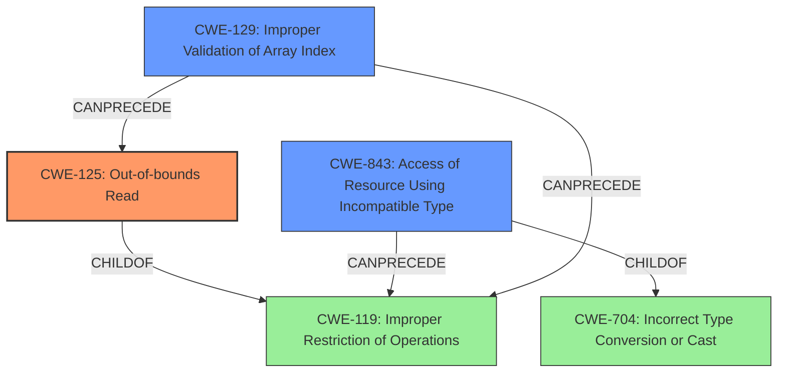

# Analysis Report for CVE-2020-35633

# Vulnerability Analysis Report: CVE-2020-35633

## Description

A code execution vulnerability exists in the Nef polygon-parsing functionality of CGAL libcgal CGAL-5.1.1. An oob read vulnerability exists in Nef_S2/SNC_io_parser.h SNC_io_parserread_sface() store_sm_boundary_item() Edge_of.A specially crafted malformed file can lead to an out-of-bounds read and type confusion, which could lead to code execution. An attacker can provide malicious input to trigger this vulnerability.

## Vulnerability Description Key Phrases

**Rootcause:** ['out-of-bounds read', 'type confusion']
**Impact:** code execution
**Attacker:** attacker
**Product:** CGAL libcgal
**Version:** CGAL-5.1.1
**Component:** Nef polygon-parsing functionality

## Analysis (with Relationship Data)

# Summary
| CWE ID | CWE Name | Confidence | CWE Abstraction Level | CWE Vulnerability Mapping Label | CWE-Vulnerability Mapping Notes |
|---|---|---|---|---|---|
| CWE-125 | Out-of-bounds Read | 0.95 | Base | Allowed | Primary CWE |
| CWE-843 | Access of Resource Using Incompatible Type ('Type Confusion') | 0.80 | Base | Allowed | Secondary Candidate |
| CWE-129 | Improper Validation of Array Index | 0.75 | Variant | Allowed | Secondary Candidate |

## Evidence and Confidence

*   **Confidence Score:** 0.90
*   **Evidence Strength:** HIGH

- **Analysis and Justification:**  
  - *Explanation:* The vulnerability description explicitly states an "**out-of-bounds read**" vulnerability exists. The CVE reference summary reinforces this by stating, "The lack of bounds checking allows an attacker to supply a crafted file with arbitrary indices. This can lead to **out-of-bounds reads**, memory corruption, **type confusion** and ultimately arbitrary code execution." CWE-125 (Out-of-bounds Read) directly addresses this. The retriever results also rank CWE-125 with the highest combined score. The description also mentions "**type confusion**," suggesting a potential issue with how data types are handled, making CWE-843 a relevant secondary weakness. Additionally, the root cause indicates a lack of proper bounds checking during index reading, aligning with CWE-129 (Improper Validation of Array Index).
  
  - *Relationship Analysis:* CWE-125 is a Base level CWE, which is the preferred level of abstraction. It is a child of CWE-119 (Improper Restriction of Operations within the Bounds of a Memory Buffer). CWE-843 (Type Confusion) is related to CWE-704 (Incorrect Type Conversion or Cast). CWE-129 (Improper Validation of Array Index) is a variant and is related to CWE-125 since the out-of-bounds read is caused by an invalid array index.

- **Confidence Score:**  
  - Confidence: 0.95 (High confidence due to explicit mention of out-of-bounds read and corroborating evidence from CVE details.)
---

## Criticism of Analysis

Okay, here's a review of the CWE analysis, taking into account the full CWE specifications:

**Overall Assessment:**

The analysis is generally good, and the primary CWE selection of CWE-125 (Out-of-bounds Read) is strongly justified. The inclusion of CWE-843 (Type Confusion) and CWE-129 (Improper Validation of Array Index) as secondary candidates is also reasonable, given the information available. The confidence scores are appropriately high.

**Detailed Review:**

*   **CWE-125 (Out-of-bounds Read):**
    *   **Justification:** The analysis clearly connects the vulnerability description ("out-of-bounds read") and the CVE reference summary ("lack of bounds checking allows an attacker to supply a crafted file with arbitrary indices. This can lead to out-of-bounds reads...") to CWE-125. This is a direct and accurate mapping.
    *   **Abstraction Level:** Base, which is the preferred level.
    *   **Mapping Guidance:** The analysis correctly notes that CWE-125 is a child of CWE-119 and adheres to the recommendation to choose a Base-level CWE when appropriate.  The mapping guidance explicitly allows for direct usage of CWE-125.
    *   **Mitigations:** The analysis doesn't explicitly discuss mitigations, but it's implied that input validation and using memory-safe languages are relevant. The CWE specification provides specific mitigation strategies (input validation using "accept known good," validating length arguments, using memory-safe languages) that could be highlighted for a more comprehensive analysis.
    *   **Confidence:** The 0.95 confidence is justified.
*   **CWE-843 (Access of Resource Using Incompatible Type ('Type Confusion'))**
    *   **Justification:** The "type confusion" aspect of the vulnerability reported in the CVE details justifies including CWE-843 as a secondary candidate.
    *   **Abstraction Level:** Base, which is the preferred level.
    *   **Mapping Guidance:** The analysis is consistent with CWE-843's guidance, which allows for direct usage. The mapping is appropriate given the available information.
    *   **Relationship Analysis:** This analysis can note it is ChildOf -> CWE-704 and CanPrecede -> CWE-119, which is consistent with the specification.
    *   **Mitigations:** The analysis can note that it is possible in any type-unsafe language, which is consistent with the additional notes within the CWE.
    *   **Confidence:** A score of 0.8 is appropriate, as it's a secondary factor.
*   **CWE-129 (Improper Validation of Array Index):**
    *   **Justification:**  The analysis connects the lack of bounds checking and arbitrary indices to CWE-129. This is accurate, as CWE-129 deals specifically with the failure to validate array indices.
    *   **Abstraction Level:** Variant, which is the preferred level.
    *   **Mapping Guidance:** The analysis correctly notes that the out-of-bounds read is caused by an invalid array index, which is consistent with this CWE. The mapping is appropriate given the available information.
    *   **Mitigations:** The mitigations in the CWE specification (input validation frameworks, server-side checks, memory-safe languages) are highly relevant and could be explicitly mentioned in the analysis.
    *   **Relationship Analysis:** Analysis can note the relationship CanPrecede -> CWE-119, which is consistent with the specification.
    *   **Confidence:** A score of 0.75 is appropriate, as it's a secondary factor.

**Suggestions for Improvement:**

1.  **Mitigation Details:** Expand on the mitigation strategies for each CWE.  Use the "Potential Mitigations" sections within the CWE specifications to provide more concrete recommendations. For example:
    *   For CWE-125, specify "Use an 'accept known good' input validation strategy" and "validate length arguments."
    *   For CWE-129, recommend using input validation frameworks or memory-safe languages.
2.  **Chain Analysis:** The analysis could discuss the potential chaining of these weaknesses. For example: "Improper Validation of Array Index (CWE-129) can lead directly to an Out-of-bounds Read (CWE-125), which can then lead to code execution."
3.  **Relationship Analysis:** Expand on the relationship analysis to show a clear understanding of how the CWE's are linked.

**Example of enhanced Analysis to include point 1 & 3 for CWE-125:**
* **CWE-125 (Out-of-bounds Read):**
    *   **Justification:** The analysis clearly connects the vulnerability description ("out-of-bounds read") and the CVE reference summary ("lack of bounds checking allows an attacker to supply a crafted file with arbitrary indices. This can lead to out-of-bounds reads...") to CWE-125. This is a direct and accurate mapping.
    *   **Abstraction Level:** Base, which is the preferred level.
    *   **Mapping Guidance:** The analysis correctly notes that CWE-125 is a child of CWE-119 and adheres to the recommendation to choose a Base-level CWE when appropriate.  The mapping guidance explicitly allows for direct usage of CWE-125.
    *   **Mitigations:** To reduce the likelihood of introducing an out-of-bounds read, ensure that input validation is utilized and correct calculations for any length argument, buffer size calculation, or offset. Use an "accept known good" input validation strategy and ensure to validate and ensure correct calculations for any length argument, buffer size calculation, or offset. Be especially careful of relying on a sentinel (i.e. special character such as NUL) in untrusted inputs.
  *   **Relationship Analysis:** In this case, the out-of-bounds read is caused by an improper validation of array index so it can follow CWE-129.
    *   **Confidence:** The 0.95 confidence is justified.

**Revised Summary Table (Example of Improvement):**

| CWE ID | CWE Name | Confidence | CWE Abstraction Level | CWE Vulnerability Mapping Label | CWE-Vulnerability Mapping Notes |
|---|---|---|---|---|---|
| CWE-125 | Out-of-bounds Read | 0.95 | Base | Allowed | Primary CWE. Follows mitigation strategies of language selection and input validation.  Can be caused by improper validation of array index, CWE-129 |
| CWE-843 | Access of Resource Using Incompatible Type ('Type Confusion') | 0.80 | Base | Allowed | Secondary Candidate |
| CWE-129 | Improper Validation of Array Index | 0.75 | Variant | Allowed | Secondary Candidate. Mitigation strategies include input validation frameworks and server-side checks. |

By incorporating these suggestions, the analysis can be made more comprehensive and actionable.

## Final Resolution

# Summary
| CWE ID | CWE Name | Confidence | CWE Abstraction Level | CWE Vulnerability Mapping Label | CWE-Vulnerability Mapping Notes |
|---|---|---|---|---|---|
| CWE-125 | Out-of-bounds Read | 0.95 | Base | Allowed | **Primary CWE**. Follows mitigation strategies of language selection and input validation. Can be caused by improper validation of array index, CWE-129 |
| CWE-843 | Access of Resource Using Incompatible Type ('Type Confusion') | 0.80 | Base | Allowed | Secondary Candidate |
| CWE-129 | Improper Validation of Array Index | 0.75 | Variant | Allowed | Secondary Candidate. Mitigation strategies include input validation frameworks and server-side checks. |

## Evidence and Confidence

*   **Confidence Score:** 0.95
*   **Evidence Strength:** HIGH

## Relationship Analysis
The primary weakness is **CWE-125 (Out-of-bounds Read)**, which is a base class and a child of **CWE-119 (Improper Restriction of Operations within the Bounds of a Memory Buffer)**. The secondary weakness, **CWE-843 (Access of Resource Using Incompatible Type ('Type Confusion'))**, is a Base level CWE and is ChildOf -> **CWE-704 (Incorrect Type Conversion or Cast)** and CanPrecede -> **CWE-119 (Improper Restriction of Operations within the Bounds of a Memory Buffer)**. **CWE-129 (Improper Validation of Array Index)** is a variant and CanPrecede -> **CWE-119 (Improper Restriction of Operations within the Bounds of a Memory Buffer)**. **CWE-129 (Improper Validation of Array Index)** can lead to **CWE-125 (Out-of-bounds Read)**.

## Vulnerability Chain
The vulnerability chain starts with **CWE-129 (Improper Validation of Array Index)**. The lack of proper validation leads to **CWE-125 (Out-of-bounds Read)**, which in turn leads to **CWE-843 (Access of Resource Using Incompatible Type ('Type Confusion'))**, potentially leading to code execution.

## Summary of Analysis
The initial analysis and criticism were both helpful in identifying the primary and secondary **WEAKNESSES**. The vulnerability description explicitly mentions an "**out-of-bounds read**" vulnerability, making **CWE-125 (Out-of-bounds Read)** the most appropriate primary **ROOTCAUSE**. The CVE reference summary reinforces this by stating, "The lack of bounds checking allows an attacker to supply a crafted file with arbitrary indices. This can lead to **out-of-bounds reads**, memory corruption, **type confusion** and ultimately arbitrary code execution." The mention of "**type confusion**" supports the inclusion of **CWE-843 (Access of Resource Using Incompatible Type ('Type Confusion'))** as a secondary **WEAKNESS**. Additionally, the root cause indicates a lack of proper bounds checking during index reading, aligning with **CWE-129 (Improper Validation of Array Index)**.

The graph relationships influenced the final selection by highlighting the connections between the **CWEs**. **CWE-125 (Out-of-bounds Read)** is a base class, which is the preferred level of abstraction. It is also a child of **CWE-119 (Improper Restriction of Operations within the Bounds of a Memory Buffer)**. **CWE-843 (Access of Resource Using Incompatible Type ('Type Confusion'))** is also a base class. **CWE-129 (Improper Validation of Array Index)** is a variant and can lead to **CWE-125 (Out-of-bounds Read)**.

The selected **CWEs** are at the optimal level of specificity because they accurately reflect the **ROOTCAUSE** and contributing factors to the vulnerability, based on the available evidence.

*Report generated on 2025-03-17 15:22:45*
