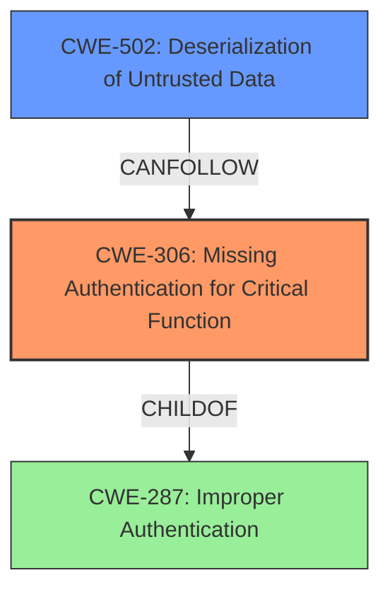

# Final Resolution for CVE-2020-36239

# Summary

| CWE ID | CWE Name | Confidence | CWE Abstraction Level | CWE Vulnerability Mapping Label | CWE-Vulnerability Mapping Notes |
|---|---|---|---|---|---|
| CWE-306 | Missing Authentication for Critical Function | 0.95 | Base | Allowed | The vulnerability stems from a **missing authentication vulnerability** for the Ehcache RMI network service, allowing attackers to execute arbitrary code. Enabling a shared secret addresses this directly. |
| CWE-502 | Deserialization of Untrusted Data | 0.75 | Base | Allowed | The **deserialization** vulnerability is a direct consequence of the missing authentication, allowing attackers to inject malicious serialized objects. Fixing CWE-306 is the primary mitigation; additionally, disabling deserialization or restricting deserialization classes can mitigate this. |

## Evidence and Confidence

*   **Confidence Score:** 0.9
*   **Evidence Strength:** HIGH

## Relationship Analysis
The primary relationship that impacted the decision was the dependency of **CWE-502 (Deserialization of Untrusted Data)** on **CWE-306 (Missing Authentication for Critical Function)**. The **missing authentication** allows an attacker to connect to the Ehcache RMI network service, which then makes the deserialization vulnerability exploitable. **CWE-287 (Improper Authentication)** is a parent of **CWE-306**, but **CWE-306** is more specific as it describes the complete absence of authentication rather than a flaw in the authentication mechanism. The base abstraction levels of both **CWE-306** and **CWE-502** make them appropriate for mapping to the root causes of this vulnerability.

## Vulnerability Chain
The vulnerability chain starts with the **ROOTCAUSE** being the **CWE-306 (Missing Authentication for Critical Function)**. This allows an attacker to connect to the Ehcache RMI network service without any authentication. Once connected, the attacker can then exploit the **CWE-502 (Deserialization of Untrusted Data)** vulnerability by injecting malicious serialized objects, leading to arbitrary code execution. The chain is:
**CWE-306** (Missing Authentication) -> **CWE-502** (Deserialization of Untrusted Data) -> Arbitrary Code Execution

## Summary of Analysis
The analysis is based on the vulnerability description, which explicitly states the "**missing authentication vulnerability**." The retriever results also support the selection of **CWE-306**, giving it the highest score. The relationship analysis confirms that **CWE-306** is the more specific choice compared to its parent **CWE-287**.

The vulnerability description states: "attackers, who can connect to the service, on port 40001 and potentially 40011, could execute arbitrary code of their choice in Jira through deserialization due to a **missing authentication vulnerability**."

The selection of **CWE-306** and **CWE-502** is at the optimal level of specificity because they are both base-level CWEs that accurately represent the **ROOTCAUSE** and contributing factor to the vulnerability. The MITRE mapping guidance allows for the use of base-level CWEs, which further supports this decision. The relationships between the CWEs, particularly the dependency of **CWE-502** on **CWE-306**, were crucial in determining the final classification.