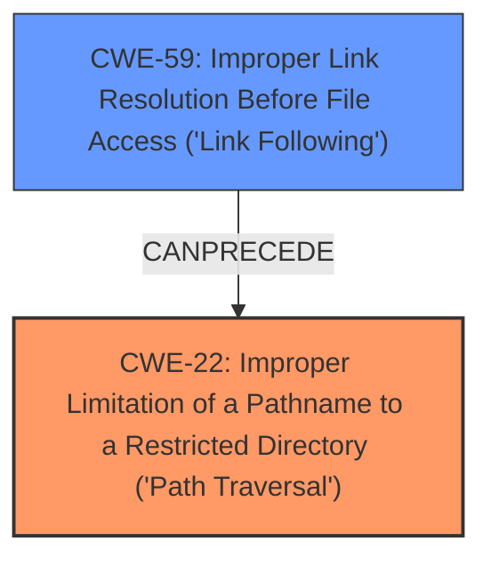

# Final Resolution for CVE-2020-36314

# Summary
| CWE ID | CWE Name | Confidence | CWE Abstraction Level | CWE Vulnerability Mapping Label | CWE-Vulnerability Mapping Notes |
|---|---|---|---|---|---|
| CWE-22 | Improper Limitation of a Pathname to a Restricted Directory ('Path Traversal') | 0.95 | Base | Allowed | Primary CWE |
| CWE-59 | Improper Link Resolution Before File Access ('Link Following') | 0.75 | Base | Allowed | Secondary Candidate (Enabling Mechanism) |

## Evidence and Confidence

*   **Confidence Score:** 0.95
*   **Evidence Strength:** HIGH

## Relationship Analysis
The primary relationship influencing this decision is the parent-child relationship where CWE-22 [Improper Limitation of a Pathname to a Restricted Directory ('Path Traversal')] can be seen as the consequence of CWE-59 [Improper Link Resolution Before File Access ('Link Following')]. CWE-59 describes the mechanism by which an attacker can influence the pathname, while CWE-22 describes the core vulnerability: the ability to access files outside the intended restricted directory. Therefore, while CWE-59 contributes to the vulnerability, CWE-22 more accurately represents the impact and nature of the weakness.

## Vulnerability Chain
The vulnerability chain begins with the **ROOTCAUSE**: **improper handling of symlinks (CWE-59)**. This leads to the **WEAKNESS** of being able to **traverse directories outside the intended extraction path (CWE-22)**. The ultimate impact is writing files to unintended locations.

## Summary of Analysis
Based on the vulnerability description, the core issue is directory traversal enabled by improper symlink handling. The criticism correctly points out that while CWE-59 [Improper Link Resolution Before File Access ('Link Following')] is involved, CWE-22 [Improper Limitation of a Pathname to a Restricted Directory ('Path Traversal')] more accurately describes the impact: the ability to write files outside the intended extraction directory. The evidence from the vulnerability description states that "it lacks a check of whether a files parent is a symlink...allows Directory Traversal during extraction". This clearly points to CWE-22 as the primary weakness, with CWE-59 being the enabling mechanism.

The relationship analysis further supports this decision. CWE-59 *precedes* CWE-22 in the vulnerability chain. The base level of abstraction for both CWEs is appropriate, but CWE-22 is a more direct representation of the vulnerability. The mapping guidance allows both CWEs.

Therefore, the final decision is to classify this vulnerability as primarily CWE-22 [Improper Limitation of a Pathname to a Restricted Directory ('Path Traversal')], with CWE-59 [Improper Link Resolution Before File Access ('Link Following')] as a secondary contributing factor. This provides a more accurate and specific classification of the vulnerability.