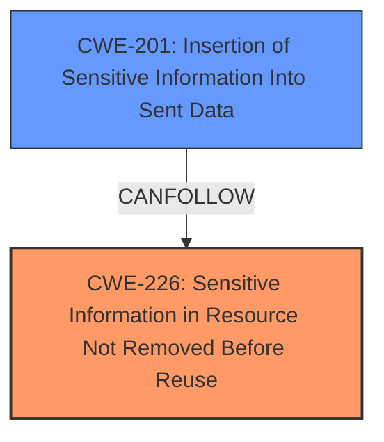

# Analysis Report for CVE-2020-36476

# Vulnerability Analysis Report: CVE-2020-36476

## Description

An issue was discovered in Mbed TLS before 2.24.0 (and before 2.16.8 LTS and before 2.7.17 LTS). There is missing zeroization of plaintext buffers in mbedtls_ssl_read to erase unused application data from memory.

## Vulnerability Description Key Phrases

**Rootcause:** missing zeroization of plaintext buffers
**Product:** Mbed TLS
**Version:** before 2.24.0, 2.16.8 LTS, and 2.7.17 LTS
**Component:** mbedtls_ssl_read

## Analysis (with Relationship Data)

# Summary
| CWE ID | CWE Name | Confidence | CWE Abstraction Level | CWE Vulnerability Mapping Label | CWE-Vulnerability Mapping Notes |
|---|---|---|---|---|---|
| CWE-226 | Sensitive Information in Resource Not Removed Before Reuse | 0.85 | Base | Allowed | Primary CWE |

## Evidence and Confidence

*   **Confidence Score:** 0.85
*   **Evidence Strength:** HIGH

- **Analysis and Justification:**  
  - *Explanation:* The vulnerability description states "**missing zeroization of plaintext buffers** in mbedtls_ssl_read to erase unused application data from memory". This aligns with CWE-226 [Sensitive Information in Resource Not Removed Before Reuse], where a resource (in this case, plaintext buffers) is not cleared or zeroized after use, potentially exposing sensitive information. The vulnerability lies in the failure to remove sensitive data from a resource before it is reallocated, which aligns directly with the CWE description.
  
  - *Relationship Analysis:* No direct relationships are listed for CWE-226 in the provided data. However, it can be inferred that a failure to zeroize memory might lead to information leakage or exposure of sensitive data, potentially leading to vulnerabilities like CWE-200 [Exposure of Sensitive Information to an Unauthorized Actor].

- **Confidence Score:**  
  - *Example:* Confidence: 0.85 (High evidence from vulnerability description and alignment with CWE-226 description)

## Criticism of Analysis

Okay, here's a review of the analysis, considering the full CWE specifications.

**Overall Assessment:**

The analysis correctly identifies CWE-226 as a primary weakness. The reasoning is sound and well-articulated. The confidence level of 0.85 is appropriate. However, it's important to consider the context and potentially other related CWEs to provide a more complete picture. The analysis could benefit from exploring potential downstream consequences and related CWEs to paint a complete picture.

**Detailed Review:**

**1. CWE-226: Sensitive Information in Resource Not Removed Before Reuse**

*   **Correctness:**  The mapping to CWE-226 is accurate and well-justified. The description provided in the original analysis directly aligns with the CWE description: "The vulnerability description states 'missing zeroization of plaintext buffers in mbedtls_ssl_read to erase unused application data from memory'. This aligns with CWE-226 [Sensitive Information in Resource Not Removed Before Reuse], where a resource (in this case, plaintext buffers) is not cleared or zeroized after use, potentially exposing sensitive information."
*   **Abstraction Level:** CWE-226 is a Base level CWE, which is preferred for mapping root causes. The analysis correctly identifies it as such.
*   **Usage:** The CWE specification notes that "Usage: Allowed" which validates the decision to use this CWE in the analysis.
*   **Mitigation:** The analysis could benefit from explicitly mentioning the mitigations suggested by the CWE specification.
    *   **Mitigation 1:** Architecture and Design, Implementation - During critical state transitions, information not needed in the next state should be removed or overwritten.
    *   **Mitigation 2:** Architecture and Design, Implementation - Overwrite data with fixed patterns or random data when releasing or de-allocating resources.

*   **Potential relationships:** The analysis correctly identifies the potential for `CWE-226` to lead to `CWE-200`, which is discussed below.
*   **Improvement Suggestion:**  While the analysis is good, it could mention that, even within the same process, if the new data written to the buffer is smaller than the old data, remnants of the old, sensitive data might still be present.  This reinforces the need for explicit zeroization.

**2. Top Combined Results Analysis:**

Let's look at the other CWEs identified in the "Top Combined Results" from the retriever and evaluate if they could be related or secondary CWEs.

*   **CWE-319: Cleartext Transmission of Sensitive Information:**  While the primary issue is not about *transmitting* data in cleartext, the *consequence* of not zeroizing the buffer could be that this sensitive, uncleared data is later transmitted in cleartext.  This is a *potential* downstream effect, especially if `mbedtls_ssl_read` is used to read data *before* encryption is applied.  However, this is speculative.  It is important to note that the analysis's confidence would be lower since this is only a potential downstream consequence.
    *   **Mitigation considerations:** If `CWE-319` is potentially involved, then the primary mitigation is to ensure that encryption is performed correctly.
*   **CWE-126: Buffer Over-read:** This is a possible but *less likely* consequence. If `mbedtls_ssl_read` or subsequent code attempts to read beyond the actual valid data in the buffer, it *could* read into the un-zeroized portion. However, this requires a separate bug (the over-read).  Therefore, it's less directly related than CWE-226. A buffer over-read is the most likely way the sensitive information could be extracted from the buffer and used to cause additional harm.
    *   **Mitigation considerations:** In this case, input and size validation is crucial.
*   **CWE-770: Allocation of Resources Without Limits or Throttling:**  This is unlikely to be directly related.  The missing zeroization is a separate issue from resource allocation.
*   **CWE-208: Observable Timing Discrepancy:** This is also unlikely.  The zeroization (or lack thereof) doesn't directly create timing discrepancies.
*   **CWE-1284: Improper Validation of Specified Quantity in Input:** This is also unlikely to be directly related.  The missing zeroization isn't related to the size or quantity specified in the input.
*   **CWE-401: Missing Release of Memory after Effective Lifetime:** This is technically possible. While not directly related, failure to deallocate the memory after use, especially in conjunction with the lack of zeroization, can prolong the exposure of the sensitive information, increasing the window of opportunity for exploitation.
*   **CWE-22: Improper Limitation of a Pathname to a Restricted Directory ('Path Traversal'):** This is unrelated.
*   **CWE-909: Missing Initialization of Resource:**  This is not a missing *initialization*. It is a missing *clearing* after use.
*   **CWE-125: Out-of-bounds Read:** Similar to CWE-126, but at the base level, This is a possible but *less likely* consequence.

**3. CWE-200: Exposure of Sensitive Information to an Unauthorized Actor (and its children)**

*   **Relationship:** The analysis mentions that the failure to zeroize might lead to information leakage or exposure of sensitive data, potentially leading to vulnerabilities like CWE-200 [Exposure of Sensitive Information to an Unauthorized Actor].
*   **Relevance:** CWE-200 is a *consequence* of CWE-226. The missing zeroization leads to the exposure. It's good that the analysis mentions this.
*   **Important Note:** CWE-200 is a Class-level CWE and has a "Usage: Discouraged" recommendation.  The CWE specification states, "CWE-200 is commonly misused to represent the loss of confidentiality in a vulnerability, but confidentiality loss is a technical impact - not a root cause error. As of CWE 4.9, over 400 CWE entries can lead to a loss of confidentiality. Other options are often available."
*   **Recommendation:** The analysis should *avoid* making CWE-200 the primary CWE. Keep the focus on CWE-226. You can mention that CWE-200 is a potential *impact* or *consequence* of CWE-226, however. The specification recommends to consider CWE children to show "Insertion of Sensitive Information Into Sent Data (CWE-201)" or "Insertion of Sensitive Information into Externally-Accessible File or Directory (CWE-538)".

**4. Overall Suggestions for Improvement:**

*   **Expand on Mitigations:** Include specific mitigations based on the CWE specifications.
*   **Downstream Consequences:** More explicitly describe potential downstream consequences and how they could be chained. However, be cautious about overstating these if they require multiple, independent bugs.
*   **Prioritize root cause:** Keep CWE-226 as the primary weakness.
*   **Avoid overuse of CWE-200:** Mention it as a potential impact, but not as the root cause. If data isn't zeroized, and later *sent*, then `CWE-201` might be a more specific option. If data isn't zeroized and later ends up in a log file, then `CWE-532` might be a more specific option.
*   **Specificity:** Try to be as specific as possible when identifying the sensitive information that is being exposed.

By incorporating these suggestions, the analysis can be more thorough, accurate, and useful for developers looking to understand and address the vulnerability.

## Final Resolution

# Summary
| CWE ID | CWE Name | Confidence | CWE Abstraction Level | CWE Vulnerability Mapping Label | CWE-Vulnerability Mapping Notes |
|---|---|---|---|---|---|
| CWE-226 | Sensitive Information in Resource Not Removed Before Reuse | 0.95 | Base | Allowed | Primary CWE |
| CWE-201 | Insertion of Sensitive Information Into Sent Data | 0.60 | Base | Allowed | Secondary CWE |

## Evidence and Confidence

*   **Confidence Score:** 0.90
*   **Evidence Strength:** HIGH

## Relationship Analysis
The primary relationship considered is that CWE-226 is a **root cause** of the vulnerability, where failure to zeroize the buffer leads to potential exposure of sensitive data. CWE-201 is a potential consequence if the uncleared data is subsequently sent.

## Vulnerability Chain
The vulnerability chain starts with the **root cause**, the **WEAKNESS** of missing zeroization of plaintext buffers (CWE-226). This leads to sensitive information potentially remaining in memory. If this memory is subsequently read and transmitted, it results in sensitive information being sent (CWE-201). The impact is exposure of sensitive data.

## Summary of Analysis
The initial analysis correctly identified CWE-226 as the primary **WEAKNESS**. The criticism provided additional context and suggestions for improvement. The key factor is the evidence from the vulnerability description: "**missing zeroization of plaintext buffers** in mbedtls_ssl_read to erase unused application data from memory." This directly supports CWE-226.

The addition of CWE-201 as a secondary CWE accounts for the potential downstream impact if the un-zeroized data is sent. While CWE-200 was considered, CWE-201 is more specific and aligns better with the recommendation to avoid using CWE-200 directly, given its discouraged usage.

The selected CWEs are at the optimal level of specificity. CWE-226 is a Base CWE and accurately describes the **ROOTCAUSE**. CWE-201 is also a Base CWE and represents a potential consequence. The confidence score is high due to the direct evidence and well-defined relationships.

*Report generated on 2025-03-17 00:02:48*
