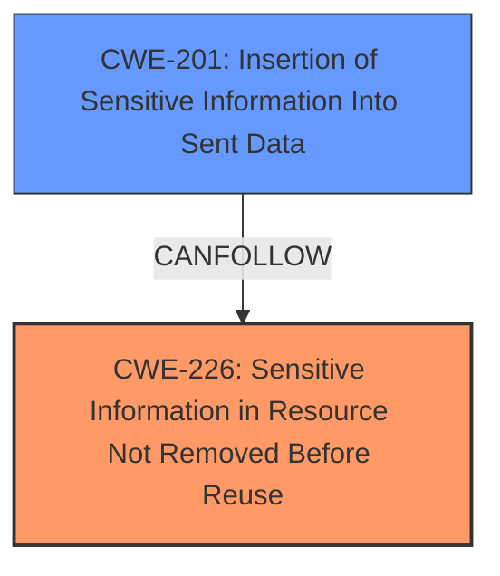

# Final Resolution for CVE-2020-36476

# Summary
| CWE ID | CWE Name | Confidence | CWE Abstraction Level | CWE Vulnerability Mapping Label | CWE-Vulnerability Mapping Notes |
|---|---|---|---|---|---|
| CWE-226 | Sensitive Information in Resource Not Removed Before Reuse | 0.95 | Base | Allowed | Primary CWE |
| CWE-201 | Insertion of Sensitive Information Into Sent Data | 0.60 | Base | Allowed | Secondary CWE |

## Evidence and Confidence

*   **Confidence Score:** 0.90
*   **Evidence Strength:** HIGH

## Relationship Analysis
The primary relationship considered is that CWE-226 is a **root cause** of the vulnerability, where failure to zeroize the buffer leads to potential exposure of sensitive data. CWE-201 is a potential consequence if the uncleared data is subsequently sent.

## Vulnerability Chain
The vulnerability chain starts with the **root cause**, the **WEAKNESS** of missing zeroization of plaintext buffers (CWE-226). This leads to sensitive information potentially remaining in memory. If this memory is subsequently read and transmitted, it results in sensitive information being sent (CWE-201). The impact is exposure of sensitive data.

## Summary of Analysis
The initial analysis correctly identified CWE-226 as the primary **WEAKNESS**. The criticism provided additional context and suggestions for improvement. The key factor is the evidence from the vulnerability description: "**missing zeroization of plaintext buffers** in mbedtls_ssl_read to erase unused application data from memory." This directly supports CWE-226.

The addition of CWE-201 as a secondary CWE accounts for the potential downstream impact if the un-zeroized data is sent. While CWE-200 was considered, CWE-201 is more specific and aligns better with the recommendation to avoid using CWE-200 directly, given its discouraged usage.

The selected CWEs are at the optimal level of specificity. CWE-226 is a Base CWE and accurately describes the **ROOTCAUSE**. CWE-201 is also a Base CWE and represents a potential consequence. The confidence score is high due to the direct evidence and well-defined relationships.