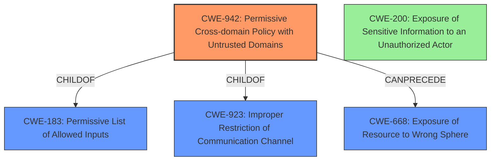

# Final Resolution for CVE-2020-4562

# Summary
| CWE ID | CWE Name | Confidence | CWE Abstraction Level | CWE Vulnerability Mapping Label | CWE-Vulnerability Mapping Notes |
|---|---|---|---|---|---|
| CWE-942 | Permissive Cross-domain Policy with Untrusted Domains | 0.90 | Variant | Allowed | Primary CWE |
| CWE-200 | Exposure of Sensitive Information to an Unauthorized Actor | 0.30 | Class | Discouraged | Secondary Candidate |

## Evidence and Confidence

*   **Confidence Score:** 0.85
*   **Evidence Strength:** HIGH

## Relationship Analysis
The primary relationship influencing the decision is the hierarchical relationship. **CWE-942** (Permissive Cross-domain Policy with Untrusted Domains) is a Variant, making it more specific than its parents, **CWE-183** (Permissive List of Allowed Inputs) and **CWE-923** (Improper Restriction of Communication Channel). This specificity is desirable. **CWE-942** can precede **CWE-668** (Exposure of Resource to Wrong Sphere), which is the general impact of the vulnerability. **CWE-200** is a class-level CWE and represents the impact rather than the **ROOTCAUSE**, making it a less desirable classification.

## Vulnerability Chain
The vulnerability chain starts with **CWE-942** (Permissive Cross-domain Policy with Untrusted Domains). This **WEAKNESS** allows a remote attacker to perform actions or access resources they should not be able to. The consequence of this is **CWE-200** (Exposure of Sensitive Information to an Unauthorized Actor), which is the potential impact.

## Summary of Analysis
The initial analysis and criticism are both sound and well-reasoned. The primary **WEAKNESS** is correctly identified as **CWE-942** (Permissive Cross-domain Policy with Untrusted Domains), which is supported by the vulnerability description stating "allowing cross-window communication with unrestricted target origin via documentation frames." This maps directly to the description of **CWE-942**, "The product uses a cross-domain policy file that includes domains that should not be trusted." The analysis correctly identifies that **CWE-200** (Exposure of Sensitive Information to an Unauthorized Actor) is a potential impact rather than a **ROOTCAUSE**.

The confidence score for **CWE-942** has been increased to 0.90 due to the direct mapping from the vulnerability description. The confidence score for **CWE-200** has been decreased to 0.30 to reflect that it is an impact, not a cause. The final classification reflects the optimal level of specificity, as **CWE-942** is a Variant level CWE and directly addresses the **ROOTCAUSE**.