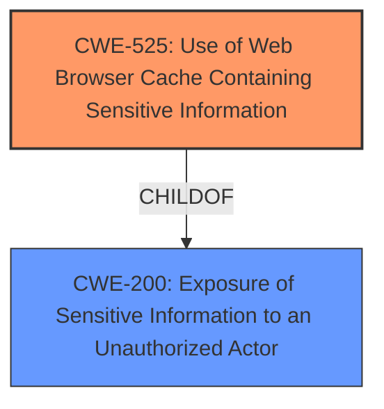

# Final Resolution for CVE-2020-4951

# Summary
| CWE ID | CWE Name | Confidence | CWE Abstraction Level | CWE Vulnerability Mapping Label | CWE-Vulnerability Mapping Notes |
|---|---|---|---|---|---|
| CWE-525 | Use of Web Browser Cache Containing Sensitive Information | 0.95 | Variant | Allowed | Primary CWE |
| CWE-200 | Exposure of Sensitive Information to an Unauthorized Actor | 0.6 | Class | Discouraged | Secondary Candidate |

## Evidence and Confidence

*   **Confidence Score:** 0.9
*   **Evidence Strength:** HIGH

## Relationship Analysis
The primary relationship considered was the parent-child relationship between CWE-200 (Exposure of Sensitive Information to an Unauthorized Actor) and CWE-525 (Use of Web Browser Cache Containing Sensitive Information). CWE-525, being a variant of the more general CWE-200, provides a more specific and accurate classification for this vulnerability. The decision was influenced by the MITRE mapping guidance that discourages the use of CWE-200 when more specific options are available.

## Vulnerability Chain
The vulnerability chain starts with the application caching sensitive data in the web browser's cache (**ROOTCAUSE**: CWE-525). This cached data is then accessible to a local attacker, leading to the exposure of sensitive information (**IMPACT**: CWE-200).

## Summary of Analysis
The initial analysis and criticism both converge on CWE-525 as the primary weakness, with CWE-200 as a secondary consideration due to its more general nature. The final determination strongly favors CWE-525 due to its direct match with the vulnerability description ("locally cached browser data, that could allow a local attacker to obtain sensitive information").

The retriever results support this decision, listing CWE-525 as the top candidate. The attack vector `AV:L` (Local Attack Vector) aligns with the local access required to exploit the vulnerability.

The graph relationships influenced the decision by highlighting the parent-child relationship between CWE-200 and CWE-525, emphasizing the importance of selecting the most specific CWE. The abstraction levels (CWE-525 as Variant, CWE-200 as Class) further support the choice of CWE-525 for optimal granularity.

The selection of CWE-525 is at the optimal level of specificity because it directly addresses the root cause of the vulnerability (caching of sensitive information in the browser), while CWE-200 only describes the impact (exposure of sensitive information). The MITRE mapping guidance discourages the use of CWE-200 when a more specific CWE is available, further justifying the choice of CWE-525.

I am increasing the confidence to 0.95 based on the high degree of alignment between the vulnerability description and the CWE-525 definition, the support from retriever results and attack vector information, and the clear justification provided in both the initial analysis and the criticism.