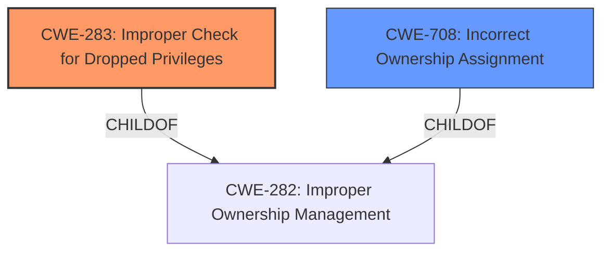

# Final Resolution for CVE-2020-5232

# Summary
| CWE ID | CWE Name | Confidence | CWE Abstraction Level | CWE Vulnerability Mapping Label | CWE-Vulnerability Mapping Notes |
|---|---|---|---|---|---|
| **CWE-283** | **Improper Check for Dropped Privileges** | 0.85 | Base | Allowed | Primary CWE |
| **CWE-708** | **Incorrect Ownership Assignment** | 0.70 | Base | Allowed | Secondary Candidate |

## Evidence and Confidence

*   **Confidence Score:** 0.83
*   **Evidence Strength:** HIGH

## Relationship Analysis
The primary relationship impacting the decision is the peer relationship between CWE-283 (**Improper Check for Dropped Privileges**) and CWE-708 (**Incorrect Ownership Assignment**). Both address aspects of ownership, but CWE-283 (**Improper Check for Dropped Privileges**) more precisely describes the core issue: the lack of verification during ownership transfer that allows the original owner to regain control. CWE-708 (**Incorrect Ownership Assignment**) describes the state of an owner outside of the intended control sphere because a trapdoor was previously configured. While CWE-282 (Improper Ownership Management) is a parent of both, it is too abstract.

## Vulnerability Chain
The vulnerability chain starts with the flawed design of the ENS registry contract, where a "trapdoor" mechanism allows the original owner to retain control. This leads to **CWE-283** (**Improper Check for Dropped Privileges**), as the system fails to properly verify the new owner's exclusive ownership before allowing the original owner to regain control. The consequence is **CWE-708** (**Incorrect Ownership Assignment**), where the intended new owner's control sphere is compromised by the previous owner’s latent control.

## Summary of Analysis
The analysis accurately identifies **CWE-283** (**Improper Check for Dropped Privileges**) as the primary weakness, supported by the vulnerability description that states the original owner can regain ownership "without the new owners consent or awareness." This aligns directly with **CWE-283** (**Improper Check for Dropped Privileges**) description: "The product does not properly verify that a critical resource is owned by the proper entity." **CWE-708** (**Incorrect Ownership Assignment**) serves as a secondary candidate, as the initial assignment of ownership is flawed due to the trapdoor mechanism. While other CWEs like **CWE-639** (**Authorization Bypass Through User-Controlled Key**) and **CWE-306** (**Missing Authentication for Critical Function**) are tangentially related, they do not represent the core issue as accurately as **CWE-283** (**Improper Check for Dropped Privileges**). The final decision is based on a comprehensive evaluation of content matching, relationship analysis, and mapping guidance.
The selected CWEs are at the optimal level of specificity, with **CWE-283** (**Improper Check for Dropped Privileges**) being a Base-level CWE that directly addresses the vulnerability's root cause.