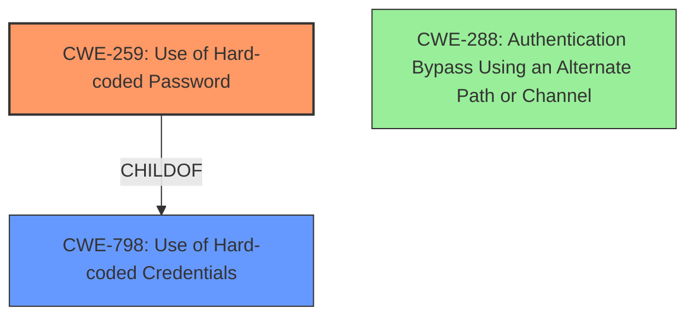

# Final Resolution for CVE-2020-5351

# Summary
| CWE ID | CWE Name | Confidence | CWE Abstraction Level | CWE Vulnerability Mapping Label | CWE-Vulnerability Mapping Notes |
|---|---|---|---|---|---|
| CWE-259 | Use of Hard-coded Password | 0.95 | Variant | Allowed | Primary CWE |
| CWE-798 | Use of Hard-coded Credentials | 0.75 | Base | Allowed | Secondary Candidate |
| CWE-288 | Authentication Bypass Using an Alternate Path or Channel | 0.4 | Base | Allowed | Tertiary Candidate |

## Evidence and Confidence

*   **Confidence Score:** 0.90
*   **Evidence Strength:** HIGH

## Relationship Analysis
The primary relationship that impacted the decision was the parent-child relationship between CWE-798 (**Use of Hard-coded Credentials**) and CWE-259 (**Use of Hard-coded Password**). CWE-259 is a variant of CWE-798, providing a more specific classification for vulnerabilities involving hard-coded passwords. Additionally, the "undocumented account" aspect hinted at CWE-288 (**Authentication Bypass Using an Alternate Path or Channel**), as the hard-coded password could allow access through a back door or undocumented interface. This led to its consideration as a tertiary candidate.

## Vulnerability Chain
The vulnerability chain starts with the **ROOTCAUSE**, which is the inclusion of a **hard-coded password** (CWE-259). This password protects an undocumented account, which allows a remote, unauthenticated attacker to log in and gain read-only privileges. This constitutes a vulnerability because it bypasses normal authentication mechanisms. If the undocumented account provides an alternate path or channel for access, CWE-288 also becomes relevant.

## Summary of Analysis
The initial analysis correctly identified CWE-259 (**Use of Hard-coded Password**) as the primary weakness, supported by the explicit mention of a hard-coded password in the vulnerability description: "Dell EMC Data Protection Advisor versions 6.4, 6.5 and 18.1 contain an undocumented account with limited privileges that is protected with a **hard-coded password**." The criticism highlighted the need to explicitly address other top retriever results and consider the implications of the "undocumented account." While CWE-321 (**Use of Hard-coded Cryptographic Key**) and CWE-256 (**Plaintext Storage of a Password**) were potential candidates, the description doesn't provide evidence to support these. However, the "undocumented account" raises the possibility of CWE-288 (**Authentication Bypass Using an Alternate Path or Channel**), which is why it has been added as a tertiary candidate. CWE-259 remains the most specific and relevant classification.
The selected CWEs are at the optimal level of specificity because CWE-259 is a variant that directly addresses the use of a hard-coded password, while CWE-798 is its base class. CWE-288 is added as a tertiary candidate because the undocumented account could imply an authentication bypass.