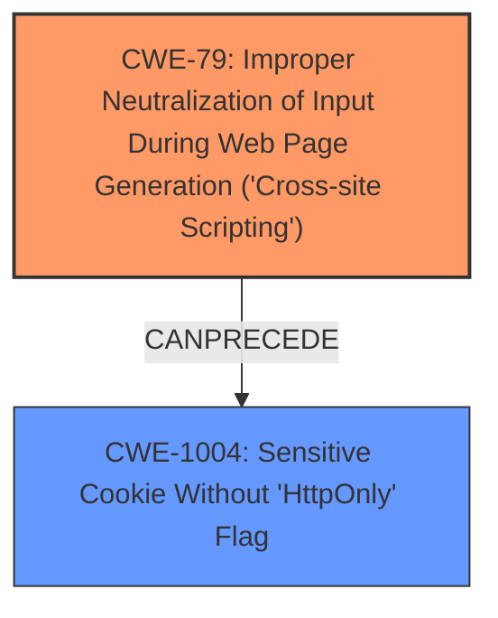

# Analysis Report for CVE-2020-7050

# Vulnerability Analysis Report: CVE-2020-7050

## Description

Codologic Codoforum through 4.8.4 allows a DOM-based XSS. While creating a new topic as a normal user, it is possible to add a poll that is automatically loaded in the DOM once the thread/topic is opened. Because session cookies lack the HttpOnly flag, it is possible to steal authentication cookies and take over accounts.

## Vulnerability Description Key Phrases

**Weakness:** DOM-based XSS
**Impact:** steal authentication cookies and take over accounts
**Product:** Codologic Codoforum
**Version:** through 4.8.4

## Analysis (with Relationship Data)

# Summary
| CWE ID | CWE Name | Confidence | CWE Abstraction Level | CWE Vulnerability Mapping Label | CWE-Vulnerability Mapping Notes |
|---|---|---|---|---|---|
| CWE-79 | Improper Neutralization of Input During Web Page Generation ('Cross-site Scripting') | 1.0 | Base | Allowed | Primary CWE |
| CWE-1004 | Sensitive Cookie Without 'HttpOnly' Flag | 0.9 | Variant | Allowed | Secondary Candidate |

## Evidence and Confidence

*   **Confidence Score:** 0.95
*   **Evidence Strength:** HIGH

- **Analysis and Justification:**
  - *Explanation:* The vulnerability description clearly states a **DOM-based XSS** **weakness** exists. The CVE Reference Links Content Summary reinforces this, explicitly mentioning that the application does not properly sanitize user-supplied input for dynamic content generation, allowing for malicious JavaScript execution. This directly aligns with the description of CWE-79 (Improper Neutralization of Input During Web Page Generation ('Cross-site Scripting')). The retriever results also rank CWE-79 as the top candidate. CWE-80 is a more specific variant but DOM-based XSS is a general case, making the Base CWE appropriate.
  - *Relationship Analysis:* CWE-79 is a base level CWE. The retriever results show relationships such as `CANFOLLOW -> CWE-113` and `PEEROF -> CWE-352`, but these are not relevant to root cause analysis.

- **Analysis and Justification:**
  - *Explanation:* The vulnerability description mentions that session cookies lack the HttpOnly flag, which allows attackers to steal authentication cookies. This is a direct instance of CWE-1004 (Sensitive Cookie Without 'HttpOnly' Flag). The CVE Reference Links Content Summary confirms this **weakness**, noting that the missing `HttpOnly` flag allows JavaScript access to the session cookie. This is a variant-level CWE.
  - *Relationship Analysis:* There are no direct relationships to analyze for CWE-1004.

- **Confidence Score:**
  - *Example:* Confidence: 1.0 (High evidence from vulnerability description, CVE reference summary, and retriever results for CWE-79)
  - *Example:* Confidence: 0.9 (High evidence from vulnerability description and CVE reference summary. Lower score due to it being a secondary weakness. for CWE-1004)

## Criticism of Analysis

Okay, here's a review of the CWE analysis, incorporating the full CWE specifications.

**Overall Assessment:**

The analysis is generally good and identifies the two key weaknesses: DOM-based XSS (CWE-79) and the missing HttpOnly flag on sensitive cookies (CWE-1004).  The confidence levels are appropriate given the evidence. The justifications are clear and well-reasoned. The example CVEs for CWE-1004 are relevant and helpful.

**Detailed Review:**

**1. CWE-79: Improper Neutralization of Input During Web Page Generation ('Cross-site Scripting')**

*   **CWE Abstraction Level:** Base. This is appropriate. While CWE-80 is a more specific Variant, DOM-based XSS is a general case of XSS where the injection and execution occur within the DOM.  CWE-79 is a suitable starting point.
*   **Confidence:** 1.0 - Justified. The vulnerability description explicitly mentions DOM-based XSS, the CVE summary confirms improper sanitization, and the retriever results support this.
*   **Justification:** The explanation is clear and accurately describes how the lack of sanitization leads to the execution of arbitrary JavaScript.
*   **Mitigation Considerations:** The provided CWE specifications list several mitigations.  The analysis could *briefly* mention some of these in the context of this vulnerability. For example:
    *   "A robust mitigation strategy would involve output encoding user-provided data before it's inserted into the web page.  Libraries like OWASP ESAPI can help with this."
*   **Relationships:** The analysis mentions some relationships from the retriever results, but they are not directly relevant to the root cause.

**2. CWE-1004: Sensitive Cookie Without 'HttpOnly' Flag**

*   **CWE Abstraction Level:** Variant. Correct. This is a specific type of cookie configuration issue.
*   **Confidence:** 0.9 - Justified. Strong evidence exists, but it's a secondary contributing factor, not the primary attack vector (XSS is).
*   **Justification:** The explanation is accurate; the missing flag allows JavaScript to access the cookie.
*   **Mitigation Considerations:** The analysis could mention the primary mitigation:
    *   "The most effective mitigation is to set the `HttpOnly` flag when creating the session cookie."
*   **Relationships:** No direct relationships were given in the analysis, which is correct, but since it depends on XSS, it could be argued that there is a relationship like requires -> CWE-79

**Retriever Results Critique:**

Let's examine some of the other CWEs identified by the retrievers and why they were correctly excluded or might warrant a brief mention:

*   **CWE-472: External Control of Assumed-Immutable Web Parameter:**  This could be tangentially related.  An attacker *might* try to manipulate other parameters related to the poll creation.  However, the core vulnerability is the lack of sanitization *within* the poll data itself, not manipulation of surrounding parameters. It's not a primary factor in this case, so excluding it is correct.
*   **CWE-201: Insertion of Sensitive Information Into Sent Data:**  This is not a direct fit. The primary issue isn't that the server is sending sensitive data. It's that the server is *allowing* the attacker to inject malicious *code* that can *steal* sensitive data (the cookie).
*   **CWE-352: Cross-Site Request Forgery (CSRF):**  While XSS can *facilitate* CSRF, CSRF is not the core issue here. The vulnerability exists even without CSRF. The XSS allows direct cookie theft.  CSRF would be a different attack vector.
*   **CWE-613: Insufficient Session Expiration:** The missing HttpOnly flag makes stolen cookies immediately useful, whereas an insufficent session expiration would only enable the cookie to be useful over a longer period of time. In this case, the vulnerability is the missing HttpOnly flag because the XSS can directly steal the cookie.
*   **CWE-113: Improper Neutralization of CRLF Sequences in HTTP Headers ('HTTP Request/Response Splitting'):**  Not relevant.  No evidence of CRLF injection.
*   **CWE-116: Improper Encoding or Escaping of Output:**  While CWE-79 (XSS) is *caused* by improper encoding or escaping, CWE-79 is the more direct and specific description of the vulnerability. CWE-116 is a contributing factor but not the central problem.
*   **CWE-312: Cleartext Storage of Sensitive Information:**  Not relevant.  The cookies aren't stored in cleartext; they're transmitted without HttpOnly.
*   **CWE-434: Unrestricted Upload of File with Dangerous Type:** Not Relevant

**Suggestions for Improvement:**

1.  **Briefly Mention Mitigations:**  In the "Analysis and Justification" sections, add a sentence or two about relevant mitigations for each CWE, drawing from the "Potential Mitigations" sections of the CWE specifications.
2.  **Relationship Nuance:** Although the core issue is XSS and the missing HttpOnly flag, acknowledge that the XSS can be *used* to perform CSRF or other attacks.  However, make it clear that these are *consequences* of the primary vulnerability, not the root cause itself.
3.  **Clarify XSS Type:** While DOM-based XSS is mentioned, briefly clarifying *why* it is DOM-based, rather than Stored or Reflected XSS, will help. (e.g., "The XSS is DOM-based because the injected code is executed client-side through the modification of the DOM, rather than being injected directly into the server's response.")

**Revised Summary Table (Example incorporating suggestions):**

| CWE ID | CWE Name | Confidence | CWE Abstraction Level | CWE Vulnerability Mapping Label | CWE-Vulnerability Mapping Notes |
|---|---|---|---|---|---|
| CWE-79 | Improper Neutralization of Input During Web Page Generation ('Cross-site Scripting') | 1.0 | Base | Allowed | Primary CWE. DOM-based XSS allows injection and execution within the DOM. Mitigations include robust output encoding. |
| CWE-1004 | Sensitive Cookie Without 'HttpOnly' Flag | 0.9 | Variant | Allowed | Secondary Candidate. Missing HttpOnly flag allows cookie theft via XSS. Mitigation: Set the HttpOnly flag. |

By adding these small details, the analysis becomes even more comprehensive and demonstrates a deeper understanding of the vulnerabilities and their potential mitigations.

## Final Resolution

# Summary

| CWE ID   | CWE Name                                                              | Confidence | CWE Abstraction Level | CWE Vulnerability Mapping Label | CWE-Vulnerability Mapping Notes                                                                                                                     |
| :------- | :-------------------------------------------------------------------- | :--------- | :-------------------- | :------------------------------ | :-------------------------------------------------------------------------------------------------------------------------------------------------- |
| CWE-79   | Improper Neutralization of Input During Web Page Generation ('Cross-site Scripting') | 1.0        | Base                  | Allowed                       | Primary **CWE**. DOM-based XSS allows injection and execution within the DOM. Mitigations include robust output encoding.                             |
| CWE-1004 | Sensitive Cookie Without 'HttpOnly' Flag                            | 0.9        | Variant               | Allowed                       | Secondary Candidate. Missing HttpOnly flag allows cookie theft via XSS. Mitigation: Set the HttpOnly flag.                                           |

## Evidence and Confidence

*   **Confidence Score:** 0.95
*   **Evidence Strength:** HIGH

## Relationship Analysis

The primary relationship impacting the decision is that CWE-79 (XSS) **CanPrecede** the exploitation of CWE-1004 (Missing HttpOnly Flag). The XSS **weakness** allows an attacker to access the cookie, and the missing HttpOnly flag makes this possible. While CWE-79 is a base CWE, and CWE-80 a variant, the description specifies DOM-based XSS, which falls under the broader category of CWE-79.

## Vulnerability Chain

The vulnerability chain starts with the **ROOTCAUSE**, Improper Neutralization of Input During Web Page Generation (CWE-79), allowing for DOM-based XSS. This leads to the consequence that an attacker can inject malicious JavaScript code into the web page. Because the session cookie lacks the HttpOnly flag (CWE-1004), the injected JavaScript can access and steal the authentication cookie. The impact is that an attacker can then take over accounts.

## Summary of Analysis

The initial analysis correctly identified CWE-79 and CWE-1004 as the primary and secondary **weaknesses** respectively. The criticism provided valuable suggestions, including adding mitigations and clarifying the type of XSS. The graph relationships confirm that the XSS **weakness** enables the exploitation of the missing HttpOnly flag.

The vulnerability description states: "Codologic Codoforum through 4.8.4 allows a DOM-based XSS... Because session cookies lack the HttpOnly flag, it is possible to steal authentication cookies and take over accounts." This is direct evidence for both CWE-79 and CWE-1004.

CWE-79 is chosen because the vulnerability is specifically described as DOM-based XSS. CWE-1004 is a contributing factor, as the missing HttpOnly flag is required for the XSS to successfully steal the cookie. These **CWEs** are at the optimal level of specificity because they accurately describe the **ROOTCAUSE** and contributing factor of the vulnerability.

*Report generated on 2025-03-16 16:57:48*
