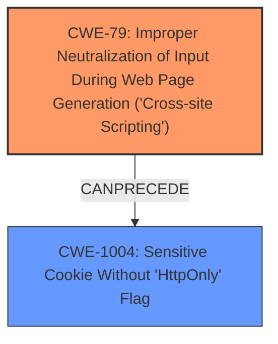

# Final Resolution for CVE-2020-7050

# Summary

| CWE ID   | CWE Name                                                              | Confidence | CWE Abstraction Level | CWE Vulnerability Mapping Label | CWE-Vulnerability Mapping Notes                                                                                                                     |
| :------- | :-------------------------------------------------------------------- | :--------- | :-------------------- | :------------------------------ | :-------------------------------------------------------------------------------------------------------------------------------------------------- |
| CWE-79   | Improper Neutralization of Input During Web Page Generation ('Cross-site Scripting') | 1.0        | Base                  | Allowed                       | Primary **CWE**. DOM-based XSS allows injection and execution within the DOM. Mitigations include robust output encoding.                             |
| CWE-1004 | Sensitive Cookie Without 'HttpOnly' Flag                            | 0.9        | Variant               | Allowed                       | Secondary Candidate. Missing HttpOnly flag allows cookie theft via XSS. Mitigation: Set the HttpOnly flag.                                           |

## Evidence and Confidence

*   **Confidence Score:** 0.95
*   **Evidence Strength:** HIGH

## Relationship Analysis

The primary relationship impacting the decision is that CWE-79 (XSS) **CanPrecede** the exploitation of CWE-1004 (Missing HttpOnly Flag). The XSS **weakness** allows an attacker to access the cookie, and the missing HttpOnly flag makes this possible. While CWE-79 is a base CWE, and CWE-80 a variant, the description specifies DOM-based XSS, which falls under the broader category of CWE-79.

## Vulnerability Chain

The vulnerability chain starts with the **ROOTCAUSE**, Improper Neutralization of Input During Web Page Generation (CWE-79), allowing for DOM-based XSS. This leads to the consequence that an attacker can inject malicious JavaScript code into the web page. Because the session cookie lacks the HttpOnly flag (CWE-1004), the injected JavaScript can access and steal the authentication cookie. The impact is that an attacker can then take over accounts.

## Summary of Analysis

The initial analysis correctly identified CWE-79 and CWE-1004 as the primary and secondary **weaknesses** respectively. The criticism provided valuable suggestions, including adding mitigations and clarifying the type of XSS. The graph relationships confirm that the XSS **weakness** enables the exploitation of the missing HttpOnly flag.

The vulnerability description states: "Codologic Codoforum through 4.8.4 allows a DOM-based XSS... Because session cookies lack the HttpOnly flag, it is possible to steal authentication cookies and take over accounts." This is direct evidence for both CWE-79 and CWE-1004.

CWE-79 is chosen because the vulnerability is specifically described as DOM-based XSS. CWE-1004 is a contributing factor, as the missing HttpOnly flag is required for the XSS to successfully steal the cookie. These **CWEs** are at the optimal level of specificity because they accurately describe the **ROOTCAUSE** and contributing factor of the vulnerability.