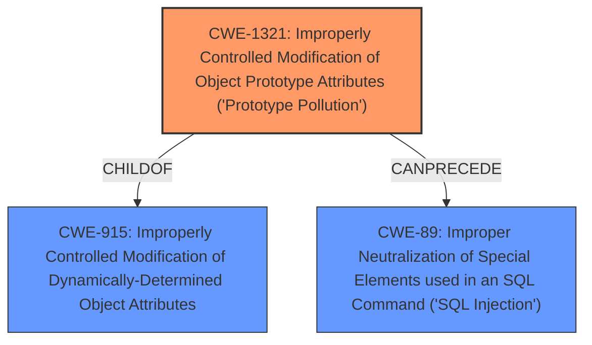

# Final Resolution for CVE-2020-8158

# Summary

| CWE ID | CWE Name | Confidence | CWE Abstraction Level | CWE Vulnerability Mapping Label | CWE-Vulnerability Mapping Notes |
|---|---|---|---|---|---|
| CWE-1321 | Improperly Controlled Modification of Object Prototype Attributes ('Prototype Pollution') | 0.95 | Variant | Allowed | Primary CWE |
| CWE-89 | Improper Neutralization of Special Elements used in an SQL Command ('SQL Injection') | 0.6 | Base | Allowed | Secondary Candidate; Potential impact of **prototype pollution** depending on usage. Mitigation efforts should primarily focus on preventing **prototype pollution**. |

## Evidence and Confidence

*   **Confidence Score:** 0.9
*   **Evidence Strength:** HIGH

## Relationship Analysis
The primary relationship impacting the decision is the hierarchical relationship between CWE-915 (Parent) and CWE-1321 (Child). While CWE-915 is a valid higher-level categorization, the vulnerability description explicitly mentions "**prototype pollution**," making CWE-1321 a more specific and accurate classification. CWE-89 is considered a potential consequence of CWE-1321, establishing a 'CanPrecede' relationship where the prototype pollution can lead to SQL injection if the polluted data is used in SQL queries without proper sanitization. The abstraction levels were also considered with the preference of using Variant and Base level CWEs when possible.

## Vulnerability Chain
The vulnerability chain starts with the **ROOTCAUSE** which is the **improperly controlled modification of object prototype attributes (CWE-1321)**. If an attacker can successfully pollute the prototype, then this can lead to the **WEAKNESS** of **improper neutralization of special elements used in an SQL command (CWE-89)** if the polluted data is used in SQL queries without proper sanitization. The final **IMPACT** is SQL injection, which can lead to data breaches, unauthorized access, or denial of service.

## Summary of Analysis
The initial analysis and criticism are well-justified and accurate. The decision to classify the vulnerability as CWE-1321 with CWE-89 as a secondary candidate is based on solid evidence and a clear understanding of the relationships between the CWEs.

The vulnerability description explicitly states a "**prototype pollution** vulnerability," directly mapping to CWE-1321. This strong evidence supports the primary classification.

The graph relationships influenced the decision by highlighting the parent-child relationship between CWE-915 and CWE-1321. Although CWE-915 is related, CWE-1321 is more specific and a better fit for the vulnerability description. The potential for SQL injection as a result of the **prototype pollution** led to the inclusion of CWE-89 as a secondary CWE.

The selected CWEs are at the optimal level of specificity. CWE-1321 is a Variant-level CWE, which is the preferred level for mapping root causes. CWE-89 is a Base-level CWE, representing a potential impact of the vulnerability. Higher level CWEs such as CWE-20 were avoided because they are too generic and not useful for trend analysis.