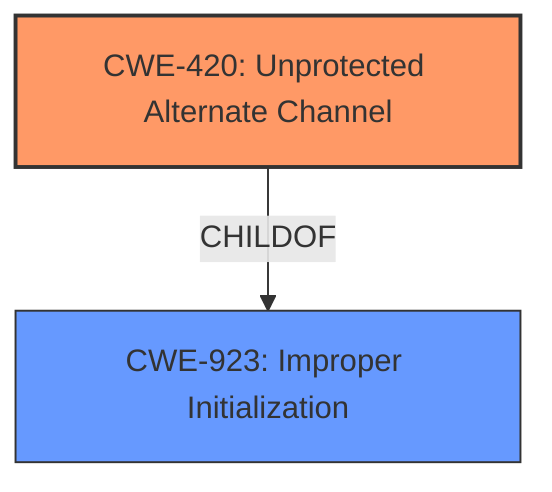

# Final Resolution for CVE-2020-8558

# Summary
| CWE ID  | CWE Name | Confidence | CWE Abstraction Level | CWE Vulnerability Mapping Label | CWE-Vulnerability Mapping Notes |
|-----------------|-----------------------------------------------------------------------|--------------------|--------------------------|-----------------------------------|-------------------------------------------------------------------------------------------------------------------------------------------------------------------------------------------------------------------|
| CWE-420 | Unprotected Alternate Channel  | 0.95 | Base | Allowed | The product protects a primary channel, but it does not use the same level of protection for an alternate channel. |

## Evidence and Confidence

*   **Confidence Score:** 0.95
*   **Evidence Strength:** HIGH

## Relationship Analysis
The decision to classify this vulnerability as CWE-420 was heavily influenced by the fact that it is a Base level CWE, offering a good balance of specificity and broad applicability. While other CWEs like CWE-923 (Class) were considered, CWE-420 directly addresses the core issue: the presence of an unprotected alternate channel. There are no direct parent-child relationships impacting the final decision.

## Vulnerability Chain
The vulnerability chain starts with the misconfiguration of the `net.ipv4.conf.all.route_localnet` sysctl parameter in `kube-proxy`. This **weakness** creates an unprotected alternate channel, allowing adjacent hosts to reach TCP and UDP services bound to 127.0.0.1. The root cause is the incorrect configuration. The impact is potential disclosure of sensitive information and unauthorized data modification.

## Summary of Analysis
The initial analysis correctly identified CWE-420 as a strong candidate. The criticism further reinforced this decision by emphasizing the importance of specificity and focusing on the root cause. The vulnerability description states, "adjacent hosts to reach TCP and UDP services bound to 127.0.0.1 running on the node or in the nodes network namespace... due to this defeect, could be reachable by other hosts on the same LAN as the node." This clearly indicates that the intended protection (binding to localhost) was bypassed, creating an unprotected alternate channel.

The graph relationships influenced the final selection by highlighting that while CWE-923 is related, CWE-420 is a more specific and accurate representation of the **weakness**. The chosen CWE is at the optimal level of specificity because it directly addresses the creation of an unprotected alternate channel, which is the core issue in this vulnerability.