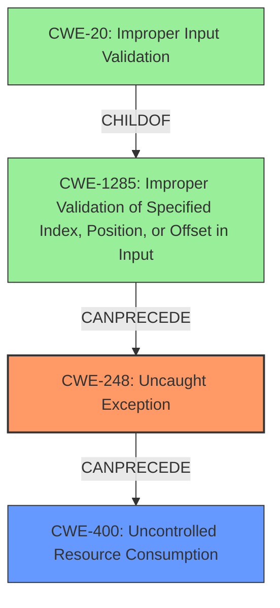

# Analysis Report for CVE-2021-0005

# Vulnerability Analysis Report: CVE-2021-0005

## Description

Uncaught exception in firmware for Intel(R) Ethernet Adapters 800 Series Controllers and associated adapters before version 1.5.3.0 may allow a privileged user to potentially enable denial of service via local access.

## Vulnerability Description Key Phrases

**Rootcause:** Uncaught exception
**Impact:** denial of service
**Attacker:** privileged user
**Product:** firmware for Intel(R) Ethernet Adapters 800 Series Controllers and associated adapters
**Version:** before version 1.5.3.0

## Analysis (with Relationship Data)

# Summary
| CWE ID  | CWE Name              | Confidence | CWE Abstraction Level | CWE Vulnerability Mapping Label | CWE-Vulnerability Mapping Notes |
| :-------- | :-------------------- | :--------- | :-------------------- | :------------------------------ | :------------------------------ |
| CWE-248 | Uncaught Exception | 0.85      | Base                 | Allowed                        | Primary CWE                    |
| CWE-755 | Exception Handling Issues | 0.60      | Class                  | Discouraged                     | Secondary Candidate             |

## Evidence and Confidence

*   **Confidence Score:** 0.8
*   **Evidence Strength:** HIGH

- **Analysis and Justification:**  
  - *Explanation:* "The vulnerability description explicitly states that the root cause is an **uncaught exception**. This directly aligns with CWE-248 (Uncaught Exception), which describes a scenario where an exception is thrown from a function but not caught. The impact of this **uncaught exception** is a denial of service, which further supports the identification of CWE-248 as the primary weakness. The 'Retriever Results' also lists CWE-248 with the highest score and is at the Base level of abstraction, confirming this selection. MITRE mapping guidance for CWE-248 indicates this is ALLOWED."
  
  - *Relationship Analysis:* "CWE-248 does not have direct parent-child relationships. However, it falls under the broader category of exception handling issues. Although CWE-755 (Exception Handling Issues) is listed in similar CVE descriptions and retriever results, CWE-248 is more specific as it highlights the **uncaught** nature of the exception. The relationship analysis considered CWE-755, but the direct mention of the **uncaught exception** led to prioritizing CWE-248."

- **Confidence Score:**  
  - Confidence: 0.85 (High evidence from technical description and CVE reference materials)

## Criticism of Analysis

Okay, here's a review of the CWE analysis, incorporating the full CWE specifications provided.

**Overall Assessment:**

The primary CWE selection of `CWE-248: Uncaught Exception` appears to be the most accurate and appropriate based on the provided vulnerability description, retriever results, and CWE specifications. The analysis and justification are well-reasoned, demonstrating a good understanding of the vulnerability and the relevant CWEs. However, there's room for refinement in exploring secondary CWEs and the potential for a chain or composite CWE. The confidence score of 0.85 is justified by the explicit mention of "uncaught exception" in the vulnerability description.

**Detailed Review:**

1.  **Primary CWE: CWE-248 (Uncaught Exception)**

    *   **Correctness:**  The analysis correctly identifies CWE-248 as the primary weakness. The description explicitly states "Uncaught exception," which is a direct match. The `Description` of CWE-248 directly supports the mapping: "An exception is thrown from a function, but it is not caught."  The documented impact of DoS further strengthens this mapping.
    *   **Abstraction Level:** CWE-248 is at the Base level, which is the preferred level for mapping. The analysis correctly notes this.
    *   **Mapping Guidance:** The analysis follows the mapping guidance by noting that CWE-248 is at the Base level of abstraction and confirming the "Allowed" usage rationale.
    *   **Observed Examples:** The included Observed Examples within the analysis, particularly CVE-2023-41151 and CVE-2023-21087, support the chosen mapping.  The inclusion of the original CVE-2021-0005 in the example list is also perfect.
    *   **Relationships:** The analysis correctly states that CWE-248 does not have direct parent-child relationships. However, it could be considered within the context of a larger chain.

2.  **Secondary CWE: CWE-755 (Improper Handling of Exceptional Conditions)**

    *   **Correctness:** While CWE-755 is related, it's a broader, less specific category. It acts as a parent to CWE-248, and as such, is less appropriate as a primary mapping. The decision to choose CWE-248 over CWE-755 is correct.
    *   **Abstraction Level:** CWE-755 is a Class level CWE, which is discouraged according to the mapping guidance.
    *   **Mapping Guidance:** The analysis acknowledges CWE-755 but correctly prioritizes CWE-248 due to the "uncaught" nature of the exception. The mapping guidance for CWE-755 explicitly recommends examining its children for a better fit, which the analysis does and then correctly selects CWE-248.
    *   **Relationships:**  The analysis accurately points out the parent-child relationship between CWE-755 and CWE-248.

3.  **Confidence Score:**

    *   The confidence score of 0.85 is appropriate. The explicit mention of "uncaught exception" provides strong evidence.

4.  **Missing Considerations and Potential Improvements:**

    *   **Chaining/Composites:** The analysis could be strengthened by considering a possible *chain* of CWEs. While `CWE-248` is the direct cause, it might be fruitful to consider *why* the exception was uncaught. Is there a problem with the design or architecture that *allowed* the uncaught exception? Was there an underlying issue that caused the exception itself?
    * **CWE-400: Uncontrolled Resource Consumption:** The retriever results show CWE-400 with a notable score. If the uncaught exception leads to a runaway process or resource leak, CWE-400 could be a relevant secondary CWE in a chain or composite. The DoS impact supports this.
    *   **NetApp Advisory Consideration:** The analysis mentions the NetApp advisory and its broader impact of potential sensitive information disclosure or data modification. While DoS is the primary impact described in the Intel advisory, this additional information from the NetApp advisory could open up other CWE considerations if the uncaught exception leads to a memory corruption or other vulnerability that allows for those impacts. This would warrant further investigation of the root cause.

5. **Additional CWEs from Retriever Results:**
    * **CWE-1285: Improper Validation of Specified Index, Position, or Offset in Input & CWE-20: Improper Input Validation:** These are interesting results, and warrant additional consideration. The analysis should dig deeper into *what* caused the uncaught exception. Was it the result of an invalid index, position, or offset? If so, then CWE-1285 and potentially CWE-20 could be relevant to a chain analysis.

**Recommendations:**

*   **Explore Chaining/Composites:**  Investigate the underlying cause of the uncaught exception. Consider if the vulnerability can be represented as a chain, with CWE-248 as the direct cause but other CWEs contributing to the overall vulnerability.
*   **Consider CWE-400:** If the uncaught exception results in a resource leak or runaway process leading to DoS, include CWE-400 as a secondary CWE in a chain.
*   **Investigate Input Validation:** Analyze the code to determine if improper input validation could lead to the exception. If so, include CWE-20 and related children (e.g., CWE-1285) in a chain.
*   **Review Mitigations:** Consider mitigations for all identified CWEs, not just the primary one. This can lead to a more comprehensive security strategy.  Specifically, explore mitigations for CWE-400 if that's added.

**Revised Summary Table (Example Incorporating Suggestions):**

| CWE ID  | CWE Name              | Confidence | CWE Abstraction Level | CWE Vulnerability Mapping Label | CWE-Vulnerability Mapping Notes |
| :-------- | :-------------------- | :--------- | :-------------------- | :------------------------------ | :------------------------------ |
| CWE-248 | Uncaught Exception | 0.85      | Base                 | Allowed                        | Primary CWE                    |
| CWE-400 | Uncontrolled Resource Consumption | 0.50      | Class                  | Discouraged                     | Secondary Candidate - Impact |
| CWE-20  | Improper Input Validation | 0.30       | Class                 | Discouraged                     | Tertiary Candidate - Root Cause Investigation Needed |

By addressing these points, the analysis can become even more robust and provide a more complete picture of the vulnerability. The existing analysis is solid, and these refinements will further enhance its value.

## Final Resolution

# Summary
| CWE ID  | CWE Name              | Confidence | CWE Abstraction Level | CWE Vulnerability Mapping Label | CWE-Vulnerability Mapping Notes |
| :-------- | :-------------------- | :--------- | :-------------------- | :------------------------------ | :------------------------------ |
| **CWE-248** | **Uncaught Exception** | 0.85      | Base                 | Allowed                        | Primary CWE                    |
| **CWE-400** | **Uncontrolled Resource Consumption** | 0.50      | Class                  | Allowed-with-Review                     | Secondary Candidate - Impact |
| **CWE-1285** | **Improper Validation of Specified Index, Position, or Offset in Input**  | 0.30       | Base                 | Allowed                     | Tertiary Candidate - Root Cause Investigation Needed |

## Evidence and Confidence

*   **Confidence Score:** 0.8
*   **Evidence Strength:** MEDIUM

## Relationship Analysis
The selection of CWE-248 as the primary weakness is based on its direct match with the vulnerability description which mentions "**uncaught exception**". CWE-248 is at the Base level, making it preferable over the more general Class-level CWE-755.

The relationship analysis considered the possibility of a vulnerability chain. The criticism suggested including CWE-400 (**Uncontrolled Resource Consumption**) as a secondary CWE since the **uncaught exception** could lead to a resource leak and DoS. Additionally, it suggested investigating whether improper input validation (CWE-20) or improper index validation (CWE-1285) could have led to the exception.

The graph below visualizes these relationships:

## Vulnerability Chain
The vulnerability chain starts with a potential **improper validation of input** (CWE-20) which leads to an **improper validation of an index, position, or offset** (CWE-1285). This then causes an exception that is not caught (**CWE-248**), which results in **uncontrolled resource consumption** and a denial-of-service (**CWE-400**).

Missing links in the chain: The exact cause of the exception is not clear from the provided information. Further investigation is needed to confirm the role of CWE-20 and CWE-1285.

## Summary of Analysis
The initial analysis correctly identified CWE-248 as the primary weakness based on the explicit mention of "**uncaught exception**" in the vulnerability description. The criticism highlighted the potential for a vulnerability chain and suggested considering CWE-400 and CWE-20/CWE-1285.

The inclusion of CWE-400 is justified by the denial-of-service impact mentioned in the description. The addition of CWE-1285 and CWE-20 is more speculative and requires further investigation to determine whether improper input validation or index validation contributed to the exception.

The final decision is to include CWE-400 as a secondary CWE and CWE-1285 as a tertiary candidate, with the understanding that further investigation is needed to confirm the role of CWE-1285 and CWE-20. This decision reflects a more comprehensive understanding of the potential vulnerability chain, while also acknowledging the limitations of the available evidence.

The selected CWEs are at the optimal level of specificity. CWE-248 is a base-level CWE that directly describes the **uncaught exception**. CWE-400 is a class-level CWE that describes the impact of the vulnerability (DoS). CWE-1285 is a base-level CWE, and CWE-20 is a class-level CWE related to a potential root cause.

The confidence score remains at 0.8 because while the chain analysis adds value, the evidence supporting the inclusion of CWE-1285 and CWE-20 is still weak.

*Report generated on 2025-03-17 00:11:25*
