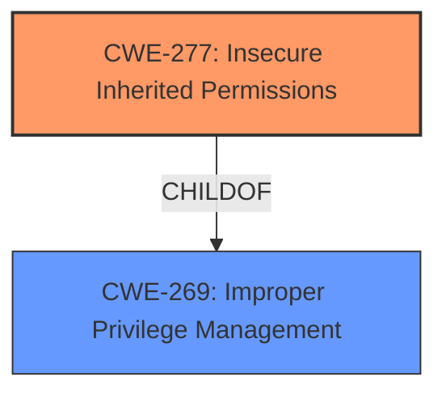

# Final Resolution for CVE-2021-0055

# Summary
| CWE ID | CWE Name | Confidence | CWE Abstraction Level | CWE Vulnerability Mapping Label | CWE-Vulnerability Mapping Notes |
|---|---|---|---|---|---|
| CWE-277 | Insecure Inherited Permissions | 0.95 | Variant | Primary | Allowed |
| CWE-269 | Improper Privilege Management | 0.5 | Class | Secondary | Discouraged |

## Evidence and Confidence

*   **Confidence Score:** 0.9
*   **Evidence Strength:** HIGH

## Relationship Analysis
The primary relationship influencing the decision is the hierarchical one, where CWE-277 (Insecure Inherited Permissions) is a more specific case of broader privilege management issues. The analysis considered CWE-269 (Improper Privilege Management) but correctly identified CWE-277 as the better fit due to its Variant level of specificity. No relevant chain or peer relationships were identified in the provided data.

## Vulnerability Chain
The vulnerability chain is relatively simple: **Insecure inherited permissions** (CWE-277) lead to a potential **escalation of privilege**. The root cause is the incorrect assignment of permissions during object creation or inheritance, and the impact is that an authenticated user can perform actions they should not be able to, thus leading to improper privilege management (CWE-269), which is considered an impact rather than a root cause.

## Summary of Analysis
The initial analysis is strong and well-supported by the provided evidence. The vulnerability description explicitly mentions "**insecure inherited permissions**", and the CVE summary reinforces this. The selection of CWE-277 is therefore highly justified. The criticism provides valuable suggestions for improvement, particularly in terms of including more specific mitigations and acknowledging alternative CWEs.

The graph relationships influenced the decision by highlighting the hierarchical relationship between CWE-277 and CWE-269. While CWE-269 is related, it's a broader class-level CWE, making CWE-277 the more precise and appropriate choice.

The selected CWEs are at the optimal level of specificity because CWE-277 directly addresses the root cause described in the vulnerability. It's a Variant-level CWE, which is preferred over class-level CWEs like CWE-269 when a more specific weakness is identifiable. The evidence clearly points to **insecure inherited permissions** as the core issue, making CWE-277 the most fitting classification.