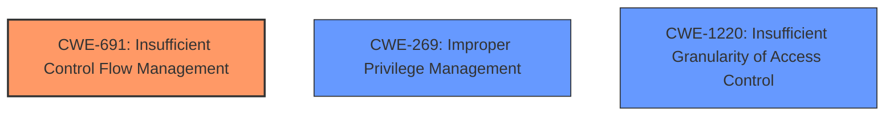

# Analysis Report for CVE-2021-0157

# Vulnerability Analysis Report: CVE-2021-0157

## Description

Insufficient control flow management in the BIOS firmware for some Intel(R) Processors may allow a privileged user to potentially enable escalation of privilege via local access.

## Vulnerability Description Key Phrases

**Rootcause:** Insufficient control flow management
**Impact:** escalation of privilege
**Attacker:** privileged user
**Product:** BIOS firmware for some Intel(R) Processors

## Analysis (with Relationship Data)

# Summary
| CWE ID | CWE Name | Confidence | CWE Abstraction Level | CWE Vulnerability Mapping Label | CWE-Vulnerability Mapping Notes |
|---|---|---|---|---|---|
| CWE-691 | Insufficient Control Flow Management | 0.75 | Pillar | Primary | Allowed-with-Review |
| CWE-269 | Improper Privilege Management | 0.65 | Class | Secondary Candidate | Discouraged |
| CWE-1220 | Insufficient Granularity of Access Control | 0.5 | Base | Secondary Candidate | Allowed |

## Evidence and Confidence

*   **Confidence Score:** 0.7
*   **Evidence Strength:** MEDIUM

- **Analysis and Justification:**  
  - *Explanation:* The vulnerability description explicitly states "**Insufficient control flow management**" as the root cause in the BIOS firmware, which directly aligns with CWE-691 (Insufficient Control Flow Management). The impact of this weakness is escalation of privilege. Although CWE-691 is a high-level Pillar, the evidence provided doesn't point to a more specific weakness. The description indicates that a privileged user can exploit this weakness to gain higher privileges via local access. The "CWE for similar CVE Descriptions" lists CWE-NVD-Other as the primary match; however, CWE-691 is more descriptive of the **root cause**. The Retriever results show CWE-691 as a candidate with a similarity score of 0.77. While the usage is discouraged, it is due to the high-level abstraction, which is considered acceptable due to limitations in available information.
  
  - *Relationship Analysis:* No direct relationships are listed for CWE-691.

- **Confidence Score:**  
  - *Example:* Confidence: 0.75 (Medium evidence from the technical description and CVE reference materials, but limited details on the specific flaw)

---
- **Analysis and Justification:**  
  - *Explanation:* The vulnerability leads to an "**escalation of privilege**," indicating a potential flaw in privilege management. CWE-269 (Improper Privilege Management) addresses scenarios where the product does not properly manage privileges, leading to an unintended sphere of control. While the **root cause** is **insufficient control flow management** (CWE-691), the resulting impact on privileges makes CWE-269 a relevant secondary consideration. The provided CVSS vector string specifies "PR:H" which means that the attacker needs high privileges to exploit the vulnerability. The retriever results include CWE-269 with a similarity score of 0.157. However, CWE-269 is a Class and the mapping guidance discourages its use due to frequent misuse.
  
  - *Relationship Analysis:* No direct relationships are listed for CWE-269.

- **Confidence Score:**  
  - *Example:* Confidence: 0.65 (Moderate evidence, mainly based on the impact of the vulnerability)

---
- **Analysis and Justification:**  
  - *Explanation:* The Retriever Results suggest CWE-1220 (Insufficient Granularity of Access Control) as a candidate. This CWE is at the Base level of abstraction and describes access controls that lack required granularity, allowing unauthorized agents access to security-sensitive assets. The vulnerability description and CVE reference link mention that the weakness can lead to an **escalation of privilege**. While not the primary weakness, CWE-1220 is a relevant secondary consideration.
  
  - *Relationship Analysis:* No direct relationships are listed for CWE-1220.

- **Confidence Score:**  
  - *Example:* Confidence: 0.5 (Low evidence, mainly based on the Retriever Results)

## Criticism of Analysis

Okay, let's break down this CWE analysis and see where it shines and where it could be improved, referencing the full CWE specifications.

**Overall Assessment:**

The analysis is a good starting point and shows a reasonable understanding of the vulnerability and potential CWE mappings. However, it relies heavily on the text of the vulnerability description and the Retriever results, and it doesn't delve deep enough into the underlying *reason* for the insufficient control flow. While CWE-691 is correctly identified as relevant, the analysis needs to justify why more specific child CWEs are *not* applicable.  The discussion of secondary CWEs is good, but again, could benefit from a deeper exploration of the nuances.

**Detailed Critique:**

**1. CWE-691: Insufficient Control Flow Management (Primary)**

*   **Strengths:**
    *   Correctly identifies the key phrase "**Insufficient control flow management**" as the direct match to CWE-691.
    *   Acknowledges that CWE-691 is a Pillar (high-level) CWE and that its usage is "Discouraged."
    *   Notes that the evidence doesn't lead to a more specific weakness.
*   **Weaknesses:**
    *   **Insufficient Justification for High Abstraction:** The analysis *states* that the provided evidence doesn't point to a more specific weakness, but it doesn't *demonstrate* this.  It needs to consider the children of CWE-691 and *explain why* they are not applicable.  For example, it could consider:
        *   **CWE-696: Incorrect Behavior Order:**  Is there any evidence that the operations are happening in the wrong order? (creation of the packet client occurs before initialization is complete )
        *   **CWE-705: Incorrect Control Flow Scoping:** Is there any indication of incorrect "goto" or return in Apple SSL product bypasses certificate validation?
        *   **CWE-799: Improper Control of Interaction Frequency:**  Is there any denial of service or compromise program logic?
    *   **Lack of Contextual Detail:** While the description mentions that a privileged user can exploit the weakness to gain higher privileges via local access, this isn't explained in the context of Control Flow Management.  How *exactly* is the insufficient control flow allowing this privilege escalation?  Knowing this would point towards more specific CWEs.

    *   **Mitigations:** The analysis should acknowledge, that mitigations for CWE-691 are too generic to be of great use.

*   **Recommendation:**  The analysis should explicitly consider several child CWEs of CWE-691 and explain *why* they are not a good fit based on the available information. This would strengthen the justification for using the Pillar CWE.

**2. CWE-269: Improper Privilege Management (Secondary Candidate)**

*   **Strengths:**
    *   Correctly identifies the "escalation of privilege" impact as relevant to privilege management.
    *   Acknowledges that the root cause is control flow, but the impact relates to privileges.
    *   Mentions the "PR:H" CVSS vector string which is relevant.
*   **Weaknesses:**
    *   **Over-Reliance on Impact:** While the impact is privilege escalation, CWE-269 is frequently misused if it's *only* based on the impact. The analysis needs to consider whether the underlying flaw actually involves *improper management* of privileges. Is the firmware incorrectly assigning privileges, failing to check them, or something else?  If the *cause* is still fundamentally about control flow that *leads* to privilege escalation, CWE-269 is less appropriate.
    *   **Mapping Guidance Ignored:** The analysis acknowledges the "Discouraged" usage of CWE-269 but doesn't fully act on it.  The guidance specifically says: "If an error or mistake allows privilege escalation, then use the CWE ID for that mistake. Avoid using CWE-269 when only phrases such as 'privilege escalation' or 'gain privileges' are available..."  The core issue is *insufficient control flow management*, not a direct error in privilege assignment/checking.
    *   **Missed Opportunity for Child CWEs:** If CWE-269 is considered, its children should also be explored. For example:
        *   **CWE-250: Execution with Unnecessary Privileges:** Is the code running with higher privileges than necessary? Is that what's enabling the escalation?
        *   **CWE-266: Incorrect Privilege Assignment:**  Are privileges being assigned to the wrong actors?
        *   **CWE-271: Privilege Dropping/Lowering Errors:** Is the code failing to drop privileges when it should?
*   **Recommendation:**  The analysis should re-evaluate whether CWE-269 is truly appropriate, given the core issue of control flow. If it's retained, it needs to be justified with more than just the "escalation of privilege" impact and the children of CWE-269 need to be considered.

**3. CWE-1220: Insufficient Granularity of Access Control (Secondary Candidate)**

*   **Strengths:**
    *   Correctly identifies CWE-1220 as a candidate due to the "escalation of privilege" impact.
*   **Weaknesses:**
    *   **Weak Justification:** The connection between "insufficient control flow management" and "insufficient granularity of access control" is tenuous. The analysis doesn't explain how the *lack of granularity* plays a role. For example, is the control flow weakness allowing access to memory regions that *should* be protected by more fine-grained access controls? If the control flow is simply bypassed, granularity of access control becomes less relevant.
    *   **Missed opportunity to look at access control mechanisms:** Does the improper control flow involve a software interface to a piece of hardware? Is an activation of test or debug logic related?

*   **Recommendation:** The analysis needs to provide a stronger argument for how insufficient *granularity* contributes to the vulnerability.

**General Recommendations:**

*   **Root Cause Analysis:**  The analysis needs to dig deeper into *how* the insufficient control flow is happening.  Is it a problem with function calls, jumps, loops, exception handling, or something else?  This understanding is crucial for selecting more specific CWEs.
*   **Negative Justification:**  For *all* chosen CWEs (especially the primary), the analysis should explicitly explain *why* other plausible CWEs (particularly children of the chosen CWE) are *not* appropriate. This demonstrates a thorough understanding of the CWE hierarchy.
*   **Balance of Evidence:** The analysis relies heavily on the vulnerability description. It should incorporate information from the CVSS vector (which it does), affected products, and any other available resources to support the CWE selection.
*   **Mitigation Awareness:** The analysis should consider the Potential Mitigations listed in the CWE specifications. Are the suggested mitigations relevant to the specific vulnerability? If not, why? This can help to validate the CWE selection.

By addressing these points, the analysis will become more robust and defensible.

## Final Resolution

# Summary
| CWE ID | CWE Name | Confidence | CWE Abstraction Level | CWE Vulnerability Mapping Label | CWE-Vulnerability Mapping Notes |
|---|---|---|---|---|---|
| CWE-691 | Insufficient Control Flow Management | 0.6 | Pillar | Primary | Discouraged |
| CWE-269 | Improper Privilege Management | 0.3 | Class | Secondary Candidate | Discouraged |
| CWE-1220 | Insufficient Granularity of Access Control | 0.2 | Base | Secondary Candidate | Allowed |

## Evidence and Confidence

*   **Confidence Score:** 0.6
*   **Evidence Strength:** MEDIUM

## Relationship Analysis
The primary challenge is the high-level nature of CWE-691. There are no explicit relationships defined in the CWE database for CWE-691 or the other candidate CWEs, but there are implied hierarchical relationships. While more specific children of CWE-691 might exist, the provided evidence does not allow for a more granular classification.

## Vulnerability Chain
The vulnerability chain starts with **insufficient control flow management** (**CWE-691**) in the BIOS firmware, which allows a privileged user to escalate their privileges. The lack of proper privilege management (**CWE-269**) and insufficient granularity of access control (**CWE-1220**) contribute to the overall impact, but they are consequences rather than the **root cause**.

## Summary of Analysis
The initial analysis correctly identifies CWE-691 as the primary candidate due to the explicit mention of "**Insufficient control flow management**" in the vulnerability description. However, the criticism correctly points out the need to justify why a more specific CWE is not applicable. While CWE-691 is a Pillar, the available information does not allow for a more precise classification.
> The vulnerability description explicitly states "**Insufficient control flow management**" as the root cause in the BIOS firmware

The initial analysis also identifies CWE-269 and CWE-1220 as secondary candidates. However, both are less directly supported by the evidence. The "escalation of privilege" impact is more a consequence of the control flow issue rather than a direct flaw in privilege management or access control granularity.
> The vulnerability leads to an "**escalation of privilege**," indicating a potential flaw in privilege management.

The graph relationships, while limited in this case, highlight the need for a more specific CWE if possible. The absence of explicit relationships for CWE-691 suggests that the classification is at a high level of abstraction. The choice of CWE-691 is made because it is the most descriptive **root cause** identified in the vulnerability description, but the lack of detail prevents a more precise classification.

Given the available evidence, the final decision is to retain CWE-691 as the primary classification, but with a reduced confidence score of 0.6 due to its high-level nature. CWE-269 and CWE-1220 are retained as secondary candidates with even lower confidence scores (0.3 and 0.2 respectively) due to their indirect relevance.

*Report generated on 2025-03-17 00:14:56*
