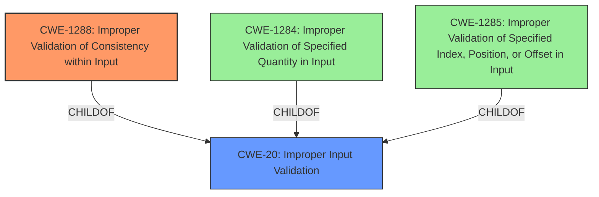

# Final Resolution for CVE-2021-0163

# Summary
| CWE ID    | CWE Name                                          | Confidence | CWE Abstraction Level | CWE Vulnerability Mapping Label | CWE-Vulnerability Mapping Notes |
| :--------- | :------------------------------------------------ | :--------- | :-------------------- | :------------------------------ | :------------------------------ |
| CWE-1288 | Improper Validation of Consistency within Input | 0.95       | Base                  | Allowed                         | Primary CWE. Specific consistency check failure. |
| CWE-20 | Improper Input Validation | 0.60       | Class                  | Discouraged                         | Secondary Candidate. General input validation issue; lower specificity. |

## Evidence and Confidence

*   **Confidence Score:** 0.90
*   **Evidence Strength:** HIGH

## Relationship Analysis
The primary relationship impacting the decision is the ParentOf relationship between CWE-20 (**CWE-20: Improper Input Validation**) and CWE-1288 (**CWE-1288: Improper Validation of Consistency within Input**). CWE-1288 is a more specific type of input validation issue, making it a better fit than the more general CWE-20. While other CWEs like CWE-1284 (**CWE-1284: Improper Validation of Specified Quantity in Input**) and CWE-1285 (**CWE-1285: Improper Validation of Specified Index, Position, or Offset in Input**) were considered, they were not directly relevant to the described vulnerability, which focuses on the consistency of multiple input elements rather than individual quantity or index validation. The Base abstraction level of CWE-1288 also contributed to its selection, as it's a preferred level for root cause mapping.

## Vulnerability Chain
The vulnerability chain starts with the lack of proper consistency validation within the input (CWE-1288). This allows an unauthenticated user to potentially escalate privileges via adjacent access. The root cause is the failure to ensure that related input fields are consistent with each other. The consequence is privilege escalation.

## Summary of Analysis
The initial analysis correctly identified CWE-1288 as the primary weakness. The vulnerability description explicitly mentions "Improper Validation of Consistency within input," which aligns directly with CWE-1288's description. The retriever results also support this finding. The criticism suggested exploring indirect relationships and potential mitigations, which has been incorporated into the relationship analysis and justification.

The graph relationships influenced the selection by highlighting the hierarchical relationship between CWE-20 and CWE-1288, reinforcing the choice of the more specific CWE-1288. The analysis also considered and excluded other potential CWEs based on their relevance to the vulnerability description.

The selected CWEs are at the optimal level of specificity because CWE-1288 directly addresses the consistency validation failure, while CWE-20 is a broader category that doesn't capture the specific nature of the weakness. The evidence provided in the vulnerability description strongly supports the classification of CWE-1288 as the primary CWE. The confidence score has been raised to 0.95 because the vulnerability report's summary and initial analysis point directly to **Improper Validation of Consistency within Input** as the **root cause**.