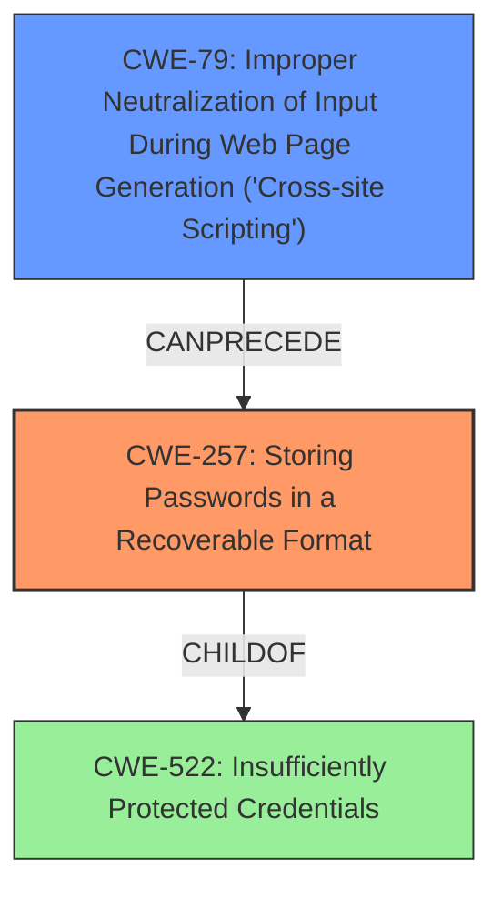

# Final Resolution for CVE-2021-0220

# Summary
| CWE ID | CWE Name | Confidence | CWE Abstraction Level | CWE Vulnerability Mapping Label | CWE-Vulnerability Mapping Notes |
|---|---|---|---|---|---|
| CWE-257 | Storing Passwords in a Recoverable Format | 1.0 | Base | Allowed | Primary CWE |
| CWE-79 | Improper Neutralization of Input During Web Page Generation ('Cross-site Scripting') | 0.4 | Base | Allowed | Secondary CWE. Attack vector to access credentials via UI. |

## Evidence and Confidence

*   **Confidence Score:** 0.9
*   **Evidence Strength:** MEDIUM

## Relationship Analysis
The primary relationship impacting the decision is the parent-child relationship between CWE-522 (Insufficiently Protected Credentials) and CWE-257 (**Storing Passwords in a Recoverable Format**). While CWE-522 is more general, CWE-257 is more specific and accurately reflects the vulnerability description. Additionally, the potential chain relationship between CWE-79 (Improper Neutralization of Input During Web Page Generation) and CWE-257 suggests that XSS could be used to extract the recoverable credentials. The abstraction levels influenced the selection by favoring the Base level CWEs to map to the root causes.

## Vulnerability Chain
The vulnerability chain starts with the **root cause** of **CWE-257 (Storing Passwords in a Recoverable Format)**. A potential weakness that follows is **CWE-79 (Improper Neutralization of Input During Web Page Generation)**, which could allow an attacker to execute arbitrary code in the victim's browser. This could then be used to access the recoverable credentials through the UI, leading to the final impact of gaining access to other servers connected to the Junos Space Management Platform.

## Summary of Analysis
The initial analysis correctly identified **CWE-257 (Storing Passwords in a Recoverable Format)** as the primary **weakness**. The criticism highlighted the need to consider related CWEs and explore the "recoverable" aspect in more detail.

The final decision includes **CWE-257 (Storing Passwords in a Recoverable Format)** as the primary CWE because the vulnerability description explicitly states that shared secrets are stored in a recoverable format. This aligns directly with the CWE description.

Additionally, **CWE-79 (Improper Neutralization of Input During Web Page Generation)** is included as a secondary CWE with lower confidence because the vulnerability description mentions that an attacker can execute arbitrary code in the victim's browser (e.g., via XSS). This suggests that XSS could be an attack vector to access the recoverable credentials.

The selected CWEs are at the optimal level of specificity because they directly address the **root cause** and a potential attack vector described in the vulnerability description. The inclusion of **CWE-79 (Improper Neutralization of Input During Web Page Generation)** is based on the evidence that arbitrary code can be executed in the browser, which could lead to credential extraction.