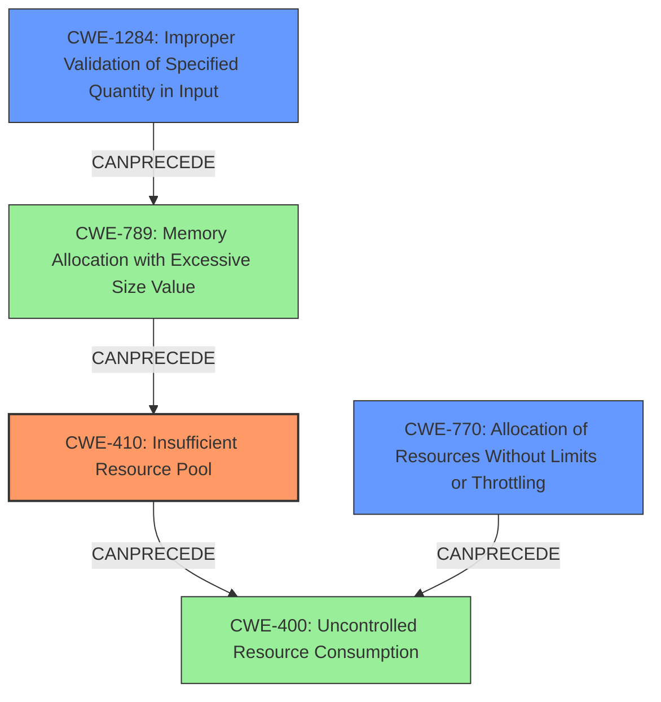

# Final Resolution for CVE-2021-0233

# Summary
| CWE ID | CWE Name | Confidence | CWE Abstraction Level | CWE Vulnerability Mapping Label | CWE-Vulnerability Mapping Notes |
|---|---|---|---|---|---|
| **CWE-410** | **Insufficient Resource Pool** | 0.75 | Base | Allowed | Primary CWE |
| CWE-1284 | Improper Validation of Specified Quantity in Input | 0.65 | Base | Allowed | Secondary Candidate |
| CWE-770 | Allocation of Resources Without Limits or Throttling | 0.60 | Base | Allowed | Secondary Candidate |

## Evidence and Confidence

*   **Confidence Score:** 0.70
*   **Evidence Strength:** MEDIUM

## Relationship Analysis
The primary CWE is **CWE-410 (Insufficient Resource Pool)**, which is a Base-level CWE. It is related to the Class-level CWE **CWE-400 (Uncontrolled Resource Consumption)** as an insufficient resource pool can lead to uncontrolled resource consumption. **CWE-770 (Allocation of Resources Without Limits or Throttling)** is also a Base-level CWE and is related to **CWE-400 (Uncontrolled Resource Consumption)**. **CWE-1284 (Improper Validation of Specified Quantity in Input)**, a Base-level CWE, can precede **CWE-789 (Memory Allocation with Excessive Size Value)**, which in turn can lead to **CWE-410 (Insufficient Resource Pool)**.

## Vulnerability Chain
The vulnerability chain begins with the receipt of specific packets at a high rate. If these packets contain malformed data, specifically related to quantities, and the system fails to properly validate these quantities (**CWE-1284**), this can lead to excessive memory allocation (**CWE-789**), which exacerbates the **CWE-410 (Insufficient Resource Pool)** condition. The result is a Denial of Service (DoS) due to the FFEB crash.

## Summary of Analysis
The initial analysis correctly identified **CWE-410 (Insufficient Resource Pool)** as a strong candidate due to the vulnerability description explicitly mentioning a high rate of packets causing a Denial of Service. The criticism highlighted the potential involvement of input validation, which led to the inclusion of **CWE-1284 (Improper Validation of Specified Quantity in Input)** as a secondary candidate.

The selection of **CWE-410 (Insufficient Resource Pool)** as the primary CWE is based on the direct evidence from the vulnerability description: "sending a high rate of specific packets to the device, resulting in a Forwarding Engine Board (FFEB) crash." This strongly suggests that the device's resource pool is inadequate to handle the incoming traffic.

The addition of **CWE-1284 (Improper Validation of Specified Quantity in Input)** addresses the possibility that the "specific packets" are crafted in a way that exploits a weakness in input validation related to quantities such as size or length. This is a plausible scenario, especially if the excessive memory allocation is triggered by malformed packets.

The confidence score for **CWE-410 (Insufficient Resource Pool)** has been slightly reduced to 0.75 to reflect the uncertainty introduced by the potential involvement of input validation. The confidence score for **CWE-1284 (Improper Validation of Specified Quantity in Input)** is 0.65, reflecting the possibility that this CWE is contributing to the vulnerability. **CWE-770 (Allocation of Resources Without Limits or Throttling)** remains a secondary candidate with a confidence score of 0.60, as the allocation of resources without limits or throttling could exacerbate the issue.

The selected CWEs are at the optimal level of specificity because they are Base-level CWEs that directly address the root causes and contributing factors of the vulnerability.