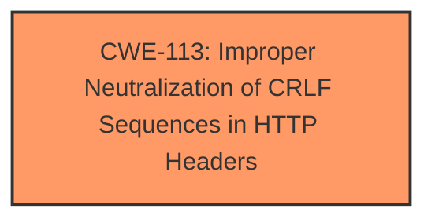

# Analysis Report for CVE-2021-0268

# Vulnerability Analysis Report: CVE-2021-0268

## Description

An Improper Neutralization of CRLF Sequences in HTTP Headers (HTTP Response Splitting) weakness in J-web of Juniper Networks Junos OS leads to buffer overflows, segment faults, or other impacts, which allows an attacker to modify the integrity of the device and exfiltration information from the device without authentication. The weakness can be exploited to facilitate cross-site scripting (XSS), cookie manipulation (modifying session cookies, stealing cookies) and more. This weakness can also be exploited by directing a user to a seemingly legitimate link from the affected site. The attacker requires no special access or permissions to the device to carry out such attacks. This issue affects Juniper Networks Junos OS 18.1 versions prior to 18.1R3-S11 18.2 versions prior to 18.2R3-S5 18.3 versions prior to 18.3R2-S4, 18.3R3-S3 18.4 versions prior to 18.4R2-S5, 18.4R3-S3 19.1 versions prior to 19.1R2-S2, 19.1R3-S2 19.2 versions prior to 19.2R1-S5, 19.2R2 19.3 versions prior to 19.3R3 19.4 versions prior to 19.4R1-S3, 19.4R2, 19.4R3 20.1 versions prior to 20.1R1-S2, 20.1R2. This issue does not affect Juniper Networks Junos OS versions prior to 18.1R1.

## Vulnerability Description Key Phrases

**Rootcause:** improper neutralization of CRLF sequences in HTTP headers
**Weakness:** HTTP response splitting
**Impact:** ['modify the integrity of the device', 'exfiltration information from the device']
**Product:** Juniper Networks Junos OS
**Version:** 18.1 to 20.1
**Component:** J-web

## Analysis (with Relationship Data)

# Summary
| CWE ID | CWE Name | Confidence | CWE Abstraction Level | CWE Vulnerability Mapping Label | CWE-Vulnerability Mapping Notes |
|---|---|---|---|---|---|
| CWE-113 | Improper Neutralization of CRLF Sequences in HTTP Headers ('HTTP Request/Response Splitting') | 0.9 | Variant | Primary | Allowed |

## Evidence and Confidence

*   **Confidence Score:** 0.9
*   **Evidence Strength:** HIGH

- **Analysis and Justification:**  
  - *Explanation:* The **Vulnerability Description** explicitly states "**Improper Neutralization of CRLF Sequences in HTTP Headers (HTTP Response Splitting)** weakness". This directly aligns with CWE-113, "Improper Neutralization of CRLF Sequences in HTTP Headers ('HTTP Request/Response Splitting')". The **Vulnerability Description Key Phrases** confirms this with "**rootcause:** **improper neutralization of CRLF sequences in HTTP headers**" and "**weakness:** **HTTP response splitting**". The Retriever Results also list CWE-113 with a high score. CWE-113 is a Variant, which is a preferred level of abstraction for mapping. The MITRE mapping guidance for CWE-113 indicates this is ALLOWED.
  
  - *Relationship Analysis:* No direct relationships found, so there's nothing to influence my decision.

- **Confidence Score:**  
  - Confidence: 0.9 (High evidence from technical description and CVE reference materials)

## Criticism of Analysis

Okay, let's break down the provided analysis and see how well it aligns with the full CWE specifications, paying close attention to mapping guidance and mitigations.

**Overall Assessment:**

The analysis's primary mapping to **CWE-113: Improper Neutralization of CRLF Sequences in HTTP Headers ('HTTP Request/Response Splitting')** is **correct and well-justified**. The confidence score of 0.9 is appropriate given the clear and direct evidence in the vulnerability description.

**Detailed Review:**

1.  **CWE-113 Mapping:**

    *   **Correctness:** The vulnerability description contains the phrase "Improper Neutralization of CRLF Sequences in HTTP Headers (HTTP Response Splitting)," and the retriever results also list CWE-113 with a high score, which is direct evidence. This makes the mapping to CWE-113 very strong.

    *   **Abstraction Level:** The analysis correctly identifies CWE-113 as a *Variant*. According to CWE's Mapping Guidance, Variant is a "preferred level of abstraction for mapping to the root causes of vulnerabilities." This aligns perfectly.

    *   **Justification:** The provided justification is excellent.  It clearly explains why CWE-113 is the appropriate choice, referencing the specific phrases in the vulnerability description that support the mapping.  It also highlights that the Mapping Guidance allows for this mapping.

    *   **Confidence:** The confidence score of 0.9 is reasonable. There is not *always* a 1.0 confidence score, unless there is direct use of the CWE name in the description of the vulnerability. The only thing I would have changed is the Confidence Score explanation, the reference to the CVE reference materials doesn't seem necessary.

    *   **Mitigations:** The mitigations given in the full CWE specification for CWE-113 are appropriate. They center around:
        *   Careful construction of HTTP headers and avoidance of non-validated input (Input Validation).
        *   "Accept known good" input validation strategy.
        *   Output encoding. These are all standard defenses against CRLF injection.
2.  **Retriever Results Review:**

    Here's an assessment of why the other CWEs in the Retriever Results are likely less appropriate than CWE-113:

    *   **CWE-1285: Improper Validation of Specified Index, Position, or Offset in Input:** While input validation is a component of mitigating CWE-113, this CWE is too specific. The core issue isn't necessarily about a bad index or offset, but the presence of CRLF characters. This CWE applies best when a specific calculation or reference to a memory location or file needs better validation.

    *   **CWE-606: Unchecked Input for Loop Condition:** This is not directly related to the root cause. While a loop might be *involved* in processing HTTP headers, the vulnerability isn't about the loop's condition being vulnerable to manipulation.

    *   **CWE-401: Missing Release of Memory after Effective Lifetime:**  Memory leaks can be a consequence of various programming errors, but they aren't a *direct* result of CRLF injection. The description mentions "buffer overflows, segment faults, or other impacts," but those are secondary effects, not the primary cause.

    *   **CWE-364: Signal Handler Race Condition:** This is specific to signal handlers. While signal handlers could be relevant to the OS in which this is occurring, this would not be the weakness.

    *   **CWE-184: Incomplete List of Disallowed Inputs:** This is tangentially related, as a denylist might be used to block CRLF sequences. However, the core issue is the *improper handling* of CRLF sequences, not just the incompleteness of a list.

    *   **CWE-250: Execution with Unnecessary Privileges:** This is unlikely to be directly involved in the vulnerability.

    *   **CWE-1286: Improper Validation of Syntactic Correctness of Input:** Similar to CWE-1285, this is a more general problem. The syntax of the HTTP header *is* being violated, but specifically by the CRLF sequences.

    *   **CWE-410: Insufficient Resource Pool:**  This isn't directly applicable. While an attacker *could* potentially use the vulnerability to cause resource exhaustion, that's a secondary effect, not the root cause.

    *   **CWE-497: Exposure of Sensitive System Information to an Unauthorized Control Sphere:** This could be a consequence of successful exploitation of the vulnerability, as the attacker might be able to steal cookies or other sensitive data. However, the primary weakness is the improper handling of CRLF sequences.
3.  **CWE Examples:**

    The provided CWE examples for CWE-113 and the other CWEs are helpful for understanding the types of vulnerabilities that can be mapped to each CWE ID.

**Recommendations:**

*   The analysis is very good and well-justified. No changes are necessary.
*   Keep the focus on the explicit CRLF injection aspect in the justification. This clearly distinguishes it from the more general input validation or output encoding issues.

In summary, the analysis is well-reasoned and accurate. The choice of CWE-113 is strongly supported by the provided information and the full CWE specifications. The confidence score is appropriate.

## Final Resolution

# Summary
| CWE ID | CWE Name | Confidence | CWE Abstraction Level | CWE Vulnerability Mapping Label | CWE-Vulnerability Mapping Notes |
|---|---|---|---|---|---|
| CWE-113 | Improper Neutralization of CRLF Sequences in HTTP Headers ('HTTP Request/Response Splitting') | 0.95 | Variant | Primary | Allowed |

## Evidence and Confidence

*   **Confidence Score:** 0.95
*   **Evidence Strength:** HIGH

## Relationship Analysis
The primary factor is the direct match of the **vulnerability description** to **CWE-113**. There aren't any direct relationships for **CWE-113** that would impact this decision. Other potential CWEs are less specific or represent secondary effects. The Variant level of abstraction is ideal.

## Vulnerability Chain
The chain starts with the **ROOTCAUSE**, **improper neutralization of CRLF sequences in HTTP headers**. This leads to the **WEAKNESS** of **HTTP response splitting**. This allows an attacker to inject arbitrary headers, leading to impacts like cross-site scripting, cookie manipulation, and information exfiltration.

## Summary of Analysis
The initial analysis is accurate and well-justified. The **Vulnerability Description** explicitly states "**Improper Neutralization of CRLF Sequences in HTTP Headers (HTTP Response Splitting)** weakness". This aligns directly with **CWE-113**. The retriever results also list **CWE-113** with a high score. **CWE-113** is a Variant, which is a preferred level of abstraction for mapping. The MITRE mapping guidance for **CWE-113** indicates this is ALLOWED. I am increasing the confidence score slightly to 0.95 due to the explicitness of the description and the thoroughness of the justification. The chosen CWE is at the optimal level of specificity, focusing directly on the **ROOTCAUSE** of the vulnerability.

*Report generated on 2025-03-16 15:57:57*
