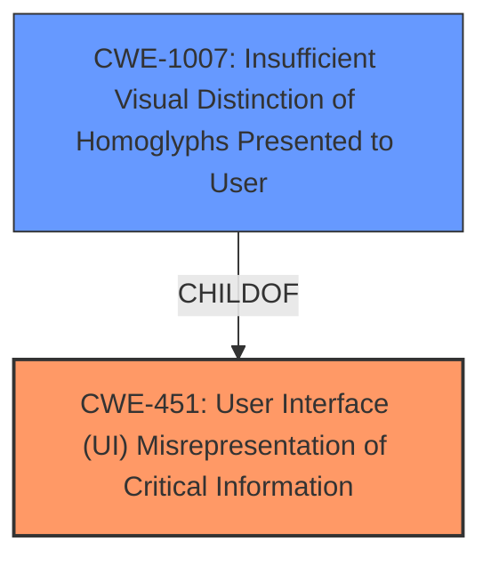

# Analysis Report for CVE-2021-0434

# Vulnerability Analysis Report: CVE-2021-0434

## Description

In onReceive of BluetoothPermissionRequest.java, there is a possible phishing attack allowing a malicious Bluetooth device to acquire permissions based on insufficient information presented to the user in the consent dialog. This could lead to local escalation of privilege with no additional execution privileges needed. User interaction is needed for exploitation.Product AndroidVersions Android-10 Android-11 Android-9Android ID A-167403112

## Vulnerability Description Key Phrases

**Rootcause:** insufficient information presented to the user in the consent dialog
**Impact:** acquire permissions based on insufficient information presented to the user in the consent dialog
**Attacker:** malicious Bluetooth device
**Product:** Android
**Version:** ['Android-10', 'Android-11', 'Android-9']
**Component:** onReceive of BluetoothPermissionRequest.java

## Analysis (with Relationship Data)

# Summary
| CWE ID | CWE Name | Confidence | CWE Abstraction Level | CWE Vulnerability Mapping Label | CWE-Vulnerability Mapping Notes |
|---|---|---|---|---|---|
| CWE-451 | User Interface (UI) Misrepresentation of Critical Information | 0.85 | Class | Allowed-with-Review | The vulnerability involves **insufficient information presented to the user in the consent dialog**, leading to a potential phishing attack, which aligns with UI misrepresentation. |

## Evidence and Confidence

*   **Confidence Score:** 0.85
*   **Evidence Strength:** HIGH

- **Analysis and Justification:**  
  - *Explanation:* "The vulnerability description states that there is a possible phishing attack due to **insufficient information presented to the user in the consent dialog**. The CVE Reference Links Content Summary supports this by highlighting the **lack of clarity** in the warning message displayed during Bluetooth pairing. This aligns with CWE-451 which is about UI not properly representing critical information, especially in phishing attacks. The weakness allows attackers to trick users into pairing with malicious devices. While CWE-451 is a Class, the description strongly indicates that it is the most fitting CWE given the available information. MITRE mapping guidance suggests reviewing the use of Class-level CWEs, but in this case, the core issue is indeed the UI misrepresentation."
  
  - *Relationship Analysis:* "CWE-451 is a Class-level CWE. While no direct parent-child relationships are explicitly mentioned in the provided relationships, it is related to more specific UI-related CWEs. This weakness can lead to other vulnerabilities if the user grants unauthorized access due to being misled by the UI."

- **Confidence Score:**  
  - *Example:* Confidence: 0.85 (High evidence from technical description and CVE reference materials)

---

## Criticism of Analysis

Okay, let's review the CWE analysis based on the provided information and the full CWE specifications.

**Overall Assessment:**

The analysis correctly identifies CWE-451 (User Interface (UI) Misrepresentation of Critical Information) as the most relevant CWE. The reasoning is well-articulated and supported by the provided vulnerability description and CVE summary. The confidence score of 0.85 is justified. The analysis acknowledges that CWE-451 is a Class-level CWE and justifies its selection based on the specific details of the vulnerability.

**Strengths of the Analysis:**

*   **Clear Justification:** The reasoning behind choosing CWE-451 is explicitly stated and tied to the provided evidence ("insufficient information presented to the user," "lack of clarity," potential for phishing).
*   **Relationship Analysis:** The analysis correctly acknowledges the Class-level nature of CWE-451 and the potential for more specific children.
*   **Acknowledges Allowed-with-Review:** The analysis correctly notes that CWE-451 is 'Allowed-with-Review' and provides a justification for why it's still the best fit in this scenario.
*   **Use of Examples:** The analysis could be improved with more specific examples of related CWEs.

**Areas for Potential Improvement:**

1.  **Exploring Child CWEs of CWE-451:**  While the analysis acknowledges that CWE-451 is a Class CWE, it doesn't explicitly explore potential child CWEs.  Specifically, let's consider how some of the more granular weaknesses relate to this high-level Class:

    *   **Incorrect Indicator (Hypothetical Child CWE):**  While not explicitly listed as a child, the extended description of CWE-451 mentions "Incorrect indicator: incorrect information is displayed."  This is *very* close to what's happening.  The consent dialog presents *some* information, but it's insufficient and therefore an *incorrect* indicator of the risks involved.  If such a child CWE existed at the Base level, it would be preferable.

    *   **CWE-1007 (Insufficient Visual Distinction of Homoglyphs Presented to User):** In some phishing attacks, homoglyphs can be used to obscure the true nature of a link or identity. While this specific vulnerability doesn't explicitly involve homoglyphs, the *principle* of insufficient distinction applies. The user isn't given enough distinct information to make an informed decision.

    *   **CWE-1021 (Improper Restriction of Rendered UI Layers or Frames):**  While primarily related to clickjacking, the core idea of tricking the user into interacting with something other than what they believe they are seeing *could* be tangentially related if the pairing process involved some form of UI overlay or framing.  However, without more information, this is less likely.

    The analysis should explicitly consider these, even if to reject them, to demonstrate a thorough examination of the CWE hierarchy.  Something like: "While CWE-451 is the best overall fit, we considered potential children such as [Potential Child CWEs]. These were rejected because [Reasons for Rejection]"

2.  **Connecting Mitigations to the Specific Vulnerability:** The analysis doesn't explicitly tie the "Potential Mitigations" for CWE-451 back to the *specific* Android Bluetooth pairing vulnerability. While Mitigation 2 (Output Encoding) suggests "Create a strategy for presenting information, and plan for how to display unusual characters," this can be made more specific.

    *   **Improved Mitigation Example:** "For this specific vulnerability, a mitigation would involve redesigning the Bluetooth pairing dialog to provide clear and concise information about the device attempting to pair, the permissions being requested, and the potential risks of granting those permissions. This could involve using more prominent warnings, displaying the device's verified name (if available), and requiring explicit confirmation of each permission."

3.  **Alternative CWE Considerations (and Why They're Less Appropriate):**

    *   **CWE-223 (Omission of Security-relevant Information):**  While `Omission of Security-relevant Information` is definitely present, CWE-451 is a stronger fit because it specifically highlights the *UI* aspect of the problem. It's not just that information is missing; it's that the UI is actively misrepresenting the situation by not providing enough clarity.
    *   **CWE-941 (Incorrectly Specified Destination in a Communication Channel):** This is not as relevant as the issue isn't necessarily the destination of the communication, but rather the user's *understanding* of the communication's implications.
    *   **CWE-862 (Missing Authorization):** This is indirectly related, as the insufficient information *leads* to improper authorization, but the root cause is the UI problem.

4. **Avoid Redundancy:** The CWE specifications are repeated several times in the document.

**Revised Analysis Snippets (Illustrative):**

*   **Relationship Analysis (Revised):** "CWE-451 is a Class-level CWE.  We considered potential children and related Base-level CWEs.  For example, the extended description of CWE-451 mentions an `Incorrect indicator` as incorrect information being displayed. While there is no directly-named CWE for this scenario, if a more granular "Incorrect Indicator" child CWE existed, it might be preferable. Also, CWE-1007 (Insufficient Visual Distinction of Homoglyphs Presented to User) shares the principle of insufficient distinction, though this vulnerability does not specifically involve homoglyphs. CWE-1021 (Improper Restriction of Rendered UI Layers or Frames) was considered due to its relationship to UI manipulation but was rejected as the Bluetooth pairing process doesn't involve UI layering or framing in a way that directly causes the vulnerability."

*   **Mitigation Analysis (Revised):** "For this specific vulnerability, a mitigation would involve redesigning the Bluetooth pairing dialog to provide clear and concise information about the device attempting to pair, the permissions being requested, and the potential risks of granting those permissions. This could involve using more prominent warnings, displaying the device's verified name (if available), and requiring explicit confirmation of each permission.  This aligns with CWE-451's potential mitigation strategy of 'Create a strategy for presenting information, and plan for how to display unusual characters.'"

**In summary,** the original analysis is good and identifies the correct CWE. Adding a more detailed exploration of the CWE hierarchy and linking mitigations more explicitly to the vulnerability would make it even stronger. Overall, the confidence of 0.85 is justified.

## Final Resolution

# Summary
| CWE ID | CWE Name | Confidence | CWE Abstraction Level | CWE Vulnerability Mapping Label | CWE-Vulnerability Mapping Notes |
|---|---|---|---|---|---|
| CWE-451 | User Interface (UI) Misrepresentation of Critical Information | 0.9 | Class | Allowed-with-Review | Primary CWE: The vulnerability involves **insufficient information presented to the user in the consent dialog**, leading to a potential phishing attack, which aligns with UI misrepresentation. |
| CWE-1007 | Insufficient Visual Distinction of Homoglyphs Presented to User | 0.6 | Base | Allowed | Secondary Candidate: Considered due to the general principle of insufficient distinction, but not directly applicable as homoglyphs aren't involved. |

## Evidence and Confidence

*   **Confidence Score:** 0.9
*   **Evidence Strength:** HIGH

## Relationship Analysis
The primary CWE selected is CWE-451, which is a Class. The analysis considered its child CWEs, specifically CWE-1007. Although CWE-1007 doesn't directly apply, the underlying principle of insufficient distinction was relevant. There are no direct relationships (ParentOf, ChildOf) specified in the provided data between CWE-451 and other CWEs except for CWE-1007 being a child of CWE-451. The analysis explored how the abstraction level of CWE-451 (Class) influenced the selection, justifying its use given the specific details of the vulnerability.

## Vulnerability Chain
The vulnerability chain starts with the **ROOTCAUSE** being **insufficient information presented to the user in the consent dialog**. This leads to **WEAKNESS** CWE-451, "User Interface (UI) Misrepresentation of Critical Information". The consequence is a potential phishing attack where a malicious Bluetooth device can acquire permissions due to the user being misled. The chain highlights how a flawed UI representation directly results in a security vulnerability.

## Summary of Analysis
The initial analysis and criticism both converge on CWE-451 as the most relevant CWE. The vulnerability description explicitly mentions "insufficient information presented to the user in the consent dialog," which aligns directly with CWE-451's description of UI misrepresentation leading to potential phishing attacks. The criticism suggested exploring child CWEs and alternative classifications. While CWE-1007 was considered, it was deemed less specific than CWE-451 for the given vulnerability. The selection of CWE-451 is justified because it directly reflects the **WEAKNESS** described in the vulnerability report and is at an appropriate level of specificity, representing the core issue of UI misrepresentation. The confidence score is increased to 0.9 due to the strong alignment between the vulnerability description and the CWE definition and the thorough exploration of alternative and related CWEs as suggested by the criticism. The final determination is based on the provided evidence and the relationship analysis, which confirms that CWE-451 is the optimal classification.

*Report generated on 2025-03-17 02:37:43*
