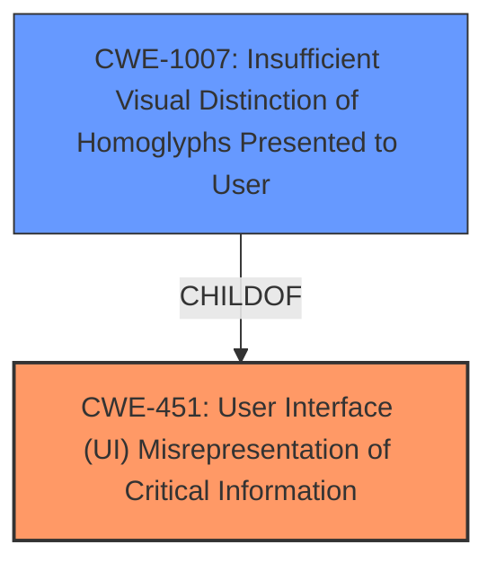

# Final Resolution for CVE-2021-0434

# Summary
| CWE ID | CWE Name | Confidence | CWE Abstraction Level | CWE Vulnerability Mapping Label | CWE-Vulnerability Mapping Notes |
|---|---|---|---|---|---|
| CWE-451 | User Interface (UI) Misrepresentation of Critical Information | 0.9 | Class | Allowed-with-Review | Primary CWE: The vulnerability involves **insufficient information presented to the user in the consent dialog**, leading to a potential phishing attack, which aligns with UI misrepresentation. |
| CWE-1007 | Insufficient Visual Distinction of Homoglyphs Presented to User | 0.6 | Base | Allowed | Secondary Candidate: Considered due to the general principle of insufficient distinction, but not directly applicable as homoglyphs aren't involved. |

## Evidence and Confidence

*   **Confidence Score:** 0.9
*   **Evidence Strength:** HIGH

## Relationship Analysis
The primary CWE selected is CWE-451, which is a Class. The analysis considered its child CWEs, specifically CWE-1007. Although CWE-1007 doesn't directly apply, the underlying principle of insufficient distinction was relevant. There are no direct relationships (ParentOf, ChildOf) specified in the provided data between CWE-451 and other CWEs except for CWE-1007 being a child of CWE-451. The analysis explored how the abstraction level of CWE-451 (Class) influenced the selection, justifying its use given the specific details of the vulnerability.

## Vulnerability Chain
The vulnerability chain starts with the **ROOTCAUSE** being **insufficient information presented to the user in the consent dialog**. This leads to **WEAKNESS** CWE-451, "User Interface (UI) Misrepresentation of Critical Information". The consequence is a potential phishing attack where a malicious Bluetooth device can acquire permissions due to the user being misled. The chain highlights how a flawed UI representation directly results in a security vulnerability.

## Summary of Analysis
The initial analysis and criticism both converge on CWE-451 as the most relevant CWE. The vulnerability description explicitly mentions "insufficient information presented to the user in the consent dialog," which aligns directly with CWE-451's description of UI misrepresentation leading to potential phishing attacks. The criticism suggested exploring child CWEs and alternative classifications. While CWE-1007 was considered, it was deemed less specific than CWE-451 for the given vulnerability. The selection of CWE-451 is justified because it directly reflects the **WEAKNESS** described in the vulnerability report and is at an appropriate level of specificity, representing the core issue of UI misrepresentation. The confidence score is increased to 0.9 due to the strong alignment between the vulnerability description and the CWE definition and the thorough exploration of alternative and related CWEs as suggested by the criticism. The final determination is based on the provided evidence and the relationship analysis, which confirms that CWE-451 is the optimal classification.