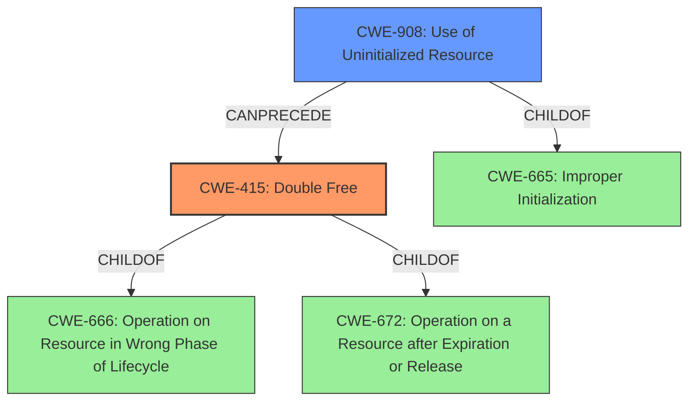

# Final Resolution for CVE-2021-0473

# Summary
| CWE ID | CWE Name | Confidence | CWE Abstraction Level | CWE Vulnerability Mapping Label | CWE-Vulnerability Mapping Notes |
|---|---|---|---|---|---|
| CWE-415 | Double Free | 0.95 | Variant | Primary | Allowed |
| CWE-908 | Use of Uninitialized Resource | 0.9 | Base | Secondary | Allowed |

## Evidence and Confidence

*   **Confidence Score:** 0.95
*   **Evidence Strength:** HIGH

## Relationship Analysis
The primary relationship identified is that **CWE-908 (Use of Uninitialized Resource)** can precede **CWE-415 (Double Free)**. The **uninitialized data** leads to an incorrect state where the same memory is freed twice.
CWE-415 is a variant of CWE-666 (Operation on Resource in Wrong Phase of Lifecycle) and CWE-672 (Operation on a Resource after Expiration or Release), indicating it's a specific type of lifecycle issue.
CWE-908 is a child of CWE-665 (Improper Initialization), which means it is a specific type of initialization issue.
The abstraction levels (Variant for CWE-415, Base for CWE-908) are appropriate for mapping to the root causes.

## Vulnerability Chain
The vulnerability chain starts with **CWE-908 (Use of Uninitialized Resource)**, where the product uses **uninitialized data**. This leads to **CWE-415 (Double Free)**, where the same memory is freed twice due to the incorrect state caused by the **uninitialized data**. The final impact is remote code execution.
- **Root Cause:** CWE-908: Use of Uninitialized Resource
- **Weakness:** CWE-415: Double Free
- **Impact:** Remote Code Execution

## Summary of Analysis
The initial analysis correctly identifies **CWE-415 (Double Free)** as the primary weakness and **CWE-908 (Use of Uninitialized Resource)** as a contributing factor. The vulnerability description explicitly states "a possible **double free** due to **uninitialized data**." This aligns perfectly with the definitions of both CWEs.

The relationship analysis confirms that **CWE-908** can lead to **CWE-415**, as the **uninitialized data** creates a condition where the same memory is freed twice. The abstraction levels (Variant for **CWE-415**, Base for **CWE-908**) are also appropriate.

The criticism suggests considering more specific children of **CWE-908**, such as **CWE-457 (Use of Uninitialized Variable)**. However, the vulnerability description refers to "uninitialized data" in a broader sense, not specifically a variable. Therefore, **CWE-908** remains the most accurate and specific classification. The suggestion to explicitly call out the chaining from **CWE-908** to **CWE-415** is valid and incorporated into the vulnerability chain analysis.

Based on the evidence and relationship analysis, the selected CWEs are at the optimal level of specificity. The confidence score is increased to 0.95 to reflect the strong alignment between the vulnerability description and the CWE definitions, as well as the clear understanding of the vulnerability chain. The mapping guidance for both CWEs indicates that they are ALLOWED for this type of vulnerability.