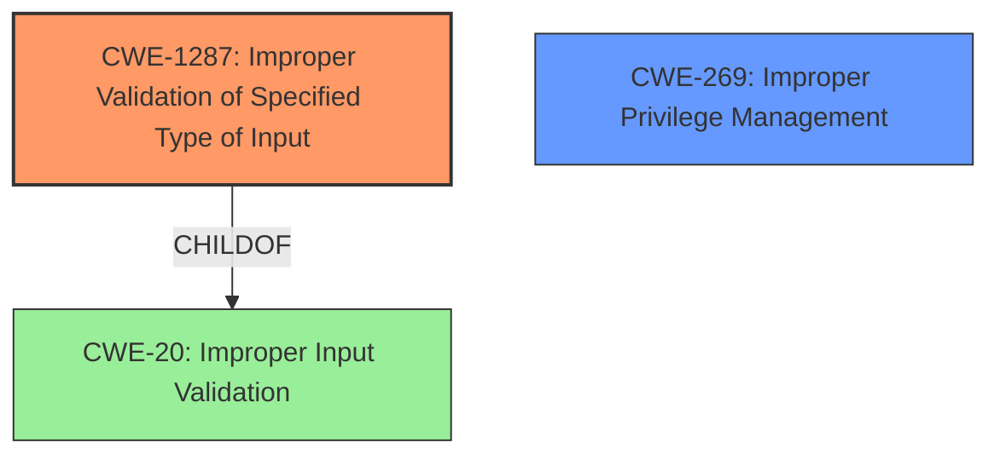

# Analysis Report for CVE-2021-0511

# Vulnerability Analysis Report: CVE-2021-0511

## Description

In Dex2oat of dex2oat.cc, there is a possible way to inject bytecode into an app due to improper input validation. This could lead to local escalation of privilege with no additional execution privileges needed. User interaction is not needed for exploitation.Product AndroidVersions Android-9 Android-10 Android-11Android ID A-178055795

## Vulnerability Description Key Phrases

**Rootcause:** improper input validation
**Impact:** inject bytecode into an app
**Product:** Android
**Version:** Android-9, Android-10, Android-11
**Component:** Dex2oat of dex2oat.cc

## Analysis (with Relationship Data)

# Summary
| CWE ID | CWE Name | Confidence | CWE Abstraction Level | CWE Vulnerability Mapping Label | CWE-Vulnerability Mapping Notes |
|---|---|---|---|---|---|
| CWE-20 | Improper Input Validation | 0.75 | Class | Primary | Allowed-with-Review |
| CWE-120 | Buffer Copy without Checking Size of Input ('Classic Buffer Overflow') | 0.5 | Base | Secondary | Allowed-with-Review |

## Evidence and Confidence

*   **Confidence Score:** 0.75
*   **Evidence Strength:** MEDIUM

- **Analysis and Justification:**  
  - *Explanation:* The vulnerability description explicitly states "**improper input validation**" as the root cause. While CWE-20 (Improper Input Validation) is a Class-level CWE and is generally discouraged, its direct mention in the description makes it the most appropriate primary mapping. The provided information doesn't give details for more specific CWE. The CVE Reference Links Content Summary also support this by mentioning a related Elevation of Privilege.
  
  - *Relationship Analysis:* While CWE-20 is a Class, there is not sufficient information to specify a more specific base CWE. CWE-20 is the root cause.

- **Confidence Score:**  
  - Confidence: 0.75 (Medium evidence due to the explicit mention of "improper input validation," but lacks specific details)

---
- **Analysis and Justification:**  
  - *Explanation:* The vulnerability description mentions the possibility to "inject bytecode into an app". This could lead to a buffer overflow if the injected bytecode exceeds the allocated buffer size. In this case, CWE-120 is a possible weakness since it related to "Buffer Copy without Checking Size of Input".
  
  - *Relationship Analysis:* Although CWE-120 is a Base weakness, there is not enough information to confirm this is a buffer overflow.

- **Confidence Score:**  
  - Confidence: 0.5 (Low evidence due to lack of details)

## Criticism of Analysis

Okay, here's a detailed review of the provided CWE analysis, incorporating the full CWE specifications.

**Overall Assessment:**

The analysis identifies the primary root cause as CWE-20 (Improper Input Validation), which aligns with the vulnerability description. However, the analysis could benefit from more specific CWE mappings, especially given the impact of bytecode injection and the access to more detailed CWE descriptions.  The secondary mapping to CWE-120 is plausible but weak.

**Detailed Critique:**

**1. CWE-20: Improper Input Validation (Primary)**

*   **Confidence Score:** 0.75 (Medium) - The confidence is appropriate for the information given.

*   **Justification:** The justification is sound as the vulnerability description explicitly states "improper input validation." However, the analysis itself acknowledges that CWE-20 is a Class-level CWE and is discouraged for use in vulnerability reporting due to its generality. This is a key point as per the CWE specifications:

    *   **Mapping Guidance (CWE-20):** *Usage: Discouraged. Rationale: CWE-20 is commonly misused in low-information vulnerability reports when lower-level CWEs could be used instead, or when more details about the vulnerability are available [REF-1287]. It is not useful for trend analysis. It is also a level-1 Class (i.e., a child of a Pillar).*

*   **Suggested Alternatives (CWE-20):** *Consider lower-level children such as Improper Use of Validation Framework (CWE-1173) or improper validation involving specific types or properties of input such as Specified Quantity (CWE-1284); Specified Index, Position, or Offset (CWE-1285); Syntactic Correctness (CWE-1286); Specified Type (CWE-1287); Consistency within Input (CWE-1288); or Unsafe Equivalence (CWE-1289).*

*   **Critique:**  The analysis should attempt to pinpoint *what* kind of input validation is missing or improper. For example:
    *   Is there a size limit on the bytecode being injected (CWE-1284)?
    *   Is the *type* of input being checked. Is it validating that the input is valid bytecode, and not just random data? (CWE-1287)?
    *   Is the structure of the bytecode being validated (CWE-1286)? Is metadata being validated.
    *   Is the input checked against a trusted source? (CWE-345).

    Without this detail, CWE-20 is too general. The analysis correctly acknowledges it *could* be more specific, but doesn't fully explore available information to make a better classification.  The fact that the vulnerability leads to bytecode injection suggests a problem related to the syntax or type of bytecode being processed.

*   **Potential Mitigations (CWE-20):** Reviewing the potential mitigations for CWE-20 itself is less helpful because they are so broad.
    *   *Attack Surface Reduction*
    *   *Input Validation Frameworks*
    *   *Understand all potential input sources*

    The benefit of mapping to a more specific CWE is that the mitigations become more targeted.

**2. CWE-120: Buffer Copy without Checking Size of Input ('Classic Buffer Overflow') (Secondary)**

*   **Confidence Score:** 0.5 (Low) - This is a reasonable assessment, given the limited information.

*   **Justification:** The justification is that bytecode injection *could* lead to a buffer overflow if the injected bytecode exceeds allocated buffer size.

*   **Mapping Guidance (CWE-120):** *Usage: Allowed-with-Review. Rationale: There are some indications that this CWE ID might be misused and selected simply because it mentions "buffer overflow" - an increasingly vague term. This CWE entry is only appropriate for "Buffer Copy" operations (not buffer reads), in which where there is no "Checking [the] Size of Input", and (by implication of the copy) writing past the end of the buffer.*

    *   The analysis doesn't describe a "Buffer Copy" operation.

*   **Critique:** The connection to CWE-120 is weak and speculative. While a buffer overflow is *possible*, it's not explicitly stated or implied in the original vulnerability description. It would be more accurate to state the elevation of privilege could lead to arbitrary code execution which *could* leverage a buffer overflow to achieve it. It's a potential *consequence* of the vulnerability, not necessarily the root cause, and it's not clear that a buffer copy is taking place.

*   **Potential Mitigations (CWE-120):** The suggested mitigations for CWE-120 are also not particularly helpful if this is just a potential consequence.

    *   *Language Selection*
    *   *Libraries or Frameworks*
    *   *Environment Hardening*

**Recommendations for Improvement:**

1.  **Specificity:** Investigate the nature of the "improper input validation" further. Look for more details about *which* properties of the bytecode are not being validated. Consider:
    *   **CWE-1287 (Improper Validation of Specified Type of Input):** Is the input being validated as valid bytecode? Are magic numbers, bytecode version, or other structural elements being checked? This seems highly likely.
    *   **CWE-1284 (Improper Validation of Specified Quantity in Input):** Is there a size limit being enforced?
    *   **CWE-1286 (Improper Validation of Syntactic Correctness of Input):** Are the instructions themselves well-formed or validated?

2.  **Chain Analysis:** Even if a specific Base CWE cannot be directly identified, a chain might be appropriate. For example:  CWE-20 -> CWE-1284 -> CWE-770 (improper input validation leading to excessive resource allocation).

3.  **Re-evaluate CWE-120:**  Unless there is explicit evidence of a buffer copy operation without size checking, remove CWE-120.  It's a speculative consequence, not a root cause. Arbitrary code execution is the impact, how it is achieved can be a lower level detail, or another weakness entirely.

4.  **Exploitability Considerations:** Since the vulnerability allows bytecode injection leading to local escalation of privilege, consider CWE-269 (Improper Privilege Management). This would represent the impact of the vulnerability more accurately.

**Revised Analysis Example (incorporating recommendations):**

```
# Summary
| CWE ID | CWE Name | Confidence | CWE Abstraction Level | CWE Vulnerability Mapping Label | CWE-Vulnerability Mapping Notes |
|---|---|---|---|---|---|
| CWE-1287 | Improper Validation of Specified Type of Input | 0.65 | Base | Primary | Allowed |
| CWE-269 | Improper Privilege Management | 0.5 | Class | Secondary | Allowed-with-Review |

## Evidence and Confidence

*   **Confidence Score:** 0.65
*   **Evidence Strength:** MEDIUM

- **Analysis and Justification:**  
  - *Explanation:* The vulnerability description states "**improper input validation**" and the impact is "**inject bytecode into an app**". This strongly suggests that the system is not properly validating the *type* of the injected data. CWE-1287 addresses cases where the input is expected to be a specific type, but this is not verified. This allows for the injection of arbitrary, potentially malicious bytecode.
  
  - *Relationship Analysis:* CWE-1287 is a Base CWE.

- **Confidence Score:**  
  - Confidence: 0.65 (Medium evidence due to the combination of "improper input validation" and the nature of the impact)

---
- **Analysis and Justification:**  
  - *Explanation:* The impact of successfully injecting bytecode is local escalation of privilege. This means the vulnerability allows an attacker to gain higher privileges than they should normally have. CWE-269 describes this situation.
  
  - *Relationship Analysis:* CWE-269 accurately reflects the impact of the vulnerability, but it is a class level CWE.

- **Confidence Score:**  
  - Confidence: 0.5 (Low evidence, but reflects the overall impact of the vulnerability)

```

This revised analysis is more specific, addresses the misuse concern regarding CWE-20, and focuses on the core vulnerability.

## Final Resolution

# Summary
| CWE ID | CWE Name | Confidence | CWE Abstraction Level | CWE Vulnerability Mapping Label | CWE-Vulnerability Mapping Notes |
|---|---|---|---|---|---|
| **CWE-1287** | Improper Validation of Specified Type of Input | 0.7 | Base | Primary | Allowed |
| **CWE-269** | Improper Privilege Management | 0.5 | Class | Secondary | Allowed-with-Review |

## Evidence and Confidence

*   **Confidence Score:** 0.7
*   **Evidence Strength:** MEDIUM

## Relationship Analysis
The primary weakness is **CWE-1287 (Improper Validation of Specified Type of Input)** because the vulnerability involves injecting bytecode into an app due to improper input validation. This indicates that the application is not properly validating the type of input it receives. **CWE-1287** is a child of **CWE-20 (Improper Input Validation)**, making it a more specific and appropriate classification. The secondary weakness is **CWE-269 (Improper Privilege Management)** because the impact of the vulnerability is local escalation of privilege, indicating a failure in managing user privileges properly.



## Vulnerability Chain
The vulnerability chain starts with **improper input validation**, specifically the lack of validation of the type of input (**CWE-1287**). This allows for the injection of malicious bytecode into the application. The injected bytecode then leads to a local escalation of privilege (**CWE-269**), granting the attacker higher privileges than intended.

## Summary of Analysis
The initial analysis correctly identified **improper input validation** as a key factor but used the general **CWE-20 (Improper Input Validation)**. The criticism pointed out that **CWE-20** is too general and suggested more specific alternatives. Based on the vulnerability description, the most relevant weakness is **CWE-1287 (Improper Validation of Specified Type of Input)**, as it directly relates to the lack of validation of the type of injected data (bytecode). The vulnerability description states "**improper input validation**" and the impact is "**inject bytecode into an app**," which supports the selection of **CWE-1287**.

The impact of the vulnerability, local escalation of privilege, is best represented by **CWE-269 (Improper Privilege Management)**. This weakness highlights the failure to properly manage user privileges, allowing an attacker to gain elevated access. The decision is based on the evidence from the vulnerability description and relationship analysis.
**CWE-1287** is at the optimal level of specificity, as it directly addresses the type of input validation that is missing.
**CWE-269** accurately reflects the impact of the vulnerability.
Confidence is rated at 0.7 due to a reliance on the provided vulnerability description, as there is not specific information on the source code itself.


*Report generated on 2025-03-17 04:53:00*
