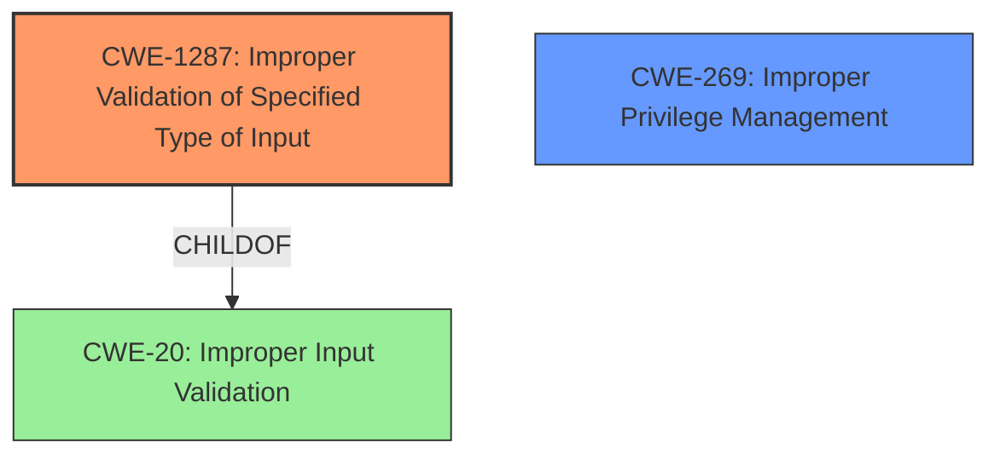

# Final Resolution for CVE-2021-0511

# Summary
| CWE ID | CWE Name | Confidence | CWE Abstraction Level | CWE Vulnerability Mapping Label | CWE-Vulnerability Mapping Notes |
|---|---|---|---|---|---|
| **CWE-1287** | Improper Validation of Specified Type of Input | 0.7 | Base | Primary | Allowed |
| **CWE-269** | Improper Privilege Management | 0.5 | Class | Secondary | Allowed-with-Review |

## Evidence and Confidence

*   **Confidence Score:** 0.7
*   **Evidence Strength:** MEDIUM

## Relationship Analysis
The primary weakness is **CWE-1287 (Improper Validation of Specified Type of Input)** because the vulnerability involves injecting bytecode into an app due to improper input validation. This indicates that the application is not properly validating the type of input it receives. **CWE-1287** is a child of **CWE-20 (Improper Input Validation)**, making it a more specific and appropriate classification. The secondary weakness is **CWE-269 (Improper Privilege Management)** because the impact of the vulnerability is local escalation of privilege, indicating a failure in managing user privileges properly.

## Vulnerability Chain
The vulnerability chain starts with **improper input validation**, specifically the lack of validation of the type of input (**CWE-1287**). This allows for the injection of malicious bytecode into the application. The injected bytecode then leads to a local escalation of privilege (**CWE-269**), granting the attacker higher privileges than intended.

## Summary of Analysis
The initial analysis correctly identified **improper input validation** as a key factor but used the general **CWE-20 (Improper Input Validation)**. The criticism pointed out that **CWE-20** is too general and suggested more specific alternatives. Based on the vulnerability description, the most relevant weakness is **CWE-1287 (Improper Validation of Specified Type of Input)**, as it directly relates to the lack of validation of the type of injected data (bytecode). The vulnerability description states "**improper input validation**" and the impact is "**inject bytecode into an app**," which supports the selection of **CWE-1287**.

The impact of the vulnerability, local escalation of privilege, is best represented by **CWE-269 (Improper Privilege Management)**. This weakness highlights the failure to properly manage user privileges, allowing an attacker to gain elevated access. The decision is based on the evidence from the vulnerability description and relationship analysis.
**CWE-1287** is at the optimal level of specificity, as it directly addresses the type of input validation that is missing.
**CWE-269** accurately reflects the impact of the vulnerability.
Confidence is rated at 0.7 due to a reliance on the provided vulnerability description, as there is not specific information on the source code itself.