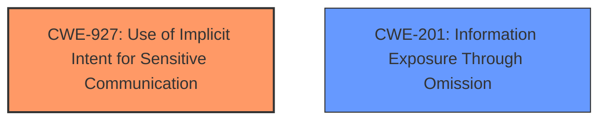

# Final Resolution for CVE-2021-0542

# Summary
| CWE ID | CWE Name | Confidence | CWE Abstraction Level | CWE Vulnerability Mapping Label | CWE-Vulnerability Mapping Notes |
|---|---|---|---|---|---|
| CWE-927 | Use of Implicit Intent for Sensitive Communication | 0.85 | Variant | Allowed | Primary CWE |
| CWE-201 | Information Exposure Through Omission | 0.70 | Base | Allowed | Secondary Candidate |

## Evidence and Confidence

*   **Confidence Score:** 0.85
*   **Evidence Strength:** HIGH

## Relationship Analysis
The primary CWE is now CWE-927 (Use of Implicit Intent for Sensitive Communication), a variant-level CWE, which is more specific than the original CWE-276. The initial analysis considered CWE-276 (Incorrect Default Permissions), which is a base-level CWE and a child of CWE-732 (Incorrect Permission Assignment for Critical Resource). The criticism pointed out that CWE-276 focuses on file permissions during installation, which is not the case here. The recommendation to consider CWE-732 was reasonable, but CWE-927 fits the description better. The secondary CWE is CWE-201 (Information Exposure Through Omission) which is a base-level CWE and related to the primary CWE by describing how the sensitive information is exposed.

## Vulnerability Chain
The vulnerability chain starts with the use of an implicit intent to broadcast sensitive Bluetooth addresses. The lack of proper permission checks on this broadcast leads to information exposure. Any application can listen to this broadcast and obtain Bluetooth addresses.

## Summary of Analysis
The initial analysis identified CWE-276 as the primary **WEAKNESS**, but the criticism correctly pointed out that this CWE is more relevant to file permissions during installation. The vulnerability description clearly states a "**missing permission check**" in `updateNotification` of `BeamTransferManager.java`, leading to "local **information disclosure** of paired Bluetooth addresses." After reviewing the CWE specifications and the retriever results, CWE-927 (Use of Implicit Intent for Sensitive Communication) emerged as a more appropriate primary CWE. This CWE accurately describes how the sensitive Bluetooth addresses are broadcast using an implicit intent without proper permission checks. The secondary CWE, CWE-201 (Information Exposure Through Omission), is used to describe the impact of the vulnerability, namely that sensitive information is being exposed. The selection of CWE-927 is at the optimal level of specificity because it directly addresses the **ROOTCAUSE** of the vulnerability.