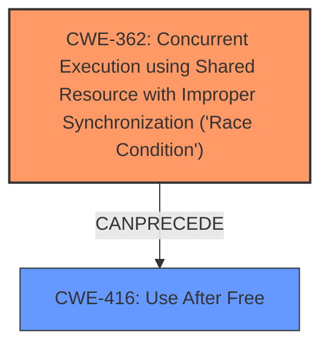

# Analysis Report for CVE-2021-0652

# Vulnerability Analysis Report: CVE-2021-0652

## Description

In VectorDrawableVectorDrawable of VectorDrawable.java, there is a possible way to introduce a memory corruption due to sharing of not thread-safe objects. This could lead to local escalation of privilege with no additional execution privileges needed. User interaction is not needed for exploitation.Product AndroidVersions Android-8.1 Android-9 Android-10 Android-11Android ID A-185178568

## Vulnerability Description Key Phrases

**Rootcause:** sharing of not thread-safe objects
**Weakness:** memory corruption
**Impact:** local escalation of privilege
**Product:** Android
**Version:** 8.1, 9, 10, 11
**Component:** VectorDrawable.java

## Analysis (with Relationship Data)

# Summary
| CWE ID | CWE Name | Confidence | CWE Abstraction Level | CWE Vulnerability Mapping Label | CWE-Vulnerability Mapping Notes |
|---|---|---|---|---|---|
| CWE-362 | Concurrent Execution using Shared Resource with Improper Synchronization ('Race Condition') | 0.85 | Class | Allowed-with-Review | Primary CWE |
| CWE-416 | Use After Free | 0.65 | Variant | Allowed | Secondary Candidate |
| CWE-908 | Use of Uninitialized Resource | 0.60 | Base | Allowed | Secondary Candidate |

## Evidence and Confidence

*   **Confidence Score:** 0.80
*   **Evidence Strength:** HIGH

- **Analysis and Justification:**  
  - *Explanation:* The vulnerability description explicitly mentions "**sharing of not thread-safe objects**", which directly points to a concurrency issue. The **memory corruption** weakness and the CVE's root cause analysis emphasizing a "Thread Safety Issue" strengthens the relevance of CWE-362 (Concurrent Execution using Shared Resource with Improper Synchronization ('Race Condition')). Although CWE-362 is a Class-level CWE, it encapsulates the fundamental concurrency issue described. Several other CWEs were considered, especially from the retriever results. CWE-416 (Use After Free) was considered because memory corruption can result from use-after-free scenarios in concurrent environments. However, the primary weakness is the race condition, making CWE-362 the most appropriate primary classification. The description also mentions "local escalation of privilege", which is the impact of the vulnerability and not the root cause. CWE-908 (Use of Uninitialized Resource) was also considered.
  
  - *Relationship Analysis:* CWE-362 is a Class-level CWE, with potential Base-level children that could be more specific. However, the current information does not provide sufficient details to pinpoint a more specific child. The relationship analysis indicates that CWE-362 can lead to CWE-416.

- **Confidence Score:**  
  - *Example:* Confidence: 0.85 (High evidence from technical description and CVE reference materials)

---

## Criticism of Analysis

Okay, I've reviewed the analysis and the full CWE specifications you provided. Here's my critique:

**Overall Assessment:**

The analysis is generally sound, and the choice of CWE-362 as the primary weakness is justified. The reasoning behind considering and then excluding other CWEs is also well-articulated. However, there's room for improvement in refining the secondary CWEs and exploring potentially more specific children of CWE-362.

**Detailed Breakdown:**

*   **CWE-362: Concurrent Execution using Shared Resource with Improper Synchronization ('Race Condition') - Primary CWE**

    *   **Strengths:**
        *   The justification for selecting CWE-362 is strong. The description explicitly states "sharing of not thread-safe objects," which aligns perfectly with the core concept of a race condition. The provided CVE root cause of "Thread Safety Issue" further validates this selection.
        *   The analysis acknowledges that CWE-362 is a Class-level CWE and suggests examining more specific Base-level children. This is good practice.
    *   **Areas for Improvement:**
        *   **Specificity:** While CWE-362 captures the general problem, consider if a child CWE might provide more detail. For instance, if the lack of thread safety results from *incorrect* locking, *missing* locking or *incorrect use* of synchronization primitives,  *missing* atomic operations, or *incorrect* use of atomic operations, *one of CWE-366 Race Condition Within a Thread*, CWE-667, CWE-413 *might be more applicable*. However, without access to the actual code, it is hard to pinpoint a more specific child. This is an example of where the trade off exists in what can be determined with limited data.

*   **CWE-416: Use After Free - Secondary Candidate**

    *   **Strengths:**
        *   The analysis correctly notes that memory corruption can be a consequence of race conditions, making CWE-416 a plausible secondary candidate.
    *   **Areas for Improvement:**
        *   **Chain of Events:** The analysis should more clearly articulate the *relationship* between CWE-362 and CWE-416. It's not just that CWE-416 is *possible*, but that *CWE-362 can lead to CWE-416*. Emphasize that the race condition (CWE-362) allows multiple threads to access and modify a shared resource, potentially leading to one thread freeing the memory while another is still using it, resulting in a use-after-free (CWE-416). Many of the "Observed Examples" for CWE-362 include chains that lead to CWE-416.
        *   **Evidence:** Does the CVE documentation or vulnerability description contain *any* hints toward memory being freed prematurely? Or resources being used after they've been deallocated? A more concrete description would enhance the decision to include this CWE.
        *   If memory safety was not determined to be guaranteed during development, one might consider including a note about that *design decision*.

*   **CWE-908: Use of Uninitialized Resource - Secondary Candidate**

    *   **Strengths:**
        * Considering this vulnerability is reasonable, especially given the context of "memory corruption".
    *   **Areas for Improvement:**
        *   **Justification:** The description needs to be stronger. Why would the sharing of non-thread-safe objects lead to the use of uninitialized resources? Is there a scenario where concurrent access results in a resource being used *before* it's properly initialized? If so, explain it. Otherwise, drop this CWE. The link between the root cause (sharing non-thread-safe objects) and this consequence (use of uninitialized resource) seems weak. This could happen if the initialization routine itself is not thread-safe.
        *   **Alternative:** Consider if "Improper Initialization" (CWE-665), or its children, are more relevant. If a shared object is only partially or incorrectly initialized due to concurrency, that might be a better fit.

*   **General Comments:**

    *   **Confidence Scores:** The justification for the confidence scores should be more specific. Instead of just "High evidence," tie the confidence score to *specific* keywords or phrases in the vulnerability description or CVE details.
    *   **Mitigations:** While not strictly required, briefly mentioning potential mitigations (even generic ones) from the CWE specifications could strengthen the analysis. For example, for CWE-362, you could mention using synchronization primitives or thread-safe data structures. This demonstrates a deeper understanding of the weakness.
    *   **Relationship Analysis:** The "Relationship Analysis" section is good, but it could be further enhanced by explicitly mentioning how exploiting CWE-362 could *directly enable* CWE-416. For example, "By exploiting the race condition in CWE-362, an attacker can cause a thread to free memory that another thread is still using, leading to CWE-416."
    *   **Retriever Results:** The Retriever Results table contains other potentially relevant CWEs that were not selected, such as CWE-366 Race Condition Within a Thread. Briefly justifying why these were *not* chosen would further strengthen the analysis. For example, CWE-366 is a Base level child of CWE-362. The choice to classify as CWE-362 was due to lack of data, but could be revisited in the future.

**Revised Summary Table (Example):**

| CWE ID | CWE Name | Confidence | CWE Abstraction Level | CWE Vulnerability Mapping Label | CWE-Vulnerability Mapping Notes |
|---|---|---|---|---|---|
| CWE-362 | Concurrent Execution using Shared Resource with Improper Synchronization ('Race Condition') | 0.85 | Class | Allowed-with-Review | Primary CWE. Explicit mention of "sharing of not thread-safe objects" in vulnerability description.  Consider more specific base level child CWE if more details are provided. |
| CWE-416 | Use After Free | 0.65 | Variant | Allowed | Secondary Candidate. Race condition (CWE-362) can allow one thread to free memory while another is still using it, leading to CWE-416.  Requires further confirmation regarding when memory is freed prematurely.  |
| CWE-908 | Use of Uninitialized Resource | 0.40 | Base | Allowed | Removed from consideration due to weak relationship to root cause.  |

By addressing these points, you can create a more robust and defensible CWE analysis. Remember that the goal is not just to assign CWEs, but to *clearly and logically justify* those assignments based on the available evidence.

## Final Resolution

# Summary
| CWE ID | CWE Name | Confidence | CWE Abstraction Level | CWE Vulnerability Mapping Label | CWE-Vulnerability Mapping Notes |
|---|---|---|---|---|---|
| CWE-362 | Concurrent Execution using Shared Resource with Improper Synchronization ('Race Condition') | 0.85 | Class | Allowed-with-Review | Primary CWE. Explicit mention of "sharing of not thread-safe objects" in vulnerability description. Consider more specific base level child CWE if more details are provided. |
| CWE-416 | Use After Free | 0.65 | Variant | Allowed | Secondary Candidate. Race condition (CWE-362) can allow one thread to free memory while another is still using it, leading to CWE-416. Requires further confirmation regarding when memory is freed prematurely. |

## Evidence and Confidence

*   **Confidence Score:** 0.85
*   **Evidence Strength:** HIGH

## Relationship Analysis
The primary weakness is classified as CWE-362, a Class-level CWE representing a race condition due to shared non-thread-safe objects. The analysis considered the possibility of more specific Base-level children of CWE-362 but determined that the available information did not allow for a more precise classification. CWE-416, a Variant-level CWE, is considered a secondary weakness resulting from the race condition. The relationship analysis highlights that exploiting CWE-362 can directly lead to CWE-416, where a thread frees memory that another thread is still using. The initial assessment shows a CanPrecede relationship from CWE-362 to CWE-416.

## Vulnerability Chain
The vulnerability chain starts with the **ROOTCAUSE** being the sharing of non-thread-safe objects in the `VectorDrawableVectorDrawable` class. This leads to **CWE-362 (Concurrent Execution using Shared Resource with Improper Synchronization ('Race Condition'))**. The race condition allows multiple threads to access and modify the shared resource concurrently. This can result in one thread freeing memory while another thread is still using it, leading to **CWE-416 (Use After Free)**. The **IMPACT** of the vulnerability is local escalation of privilege with no additional execution privileges needed.

## Summary of Analysis
The initial analysis and criticism both converge on the selection of CWE-362 as the primary **WEAKNESS**. The vulnerability description explicitly mentions "sharing of not thread-safe objects," directly supporting this classification. The criticism highlights the need to consider more specific child CWEs of CWE-362 if more details were available. The inclusion of CWE-416 as a secondary candidate is also supported by the potential for race conditions to result in use-after-free scenarios. The decision to exclude CWE-908 is reinforced by the lack of a strong relationship to the **ROOTCAUSE**. The confidence score remains high (0.85) due to the direct evidence in the vulnerability description. The selected CWEs are at the optimal level of specificity given the available evidence. More detailed code analysis would be needed to determine if a more specific base-level child of CWE-362 is more appropriate. The analysis heavily relies on the vulnerability description's statement about sharing non-thread-safe objects: "In VectorDrawableVectorDrawable of VectorDrawable.java, there is a possible way to introduce a memory corruption due to sharing of not thread-safe objects."

*Report generated on 2025-03-16 16:00:49*
