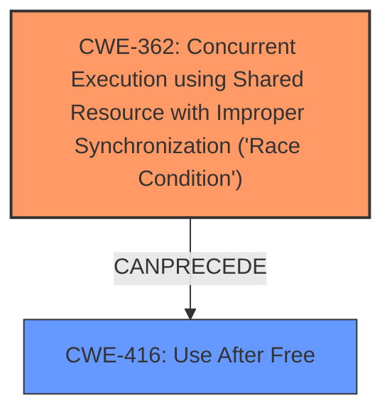

# Final Resolution for CVE-2021-0652

# Summary
| CWE ID | CWE Name | Confidence | CWE Abstraction Level | CWE Vulnerability Mapping Label | CWE-Vulnerability Mapping Notes |
|---|---|---|---|---|---|
| CWE-362 | Concurrent Execution using Shared Resource with Improper Synchronization ('Race Condition') | 0.85 | Class | Allowed-with-Review | Primary CWE. Explicit mention of "sharing of not thread-safe objects" in vulnerability description. Consider more specific base level child CWE if more details are provided. |
| CWE-416 | Use After Free | 0.65 | Variant | Allowed | Secondary Candidate. Race condition (CWE-362) can allow one thread to free memory while another is still using it, leading to CWE-416. Requires further confirmation regarding when memory is freed prematurely. |

## Evidence and Confidence

*   **Confidence Score:** 0.85
*   **Evidence Strength:** HIGH

## Relationship Analysis
The primary weakness is classified as CWE-362, a Class-level CWE representing a race condition due to shared non-thread-safe objects. The analysis considered the possibility of more specific Base-level children of CWE-362 but determined that the available information did not allow for a more precise classification. CWE-416, a Variant-level CWE, is considered a secondary weakness resulting from the race condition. The relationship analysis highlights that exploiting CWE-362 can directly lead to CWE-416, where a thread frees memory that another thread is still using. The initial assessment shows a CanPrecede relationship from CWE-362 to CWE-416.

## Vulnerability Chain
The vulnerability chain starts with the **ROOTCAUSE** being the sharing of non-thread-safe objects in the `VectorDrawableVectorDrawable` class. This leads to **CWE-362 (Concurrent Execution using Shared Resource with Improper Synchronization ('Race Condition'))**. The race condition allows multiple threads to access and modify the shared resource concurrently. This can result in one thread freeing memory while another thread is still using it, leading to **CWE-416 (Use After Free)**. The **IMPACT** of the vulnerability is local escalation of privilege with no additional execution privileges needed.

## Summary of Analysis
The initial analysis and criticism both converge on the selection of CWE-362 as the primary **WEAKNESS**. The vulnerability description explicitly mentions "sharing of not thread-safe objects," directly supporting this classification. The criticism highlights the need to consider more specific child CWEs of CWE-362 if more details were available. The inclusion of CWE-416 as a secondary candidate is also supported by the potential for race conditions to result in use-after-free scenarios. The decision to exclude CWE-908 is reinforced by the lack of a strong relationship to the **ROOTCAUSE**. The confidence score remains high (0.85) due to the direct evidence in the vulnerability description. The selected CWEs are at the optimal level of specificity given the available evidence. More detailed code analysis would be needed to determine if a more specific base-level child of CWE-362 is more appropriate. The analysis heavily relies on the vulnerability description's statement about sharing non-thread-safe objects: "In VectorDrawableVectorDrawable of VectorDrawable.java, there is a possible way to introduce a memory corruption due to sharing of not thread-safe objects."