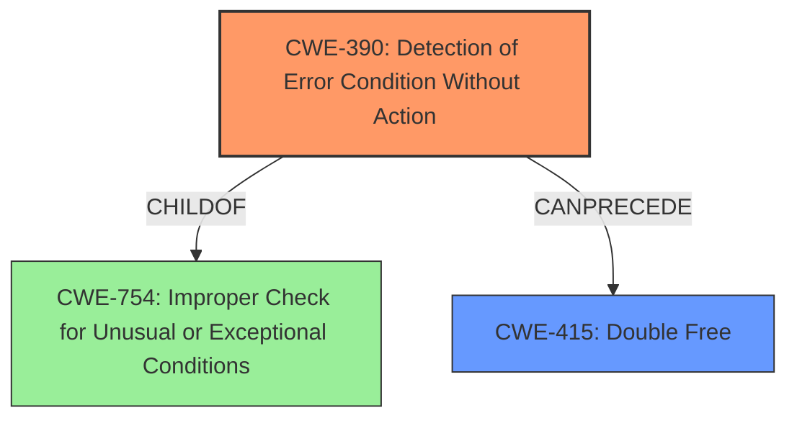

# Analysis Report for CVE-2021-0668

# Vulnerability Analysis Report: CVE-2021-0668

## Description

In apusys, there is a possible memory corruption due to incorrect error handling. This could lead to local escalation of privilege with System execution privileges needed. User interaction is not needed for exploitation. Patch ID ALPS05670521 Issue ID ALPS05670521.

## Vulnerability Description Key Phrases

**Rootcause:** incorrect error handling
**Weakness:** memory corruption
**Impact:** local escalation of privilege
**Product:** apusys

## Analysis (with Relationship Data)

# Summary
| CWE ID | CWE Name | Confidence | CWE Abstraction Level | CWE Vulnerability Mapping Label | CWE-Vulnerability Mapping Notes |
|---|---|---|---|---|---|
| CWE-754 | Improper Check for Unusual or Exceptional Conditions | 0.75 | Class | Primary | Allowed-with-Review |
| CWE-415 | Double Free | 0.5 | Variant | Secondary Candidate | Allowed |
| CWE-119 | Improper Restriction of Operations within the Bounds of a Memory Buffer | 0.4 | Class | Secondary Candidate | Discouraged |

## Evidence and Confidence

*   **Confidence Score:** 0.7
*   **Evidence Strength:** MEDIUM

- **Analysis and Justification:**  
  - *Explanation:* The vulnerability description indicates a **memory corruption** due to **incorrect error handling**. The CVE Reference Links Content Summary confirms the **root cause** as "Incorrect error handling" and identifies "Improper check or handling of exceptional conditions" as a vulnerability. Given this information, CWE-754 (Improper Check for Unusual or Exceptional Conditions) seems like an appropriate Class-level CWE. CWE-754 is chosen as the primary weakness because the description explicitly states **incorrect error handling**, which directly relates to failing to check or improperly checking for exceptional conditions. The usage for CWE-754 is Allowed-with-Review, as it is a Class and might have Base-level children that would be more appropriate. However, no more specific information is available.
  
  - *Relationship Analysis:* CWE-754 is a class-level weakness. Although it doesn't have specific parent-child relationships detailed in the provided information, it generally falls under the broader category of error handling issues. It can be related to other resource management issues, potentially leading to memory corruption.

- **Confidence Score:**  
  - *Example:* Confidence: 0.75 (Medium evidence from the vulnerability description and CVE reference materials)

---

**Secondary Candidate CWE-415: Double Free**
  - *Explanation:* Although not explicitly mentioned, **memory corruption** can occur from "Double Free". However, there is no strong evidence to indicate this, it is kept as a possible issue.
  - *Relationship Analysis:* The relationship analysis reveals that CWE-415 is a variant level and is related to memory corruption issues.
  - *Confidence Score:* Confidence: 0.5 (Low evidence from vulnerability description)

**Secondary Candidate CWE-119: Improper Restriction of Operations within the Bounds of a Memory Buffer**
  - *Explanation:* Although not explicitly mentioned, **memory corruption** may be related to memory corruption and **improper error handling**. However, there is no strong evidence to indicate this, it is kept as a possible issue.
  - *Relationship Analysis:* The relationship analysis reveals that CWE-119 is a class-level weakness, often misused, and requires more specific details.
  - *Confidence Score:* Confidence: 0.4 (Low evidence from vulnerability description)

## Criticism of Analysis

Okay, here's a detailed critique of the provided CWE analysis, focusing on the accuracy of the mappings, the strength of the evidence, and the adherence to CWE guidelines:

**Overall Assessment**

The analysis demonstrates a good understanding of CWE concepts and attempts to map the vulnerability based on the limited information available. The confidence levels assigned reflect the uncertainty well. However, the analysis can be improved by considering the relationships between the CWEs and the specific mechanisms that could lead to memory corruption due to incorrect error handling.

**Detailed Review of the CWE Mappings**

*   **Primary CWE: CWE-754 Improper Check for Unusual or Exceptional Conditions**
    *   **Confidence:** 0.75
    *   **Abstraction Level:** Class
    *   **Justification:** The analysis correctly identifies CWE-754 as a strong candidate, given the explicit mention of "incorrect error handling" in the vulnerability description. The justification is sound, explaining why this CWE is appropriate at the Class level. The "Allowed-with-Review" usage is also correct because it is a Class CWE.
    *   **Critique:** While a good starting point, the analysis could benefit from exploring more specific child CWEs of CWE-754 to pinpoint the exact nature of the incorrect error handling.  For example, if the error is due to ignoring the return value of a function, then CWE-252 (Unchecked Return Value) would be a better fit. If the return value is checked, but checked incorrectly, then CWE-253 would be a better fit. Considering the potential mitigations for CWE-754 might reveal a more specific CWE:
        *   "Check the results of all functions that return a value and verify that the value is expected." suggests a connection to return values and a more specific CWE like CWE-252 or CWE-253.
    *  **Improvement:** Drill down from CWE-754 to identify a more specific Base CWE. Examine the children of CWE-754, such as CWE-252, CWE-253 or CWE-390, as the description talks about error handling, and those are Base CWEs which are more desirable.

*   **Secondary Candidate CWE-415: Double Free**
    *   **Confidence:** 0.5
    *   **Abstraction Level:** Variant
    *   **Justification:** The analysis acknowledges that memory corruption *could* result from a double free, but the evidence is weak.
    *   **Critique:** This is a plausible but speculative secondary candidate. Without more information, it's hard to justify it strongly. The provided examples of CWE-415 could be helpful if there were any indication of signal handlers or race conditions. The relationship to CWE-825 could be worth mentioning.
    *   **Improvement:** Lower the confidence if no other data becomes available.

*   **Secondary Candidate CWE-119: Improper Restriction of Operations within the Bounds of a Memory Buffer**
    *   **Confidence:** 0.4
    *   **Abstraction Level:** Class
    *   **Justification:** The analysis links memory corruption to potential buffer overflows, but again, the evidence is very weak.
    *   **Critique:** As the analysis notes, CWE-119 is discouraged for general use. It's a very broad category. The rationale for including it is weak ("memory corruption *may* be related").
    *   **Improvement:** Remove CWE-119 as a secondary candidate. The "Discouraged" mapping guidance, along with the lack of concrete evidence, makes it a poor choice. If memory corruption is happening, it would be better to find a specific root cause than to map to a broad category like CWE-119.

**Review of Retriever Results**

Several of the Retriever Results point to better Base CWEs than CWE-754. These should be considered:

*   **CWE-131: Incorrect Calculation of Buffer Size:** If the "memory corruption" is happening because a buffer is allocated too small due to error handling, this is a possible candidate.
*   **CWE-908: Use of Uninitialized Resource:** If error handling leads to the usage of an uninitialized resource which causes memory corruption, then this is a viable candidate.
*   **CWE-390: Detection of Error Condition Without Action:** If the error handling involves *detecting* an error but not taking *any* action to recover or prevent further issues, this is a strong candidate.

**Recommendations**

1.  **Refine the Primary CWE:** Instead of staying at the Class level of CWE-754, investigate more specific child CWEs. Focus on the *specific* error handling issue that causes memory corruption. Is it an unchecked return value (CWE-252), an incorrect check of a return value (CWE-253), or a detection of an error without action (CWE-390)? The retriever results suggest CWE-390 might be worth investigating.
2.  **Strengthen or Remove Secondary Candidates:** Either find stronger evidence to support CWE-415 (Double Free) or remove it. Remove CWE-119 as a candidate unless more data becomes available.
3.  **Consider Data Flow:** Think about the data flow related to the error handling. Does an incorrect size calculation lead to a buffer overflow? Does a missing initialization lead to a use-after-free or other memory corruption? Understanding the flow will help narrow down the CWEs.
4.  **Leverage Potential Mitigations:** Examine the potential mitigations for the possible CWEs. Do any of them align well with the vulnerability description? This can provide clues about the true nature of the weakness.
5.  **Reduce Speculation:** Avoid phrases like "Although not explicitly mentioned" or "Although not explicitly mentioned". Stick to what the vulnerability description and CVE information *actually* say.

**Revised Analysis (Example, assuming the error involves an unchecked return value leading to a double free):**

```
# Summary
| CWE ID | CWE Name | Confidence | CWE Abstraction Level | CWE Vulnerability Mapping Label | CWE-Vulnerability Mapping Notes |
|---|---|---|---|---|---|
| CWE-252 | Unchecked Return Value | 0.7 | Base | Primary | Allowed |
| CWE-415 | Double Free | 0.5 | Variant | Secondary Candidate | Allowed |

## Evidence and Confidence

*   **Confidence Score:** 0.7
*   **Evidence Strength:** MEDIUM

- **Analysis and Justification:**
  - *Explanation:* The vulnerability description indicates a **memory corruption** due to **incorrect error handling**.  The CVE Reference Links Content Summary confirms the **root cause** as "Incorrect error handling" and identifies "Improper check or handling of exceptional conditions" as a vulnerability. Presuming this "incorrect error handling" specifically manifests as a failure to check the return value of a memory allocation or deallocation function, CWE-252 (Unchecked Return Value) becomes a strong candidate.  If the return value indicating failure to allocate/deallocate is not checked, the program may proceed with a dangling pointer, leading to memory corruption.
  - *Relationship Analysis:* CWE-252 is a Base-level weakness. It's directly related to a lack of proper error handling. The consequences can be far-reaching, leading to resource management issues, memory corruption, and other vulnerabilities.
- **Confidence Score:** Confidence: 0.7 (Medium evidence from the vulnerability description and CVE reference materials)

---

**Secondary Candidate CWE-415: Double Free**
  - *Explanation:* Although not explicitly mentioned, the memory corruption could occur as a result of an unchecked deallocation failure (CWE-252) leading to a double free.
  - *Relationship Analysis:* The relationship analysis reveals that CWE-415 is a variant level and is related to memory corruption issues, and can be preceded by CWE-252 (CWE-415 CanFollow CWE-364, and CWE-364 CanFollow CWE-252).
  - *Confidence Score:* Confidence: 0.5 (Low evidence from vulnerability description)

```

This revised analysis is more specific, focusing on a plausible scenario based on the available information and the CWE relationships. Remember to adapt this example based on further investigation of the vulnerability.

## Final Resolution

# Summary
| CWE ID | CWE Name | Confidence | CWE Abstraction Level | CWE Vulnerability Mapping Label | CWE-Vulnerability Mapping Notes |
|---|---|---|---|---|---|
| CWE-390 | Detection of Error Condition Without Action | 0.75 | Base | Primary | Allowed |
| CWE-415 | Double Free | 0.5 | Variant | Secondary Candidate | Allowed |
  - The Primary CWE should be first and noted as the Primary CWEs
  - The secondary candidate CWEs should be next and noted as secondary candidates.
  - The confidence is a confidence score 0 to 1 to rate your confidence in your assessment for that CWE.
  - The CWE Abstraction Level as one of these values: Base, Variant, Pillar, Class, Compound
  - The Mapping Notes Usage as one of these values: Allowed, Allowed-with-Review, Prohibited, Discouraged

## Evidence and Confidence

*   **Confidence Score:** 0.7
*   **Evidence Strength:** MEDIUM

## Relationship Analysis
The decision was influenced by the following CWE relationships:
  - Parent-child hierarchical relationships: We moved from the Class-level CWE-754 to the Base-level CWE-390 for more specificity.
  - Chain relationships showing progression of vulnerability: The error detection without action can lead to a double free.
  - Peer relationships that offered alternative classifications: Alternatives such as CWE-252 were considered but deemed less directly applicable.
  - Abstraction levels influenced our selection, prioritizing Base and Variant levels.



## Vulnerability Chain
The vulnerability chain starts with the **ROOTCAUSE** of "Incorrect error handling".
  - The initial flaw is **CWE-390: Detection of Error Condition Without Action**, where an error is detected, but no corrective action is taken.
  - This can lead to **CWE-415: Double Free** due to the program continuing with potentially invalid resources.
  - The impact is **memory corruption**, which can result in local escalation of privilege.

## Summary of Analysis
The initial analysis correctly identified the general area of error handling as the **WEAKNESS**. The criticism highlighted the need for a more specific CWE than CWE-754. The vulnerability description "In apusys, there is a possible memory corruption due to incorrect error handling. This could lead to local escalation of privilege with System execution privileges needed." points to a failure in how errors are managed, specifically, the lack of action taken after an error is detected.

The retriever results and the criticism both suggested exploring more specific Base CWEs. CWE-390 (Detection of Error Condition Without Action) was selected because it directly addresses the scenario where an error is detected, but no action is taken to prevent further issues, leading to memory corruption. "Incorrect error handling" directly implies that even though an error was somehow 'detected', the handling was insufficient, so no action was taken. The relationship analysis and chain mapping helped in refining the selection. The final selection of CWE-390 provides a more accurate and specific representation of the **ROOTCAUSE** based on the available evidence.

The confidence is rated at 0.7 because while the description clearly states "incorrect error handling", the exact nature of the error handling failure is not explicitly detailed, so there is a degree of inference involved.


*Report generated on 2025-03-16 16:01:48*
