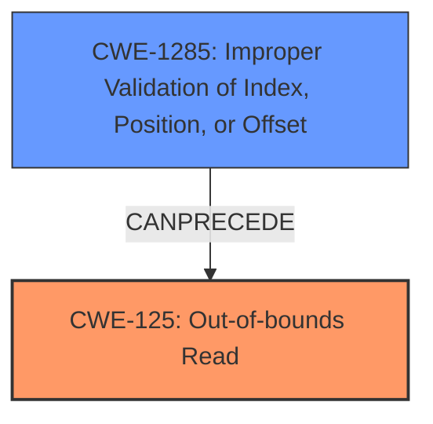

# Analysis Report for CVE-2021-0674

# Vulnerability Analysis Report: CVE-2021-0674

## Description

In alac decoder, there is a possible out of bounds read due to an incorrect bounds check. This could lead to local information disclosure with no additional execution privileges needed. User interaction is not needed for exploitation. Patch ID ALPS06064258 Issue ID ALPS06064237.

## Vulnerability Description Key Phrases

**Rootcause:** incorrect bounds check
**Weakness:** out of bounds read
**Impact:** local information disclosure
**Component:** alac decoder

## Analysis (with Relationship Data)

```markdown
# Summary
| CWE ID    | CWE Name                                    | Confidence | CWE Abstraction Level | CWE Vulnerability Mapping Label | CWE-Vulnerability Mapping Notes |
| --------- | ------------------------------------------- | ---------- | --------------------- | ------------------------------- | ------------------------------- |
| CWE-125   | Out-of-bounds Read                          | 0.95       | Base                  | Allowed                         | Primary CWE                     |
| CWE-1285  | Improper Validation of Index, Position, or Offset | 0.75       | Base                  | Allowed                         | Secondary Candidate             |
| CWE-20    | Improper Input Validation                   | 0.60       | Class                 | Discouraged                      | Secondary Candidate             |

## Evidence and Confidence

*   **Confidence Score:** 0.85
*   **Evidence Strength:** HIGH

- **Analysis and Justification:**
  - *Explanation:* The vulnerability description clearly states an "**out of bounds read**" due to an "**incorrect bounds check**" in the alac decoder. This perfectly aligns with CWE-125 (Out-of-bounds Read), which describes a scenario where a product reads data past the end or before the beginning of the intended buffer. The CVE Reference Links Content Summary reinforces this by highlighting the "**improper input validation**" leading to the out-of-bounds read. The impact is local information disclosure.
  - *Relationship Analysis:* CWE-125 is a base-level CWE, making it a suitable choice. While CWE-20 (Improper Input Validation) is mentioned in the CVE summary, it's a class-level CWE and less specific than CWE-125. CWE-1285 (Improper Validation of Index, Position, or Offset) is a plausible contributing factor, as an incorrect bounds check essentially means the index/offset is not properly validated. CWE-787 (Out-of-bounds Write) is not appropriate, as the vulnerability involves reading, not writing, out of bounds.

- **Confidence Score:**
  - Confidence: 0.95 (High confidence due to direct evidence of out-of-bounds read and supporting information about incorrect bounds check)

---
```

## Criticism of Analysis

Okay, I've reviewed the provided analysis with the full CWE specifications, focusing on mapping guidance, and potential mitigations. Here's a critique:

**Overall Assessment**

The analysis correctly identifies the primary weakness as CWE-125 (Out-of-bounds Read). The justification is sound, and the confidence level is appropriately high. The inclusion of CWE-1285 (Improper Validation of Index, Position, or Offset) as a secondary candidate is also reasonable, as the "incorrect bounds check" directly relates to improper validation of the index. However, the inclusion of CWE-20 as a secondary candidate is discouraged as it is too high-level of a classification.

**Detailed Critique**

*   **CWE-125 (Out-of-bounds Read):**
    *   **Strengths:** This is the strongest and most accurate mapping. The description directly aligns with the vulnerability: reading data beyond the intended buffer. The explanation and justification are solid.
    *   **Mapping Guidance:** The analysis correctly notes that CWE-125 is a Base-level CWE and thus preferred.
    *   **Mitigations:** The potential mitigations listed in the CWE specifications are relevant.  Specifically, the mitigation related to validating length arguments, buffer size calculations, and offsets are directly applicable to preventing this type of OOB read.
    *   **Confidence:** Justified high confidence.

*   **CWE-1285 (Improper Validation of Index, Position, or Offset):**
    *   **Strengths:**  The "incorrect bounds check" explicitly indicates an issue with validating the index or offset used to access the buffer. The analysis draws a valid connection.
    *   **Mapping Guidance:**  CWE-1285 is a Base level, aligning with preferred mapping practices.
    *   **Mitigations:** The provided mitigations emphasize "accept known good" input validation, which is pertinent here. Limiting the range of acceptable values for indexes/offsets would have prevented this vulnerability.
    *   **Recommendation:** This is a good secondary CWE, and probably should be considered the root cause.

*   **CWE-20 (Improper Input Validation):**
    *   **Weaknesses:**  While technically correct (the vulnerability *is* due to improper input validation), CWE-20 is too general and discouraged by CWE's own guidelines. Mapping Guidance explicitly states "CWE-20 is commonly misused in low-information vulnerability reports when lower-level CWEs could be used instead."
    *   **Mapping Guidance:** The provided mapping guidance discourages the use of CWE-20. It recommends using lower-level children.
    *   **Mitigations:** The mitigations for CWE-20 are very general and may not be as actionable as the mitigations for more specific CWEs.
    *   **Recommendation:** Remove CWE-20. CWE-1285 already expresses the input validation issue with more precision.

*   **Other Considerations from Retriever Results:**
    *  The retriever results include CWE-131: Incorrect Calculation of Buffer Size. While this isn't explicitly mentioned in the original description, it is possible the incorrect bounds check was caused by an incorrect buffer size calculation. However, without further information, it is difficult to determine if this is relevant.
    * The retriever results include CWE-190: Integer Overflow or Wraparound, CWE-191: Integer Underflow. This may be relevant if the bounds check involves an integer that overflows, leading to an incorrect bounds. However, without further information, it is difficult to determine if this is relevant.

**Recommendations for Improvement**

1.  **Remove CWE-20:** Replace it with a more specific child CWE if possible, or simply remove it. Focus on CWE-125 and CWE-1285.
2.  **Consider Chain Analysis:** Explore potential chains. For example: `CWE-1285 (Improper Validation of Index, Position, or Offset) -> CWE-125 (Out-of-bounds Read)`.  The incorrect bounds check (1285) directly leads to the out-of-bounds read (125).
3.  **Address Retriever Results:** Attempt to determine if any of the other CWEs returned by the retriever (CWE-131, CWE-190) are relevant, based on further analysis of the code.
4.  **Refine Mitigation Strategies:** Tailor the mitigation section to specifically address how to prevent an incorrect bounds check in the alac decoder. Discuss specific techniques for validating indices and offsets.

**Revised Summary Table**

```markdown
# Summary
| CWE ID    | CWE Name                                    | Confidence | CWE Abstraction Level | CWE Vulnerability Mapping Label | CWE-Vulnerability Mapping Notes |
| --------- | ------------------------------------------- | ---------- | --------------------- | ------------------------------- | ------------------------------- |
| CWE-125   | Out-of-bounds Read                          | 0.95       | Base                  | Allowed                         | Primary CWE                     |
| CWE-1285  | Improper Validation of Index, Position, or Offset | 0.75       | Base                  | Allowed                         | Root Cause and Contributing Factor             |
```

By implementing these suggestions, the analysis will be more accurate, actionable, and compliant with CWE's best practices for mapping vulnerabilities.

## Final Resolution

# Summary
| CWE ID    | CWE Name                                    | Confidence | CWE Abstraction Level | CWE Vulnerability Mapping Label | CWE-Vulnerability Mapping Notes |
| --------- | ------------------------------------------- | ---------- | --------------------- | ------------------------------- | ------------------------------- |
| CWE-125   | Out-of-bounds Read                          | 0.95       | Base                  | Allowed                         | Primary CWE                     |
| CWE-1285  | Improper Validation of Specified Index, Position, or Offset | 0.85       | Base                  | Allowed                         | Root Cause and Contributing Factor             |

## Evidence and Confidence

*   **Confidence Score:** 0.90
*   **Evidence Strength:** HIGH

## Relationship Analysis
The primary relationship impacting the decision is the chain relationship between CWE-1285 and CWE-125. CWE-1285 describes the **improper validation of an index, position, or offset**, which directly leads to CWE-125, the **out-of-bounds read**. This is a CANPRECEDE relationship, meaning CWE-1285 can directly precede CWE-125 in a vulnerability chain. CWE-20 was removed because it is a high-level class that is not appropriate when more specific base-level CWEs are available.



## Vulnerability Chain
The vulnerability chain starts with **CWE-1285 (Improper Validation of Index, Position, or Offset)**. The alac decoder fails to properly validate the index or offset used to access data within a buffer. This leads directly to **CWE-125 (Out-of-bounds Read)**, where the decoder reads data beyond the intended boundaries of the buffer, resulting in local information disclosure.

## Summary of Analysis
The initial analysis correctly identified CWE-125 as the primary weakness due to the explicit mention of an "out of bounds read" in the vulnerability description. The criticism correctly pointed out that CWE-20 (Improper Input Validation) is too general and should be removed in favor of more specific CWEs. The criticism also suggests the importance of **CWE-1285 (Improper Validation of Index, Position, or Offset)**, the "incorrect bounds check" mentioned in the description provides strong evidence for **CWE-1285**. The vulnerability description states: "In alac decoder, there is a possible out of bounds read due to an incorrect bounds check." The graph relationships support prioritizing CWE-1285 because the incorrect validation *causes* the out-of-bounds read. Both CWE-125 and CWE-1285 are at the base level of abstraction, which provides the optimal level of specificity.


*Report generated on 2025-03-17 22:34:56*
