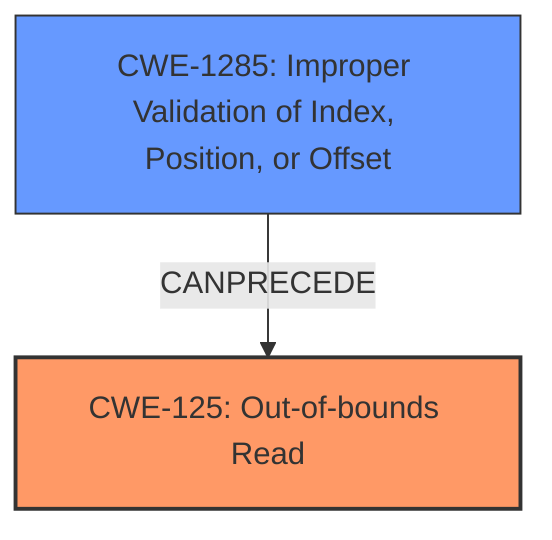

# Final Resolution for CVE-2021-0674

# Summary
| CWE ID    | CWE Name                                    | Confidence | CWE Abstraction Level | CWE Vulnerability Mapping Label | CWE-Vulnerability Mapping Notes |
| --------- | ------------------------------------------- | ---------- | --------------------- | ------------------------------- | ------------------------------- |
| CWE-125   | Out-of-bounds Read                          | 0.95       | Base                  | Allowed                         | Primary CWE                     |
| CWE-1285  | Improper Validation of Specified Index, Position, or Offset | 0.85       | Base                  | Allowed                         | Root Cause and Contributing Factor             |

## Evidence and Confidence

*   **Confidence Score:** 0.90
*   **Evidence Strength:** HIGH

## Relationship Analysis
The primary relationship impacting the decision is the chain relationship between CWE-1285 and CWE-125. CWE-1285 describes the **improper validation of an index, position, or offset**, which directly leads to CWE-125, the **out-of-bounds read**. This is a CANPRECEDE relationship, meaning CWE-1285 can directly precede CWE-125 in a vulnerability chain. CWE-20 was removed because it is a high-level class that is not appropriate when more specific base-level CWEs are available.

## Vulnerability Chain
The vulnerability chain starts with **CWE-1285 (Improper Validation of Index, Position, or Offset)**. The alac decoder fails to properly validate the index or offset used to access data within a buffer. This leads directly to **CWE-125 (Out-of-bounds Read)**, where the decoder reads data beyond the intended boundaries of the buffer, resulting in local information disclosure.

## Summary of Analysis
The initial analysis correctly identified CWE-125 as the primary weakness due to the explicit mention of an "out of bounds read" in the vulnerability description. The criticism correctly pointed out that CWE-20 (Improper Input Validation) is too general and should be removed in favor of more specific CWEs. The criticism also suggests the importance of **CWE-1285 (Improper Validation of Index, Position, or Offset)**, the "incorrect bounds check" mentioned in the description provides strong evidence for **CWE-1285**. The vulnerability description states: "In alac decoder, there is a possible out of bounds read due to an incorrect bounds check." The graph relationships support prioritizing CWE-1285 because the incorrect validation *causes* the out-of-bounds read. Both CWE-125 and CWE-1285 are at the base level of abstraction, which provides the optimal level of specificity.