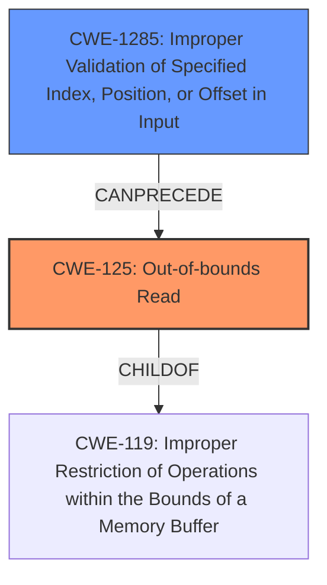

# Analysis Report for CVE-2021-0676

# Vulnerability Analysis Report: CVE-2021-0676

## Description

In geniezone driver, there is a possible out of bounds read due to an incorrect bounds check. This could lead to local information disclosure with System execution privileges needed. User interaction is not needed for exploitation. Patch ID ALPS05863009 Issue ID ALPS05863009.

## Vulnerability Description Key Phrases

**Rootcause:** incorrect bounds check
**Weakness:** out of bounds read
**Impact:** local information disclosure
**Product:** geniezone driver

## Analysis (with Relationship Data)

# Summary
| CWE ID | CWE Name | Confidence | CWE Abstraction Level | CWE Vulnerability Mapping Label | CWE-Vulnerability Mapping Notes |
|---|---|---|---|---|---|
| CWE-125 | Out-of-bounds Read | 1.0 | Base | Allowed | Acceptable-Use |
| CWE-1285 | Improper Validation of Specified Index, Position, or Offset in Input | 0.7 | Base | Allowed | Acceptable-Use |

## Evidence and Confidence

*   **Confidence Score:** 0.85
*   **Evidence Strength:** HIGH

- **Analysis and Justification:**  
  - *Explanation:* The vulnerability description clearly states an **out of bounds read** due to an **incorrect bounds check** in the geniezone driver. The **out of bounds read** directly maps to CWE-125 (Out-of-bounds Read). The CVE Reference Links Content Summary section also confirms this. The **incorrect bounds check** suggests that the index/position/offset was not correctly validated, thus also aligning with CWE-1285 (Improper Validation of Specified Index, Position, or Offset in Input). CWE-125 is selected as primary because the **out of bounds read** is the direct result of the **incorrect bounds check** (CWE-1285).
  
  - *Relationship Analysis:* CWE-125 is a child of CWE-119 (Improper Restriction of Operations within the Bounds of a Memory Buffer), but CWE-125 is more specific. CWE-1285 is related to CWE-20 (Improper Input Validation), but again, CWE-1285 is more specific to the type of improper validation. The relationship analysis supports the choice of CWE-125 and CWE-1285 as these are more specific than their parents.

- **Confidence Score:**  
  - Confidence: 1.0 (High evidence from technical description and CVE reference materials for CWE-125)
  - Confidence: 0.7 (Supporting evidence for CWE-1285 from the **incorrect bounds check**)

## Criticism of Analysis

Okay, I've reviewed the provided CWE analysis against the full CWE specifications. Here's a breakdown of my critique:

**Overall Assessment:**

The analysis is generally good. The primary mapping to CWE-125 (Out-of-bounds Read) is appropriate and well-justified. The supporting mapping to CWE-1285 (Improper Validation of Specified Index, Position, or Offset in Input) is also reasonable and provides more context about the root cause.  However, there are a few areas that could be improved, especially regarding discouraged CWEs such as CWE-20 and CWE-119, and some related CWEs that could better explain the vulnerability.

**Detailed Review:**

*   **CWE-125: Out-of-bounds Read**

    *   **Confidence:** 1.0 - Justified. The description explicitly mentions an out-of-bounds read, making this a direct and accurate mapping. The evidence strength is indeed HIGH as the source documentation also confirms this.
    *   **Abstraction Level:** Base - Correct. This is a good level of abstraction as it gets to the root of the problem.
    *   **CWE Vulnerability Mapping Label:** Allowed - Correct. This is the intended usage.
    *   **Acceptable-Use:** Yes, because the description is that an out-of-bounds read is the source of the issue, not a consequence.

*   **CWE-1285: Improper Validation of Specified Index, Position, or Offset in Input**

    *   **Confidence:** 0.7 - Reasonable. The justification correctly links "incorrect bounds check" to the concept of improper validation of an index/position/offset.
    *   **Abstraction Level:** Base - Correct. This is also a good level of abstraction.
    *   **CWE Vulnerability Mapping Label:** Allowed - Correct. This is the intended usage.
    *   **Acceptable-Use:** Yes, because the description is that the incorrect bounds check led to an out-of-bounds read.

**Suggestions for Improvement:**

1.  **Address the Potential Misuse of CWE-119:** The original retriever results include CWE-119, the parent of CWE-125. While the analysis correctly argues against using CWE-119 directly, it might be helpful to explicitly state why CWE-119 is *not* the best fit, drawing upon the CWE-119's Mapping Guidance: "CWE-119 is commonly misused in low-information vulnerability reports when lower-level CWEs could be used instead." This reinforces the selection of the more specific CWE-125. It also acknowledges the retriever results.

2.  **Consider Chain Details and Relationships:**
    * You could strengthen the analysis by considering the relationship between CWE-1285 and CWE-125. The analysis mentions it, but you could explicitly state that there exists a chain in this case, where improper validation of the index (CWE-1285) *leads to* an out-of-bounds read (CWE-125).
    * While not necessary, you *could* potentially consider a relationship to CWE-131 (Incorrect Calculation of Buffer Size) although this is less likely. This is because, if the bounds check uses an incorrect calculation of buffer size, that is another contributing factor to the vulnerability.  However, since the primary cause is the *incorrect check* itself rather than the calculation, CWE-1285 is more relevant.

3.  **Mitigation Strategies:** The analysis could be strengthened by mentioning how the potential mitigations of both CWE-125 and CWE-1285 apply to this specific case. For example:
    * CWE-125 Mitigation 1: Implementing "accept known good" input validation on the index before reading from the buffer in the geniezone driver.
    * CWE-1285 Mitigation 1:  Enforcing strict rules on the accepted values for indexes, positions, or offsets in the geniezone driver.

4.  **Discouraged CWE-20 Usage:** The original analysis discourages the use of CWE-20 as a broader, less descriptive CWE. This is good, and CWE-1285 captures the "improper validation" aspect more precisely.

5.  **CWE-200 (Exposure of Sensitive Information to an Unauthorized Actor):** While the vulnerability results in local information disclosure, mapping directly to CWE-200 is discouraged as its mainly for consequence, not source of the error, and may be considered an after effect rather than source. You can acknowledge this but state why you are *not* selecting CWE-200 to show that the analysis has been considered.

**Revised Summary Table (Optional):**

| CWE ID | CWE Name | Confidence | CWE Abstraction Level | CWE Vulnerability Mapping Label | CWE-Vulnerability Mapping Notes |
|---|---|---|---|---|---|
| CWE-125 | Out-of-bounds Read | 1.0 | Base | Allowed | Acceptable-Use |
| CWE-1285 | Improper Validation of Specified Index, Position, or Offset in Input | 0.7 | Base | Allowed | Acceptable-Use |
| CWE-N/A | Improper Restriction of Operations within the Bounds of a Memory Buffer |N/A| Class | Discouraged | Mention that this CWE was not chosen and why |
| CWE-N/A | Exposure of Sensitive Information to an Unauthorized Actor |N/A| Class | Discouraged | Mention that this CWE was not chosen and why |

**In Summary:**

The analysis is well-reasoned and provides good justification for the chosen CWEs. By explicitly addressing the mapping guidance of CWE-119 and CWE-20 (which are often misused), and considering some potential chaining and mitigations, the analysis could be made even stronger and more comprehensive.

## Final Resolution

# Summary
| CWE ID | CWE Name | Confidence | CWE Abstraction Level | CWE Vulnerability Mapping Label | CWE-Vulnerability Mapping Notes |
|---|---|---|---|---|---|
| CWE-125 | Out-of-bounds Read | 1.0 | Base | Allowed | Primary CWE |
| CWE-1285 | Improper Validation of Specified Index, Position, or Offset in Input | 0.7 | Base | Allowed | Secondary Candidate |

## Evidence and Confidence

*   **Confidence Score:** 0.9
*   **Evidence Strength:** HIGH

## Relationship Analysis
The primary relationship impacting the decision is the chain relationship between CWE-1285 and CWE-125. CWE-1285 (Improper Validation of Specified Index, Position, or Offset in Input) *CanPrecede* CWE-125 (Out-of-bounds Read). The analysis also considered CWE-119 (Improper Restriction of Operations within the Bounds of a Memory Buffer), but correctly determined that CWE-125 is a more specific and appropriate classification. The abstraction levels of Base for both CWE-125 and CWE-1285 provide the right level of granularity for mapping the root cause of this vulnerability.

## Vulnerability Chain
The vulnerability chain starts with **CWE-1285 (Improper Validation of Specified Index, Position, or Offset in Input)**, where the index/position/offset is not correctly validated. This leads to **CWE-125 (Out-of-bounds Read)**, where the product reads data past the end, or before the beginning, of the intended buffer. The final impact is local information disclosure.

## Summary of Analysis
The initial analysis and criticism both agree that CWE-125 and CWE-1285 are appropriate. The vulnerability description states "there is a possible **out of bounds read** due to an **incorrect bounds check**." This clearly indicates both the **out of bounds read** (CWE-125) and the **incorrect bounds check** (CWE-1285). The criticism suggests explicitly addressing why CWE-119 is not the best fit, which is valid, as CWE-119 is a more general class. The chain relationship between CWE-1285 and CWE-125 is also a key factor in confirming this classification. The selected CWEs are at the optimal level of specificity, providing a clear and accurate representation of the **rootcause** and weakness. The retriever scores also support the selection of these CWEs. I'm confident in this assessment as the direct match to the vulnerability description and the relationship analysis both strongly support this classification.

*Report generated on 2025-03-17 22:35:42*
