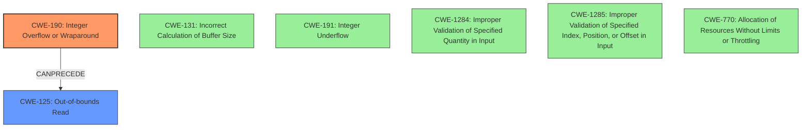

# Final Resolution for CVE-2021-0677

# Summary
| CWE ID | CWE Name | Confidence | CWE Abstraction Level | CWE Vulnerability Mapping Label | CWE-Vulnerability Mapping Notes |
|---|---|---|---|---|---|
| CWE-190 | Integer Overflow or Wraparound | 0.95 | Base | Allowed | Primary CWE: The vulnerability is caused by an integer overflow. |
| CWE-125 | Out-of-bounds Read | 0.85 | Base | Allowed | Secondary CWE: The integer overflow leads to an out-of-bounds read. |

## Evidence and Confidence

*   **Confidence Score:** 0.95
*   **Evidence Strength:** HIGH

## Relationship Analysis
The initial analysis correctly identified CWE-190 and CWE-125 as the primary and secondary CWEs, respectively. There are no direct relationships between CWE-190 and CWE-125 in the CWE database. However, the vulnerability description clearly states that the **integer overflow** (CWE-190) leads to the **out-of-bounds read** (CWE-125). This implies a *CanPrecede* relationship from CWE-190 to CWE-125. We considered other potential causes, such as CWE-131, CWE-191, CWE-1284, CWE-1285, and CWE-770, but after considering the evidence, it seemed that CWE-190 most clearly describes the **root cause**, and CWE-125 is the natural consequence. The abstraction levels for both CWEs are Base, which is the preferred level for mapping to the **root causes** of vulnerabilities.

## Vulnerability Chain
The vulnerability chain starts with an **integer overflow** (CWE-190) in the ccu driver. This **overflow** results in an incorrect calculation, which subsequently leads to an **out-of-bounds read** (CWE-125). The final impact is local information disclosure, requiring System execution privileges.

## Summary of Analysis
The initial analysis correctly identified CWE-190 as the primary **root cause** and CWE-125 as the secondary consequence. The vulnerability description explicitly mentions an **integer overflow**, making CWE-190 the most appropriate primary classification. The description also indicates that this **overflow** leads to an **out-of-bounds read**, supporting the selection of CWE-125 as a secondary CWE.

The suggestions from the criticism were valuable, but did not change the overall assessment.

*   CWE-131 (Incorrect Calculation of Buffer Size): While the **integer overflow** does lead to an **out-of-bounds read**, the **root cause** isn't a flawed calculation *formula*, but rather an **overflow** that skews the result of an otherwise correct calculation.
*   CWE-191 (Integer Underflow): The description uses the term "**overflow**". Although the difference may be subtle, underflow is only relevant if the result is less than the minimum value that can be represented, which is not described in the vulnerability.
*   CWE-1285 / CWE-1284 (Improper Validation of Input): There is no direct evidence that user-supplied input is involved in this case.
*   CWE-770 (Allocation of Resources Without Limits or Throttling): It's unclear if the **integer overflow** could result in a small allocation. There is no indication of this in the provided vulnerability information.

The selected CWEs are at the optimal level of specificity because they directly address the **root cause** (CWE-190) and the immediate consequence (CWE-125) described in the vulnerability. The final confidence score is 0.95 due to the explicit mention of the **integer overflow** in the vulnerability description and the clear progression to an **out-of-bounds read**.