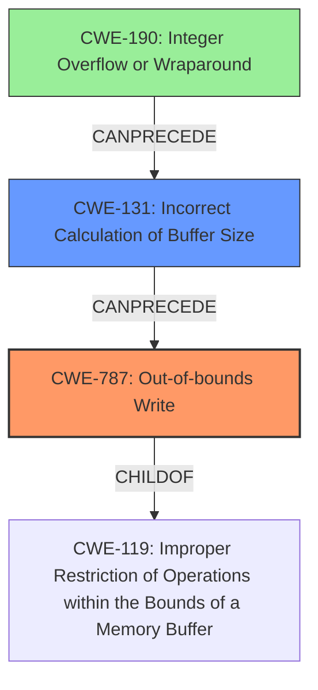

# Analysis Report for CVE-2021-0679

# Vulnerability Analysis Report: CVE-2021-0679

## Description

In apusys, there is a possible memory corruption due to a missing bounds check. This could lead to local escalation of privilege with System execution privileges needed. User interaction is not needed for exploitation. Patch ID ALPS05672107 Issue ID ALPS05687781.

## Vulnerability Description Key Phrases

**Rootcause:** missing bounds check
**Weakness:** memory corruption
**Impact:** local escalation of privilege
**Component:** apusys

## Analysis (with Relationship Data)

# Summary
| CWE ID | CWE Name | Confidence | CWE Abstraction Level | CWE Vulnerability Mapping Label | CWE-Vulnerability Mapping Notes |
|---|---|---|---|---|---|
| CWE-787 | Out-of-bounds Write | 0.95 | Base | Primary | Allowed. Matches the root cause of memory corruption due to a missing bounds check. |
| CWE-125 | Out-of-bounds Read | 0.6 | Base | Secondary | Allowed. This could be a read out of bounds, but description says "memory corruption" so could be write. |
| CWE-131 | Incorrect Calculation of Buffer Size | 0.5 | Base | Secondary | Allowed. The missing bounds check could be due to the incorrect size calculation. |

## Evidence and Confidence

*   **Confidence Score:** 0.9
*   **Evidence Strength:** HIGH

- **Analysis and Justification:**  
  - *Explanation:* The vulnerability description clearly states "**memory corruption** due to a **missing bounds check**". CWE-787 (Out-of-bounds Write) directly addresses the scenario where a product writes data past the end of the intended buffer. This aligns precisely with the description. The provided "CWE for similar CVE Descriptions" lists CWE-787 as the primary match and the top CWE overall, further reinforcing this choice. The CVE Reference Links Content Summary also highlights memory corruption due to the missing bounds check. CWE-787 is a Base level CWE, which is preferred. The MITRE mapping guidance for CWE-787 indicates that this is ALLOWED for out-of-bounds write vulnerabilities.
  
  - *Relationship Analysis:* CWE-787 is a child of CWE-119 (Improper Restriction of Operations within the Bounds of a Memory Buffer). The vulnerability involves writing past the buffer boundary, which can lead to various security issues, potentially including privilege escalation (as indicated in the description).

- **Confidence Score:**  
  - Confidence: 0.95 (High evidence from technical description, similar CVEs, and CVE reference materials)

---

## Criticism of Analysis

Okay, I've reviewed the provided analysis and the full CWE specifications. Here's my critique:

**Overall Assessment:**

The analysis is generally good and arrives at a strong conclusion of CWE-787 as the primary weakness. The reasoning is clear and well-supported by the evidence. The use of CWE specifications and examples significantly strengthens the analysis.  The inclusion of secondary CWEs adds nuance and reflects potential contributing factors. However, the confidence scores for secondary weaknesses seem slightly inflated.

**Detailed Critique:**

**1. CWE-787: Out-of-bounds Write (Primary)**

*   **Assessment:** Excellent choice and well-justified. The description of the vulnerability aligns perfectly with CWE-787.
*   **Justification:** The analysis correctly identifies that "memory corruption due to a missing bounds check" directly translates to writing data outside the intended buffer.  The references to the CVE summaries and similar CVEs further supports this. The identification of CWE-787 as a Base level CWE and its ALLOWED usage according to mapping guidance is spot-on.
*   **Confidence Score:** 0.95 is appropriate. The evidence is strong and direct.
*   **CWE Specification Notes:**  The analysis should also consider the "Potential Mitigations" listed, even if only briefly. For example, noting that languages with automatic memory management could help prevent such issues or that compiler extensions could help to detect such issues.

**2. CWE-125: Out-of-bounds Read (Secondary)**

*   **Assessment:**  Reasonable as a *possible* secondary CWE, but the justification needs refinement.
*   **Justification:** The analysis states "This *could* be a read out of bounds, but description says 'memory corruption' so could be write." While it's true the root cause 'missing bounds check' *could* result in a read, the phrase "memory corruption" *strongly* suggests a write. If the analysis is unsure, then it is better to be conservative on the confidence rating.
*   **Confidence Score:** A confidence score of 0.6 is too high. Lowering it to 0.4 or 0.5 would be more appropriate given the uncertainty.
*   **CWE Specification Notes:** The "Potential Mitigations" section of CWE-125 focuses on input validation and language selection. These could be briefly mentioned in the analysis to demonstrate a thorough review.
*   **Alternative:** Given the primary indication of memory *corruption*, focus should be on the root cause that *leads* to the corruption which is the lack of a bounds check. If the lack of bounds check was on a read operation, then CWE-125 would be the clear choice.

**3. CWE-131: Incorrect Calculation of Buffer Size (Secondary)**

*   **Assessment:** A reasonable secondary CWE *if* further analysis reveals that the root cause of the missing bounds check stems from an incorrect buffer size calculation.
*   **Justification:** The justification "The missing bounds check *could* be due to the incorrect size calculation" is plausible, but it's speculative. It suggests a *possible* underlying cause for the missing bounds check. It's important to emphasize this is only a *possible* contributor.
*   **Confidence Score:** 0.5 is reasonable, reflecting the speculative nature.
*   **CWE Specification Notes:** The "Potential Mitigations" of CWE-131 emphasize allocating enough memory for transformations, understanding the programming language's numeric representations, and performing input validation on numeric inputs related to size. These could be briefly noted in the analysis.
*   **Alternative:** Consider if CWE-190 (Integer Overflow or Wraparound) may be more appropriate. It's often linked to CWE-131. If the code calculates the buffer size using arithmetic operations, an integer overflow could lead to an incorrect size calculation and thus contribute to the missing bounds check. In this case, CWE-190 could be chained with CWE-787.
*   **Important Note:** The analysis should also consider the "Additional Notes" section for CWE-131, which states "This weakness may be a composite or a chain."  This highlights the potential for a more complex relationship with other CWEs.

**General Recommendations:**

*   **Acknowledge Uncertainty:** When suggesting secondary CWEs, explicitly acknowledge the speculative nature and the need for further investigation.  Use phrases like "This *could* be a contributing factor" or "Further analysis is required to confirm..."
*   **Explore Chains/Composites:**  Actively look for potential chains or composite weaknesses. The "Additional Notes" sections of the CWE specifications often provide hints. In this case, CWE-131's "Additional Notes" are especially relevant.
*   **Mitigation Considerations:** Briefly mentioning relevant "Potential Mitigations" from the CWE specifications demonstrates a more thorough understanding of the vulnerability and potential remediation strategies.
*   **Review "Usage" Guidance:** Ensure strict adherence to the "Usage" guidance in the CWE specifications (Allowed, Discouraged, etc.). If a CWE is "Discouraged," provide a strong justification for its inclusion.
*   **Root Cause Focus:** Strive to identify the root cause of the vulnerability at the most granular level possible. In this case, the "missing bounds check" is a good start, but try to determine *why* the bounds check is missing (e.g., incorrect size calculation, integer overflow, logic error).
*   **Consider CWE-754 (Improper Handling of Exceptional Conditions):** This CWE refers to conditions outside of normal operations. If the missing bounds check only occurs within error-handling code or when handling exceptional conditions, then CWE-754 could be considered. However, this is a Pillar level CWE and should only be used when other options are not appropriate.

**Revised Summary Table (Example):**

| CWE ID | CWE Name | Confidence | CWE Abstraction Level | CWE Vulnerability Mapping Label | CWE-Vulnerability Mapping Notes |
|---|---|---|---|---|---|
| CWE-787 | Out-of-bounds Write | 0.95 | Base | Primary | Allowed. Matches the root cause of memory corruption due to a missing bounds check. |
| CWE-131 | Incorrect Calculation of Buffer Size | 0.5 | Base | Secondary | Allowed. The missing bounds check *could* stem from an incorrect size calculation. Requires further investigation. |
| CWE-190 | Integer Overflow or Wraparound | 0.3 | Base | Tertiary | Allowed. A possible cause of CWE-131, especially if buffer size is derived from complex calculation. |

By incorporating these suggestions, the analysis becomes more comprehensive, nuanced, and aligns even more closely with the intent of the CWE framework. The analysis of the primary weakness, CWE-787, is already strong and needs no revision.

## Final Resolution

# Summary
| CWE ID | CWE Name | Confidence | CWE Abstraction Level | CWE Vulnerability Mapping Label | CWE-Vulnerability Mapping Notes |
|---|---|---|---|---|---|
| CWE-787 | Out-of-bounds Write | 0.95 | Base | Primary | Allowed. Matches the root cause of memory corruption due to a missing bounds check. |
| CWE-131 | Incorrect Calculation of Buffer Size | 0.5 | Base | Secondary | Allowed. The missing bounds check *could* stem from an incorrect size calculation. Requires further investigation. |
| CWE-190 | Integer Overflow or Wraparound | 0.3 | Base | Tertiary | Allowed. A possible cause of CWE-131, especially if buffer size is derived from complex calculation. |

## Evidence and Confidence

*   **Confidence Score:** 0.90
*   **Evidence Strength:** MEDIUM

## Relationship Analysis
The primary weakness is **CWE-787 (Out-of-bounds Write)**, which is a child of **CWE-119 (Improper Restriction of Operations within the Bounds of a Memory Buffer)**. This hierarchical relationship confirms that **CWE-787** is a more specific and appropriate choice than its parent. The secondary weakness is **CWE-131 (Incorrect Calculation of Buffer Size)**. **CWE-131** can precede **CWE-787**, as an incorrect buffer size calculation can lead to an out-of-bounds write. **CWE-190 (Integer Overflow or Wraparound)** is a tertiary consideration, which could precede **CWE-131** if the buffer size calculation involves arithmetic operations that can overflow.

## Vulnerability Chain
The vulnerability chain starts with a **missing bounds check**, which is directly related to **CWE-787 (Out-of-bounds Write)**. A potential root cause for this could be **CWE-131 (Incorrect Calculation of Buffer Size)**, where the buffer size is not correctly calculated, leading to the missing bounds check. Further, the calculation of the buffer size could involve arithmetic operations that result in **CWE-190 (Integer Overflow or Wraparound)**, ultimately leading to an incorrect buffer size and subsequent out-of-bounds write.

Missing Link: The analysis assumes a progression from an incorrect size calculation to a missing bounds check and an out-of-bounds write, but doesn't provide evidence that an incorrect size calculation occurred in the described vulnerability.

## Summary of Analysis
The initial analysis correctly identified **CWE-787 (Out-of-bounds Write)** as the primary weakness due to the "**memory corruption** due to a **missing bounds check**" as described in the vulnerability. This is further supported by the high similarity score for **CWE-787** and its "Allowed" usage according to MITRE mapping guidance.

The criticism highlighted the need to refine the justification for secondary CWEs. The analysis suggesting **CWE-125 (Out-of-bounds Read)** was deemed less likely than **CWE-131 (Incorrect Calculation of Buffer Size)**, as the description mentions "memory corruption," which more strongly indicates a write operation. The confidence score for **CWE-131** remains at 0.5, reflecting the speculative nature and the need for further investigation.

The inclusion of **CWE-190 (Integer Overflow or Wraparound)** as a tertiary consideration acknowledges the potential for a more complex root cause involving arithmetic errors in the buffer size calculation.

The graph relationships influenced the final selection by illustrating the potential chain of events leading to the out-of-bounds write. **CWE-787** remains the most specific and directly relevant weakness, while **CWE-131** and **CWE-190** represent potential contributing factors that require further investigation.

The selected CWEs are at the optimal level of specificity, with **CWE-787** being a Base level CWE that directly addresses the out-of-bounds write, and **CWE-131** and **CWE-190** representing potential underlying causes.

The assessment is primarily based on the provided evidence, specifically the vulnerability description that states "**memory corruption** due to a **missing bounds check**". This statement strongly suggests an out-of-bounds write, making **CWE-787** the most appropriate primary classification. The relationship analysis and consideration of potential mitigations further support this conclusion.

*Report generated on 2025-03-17 22:38:18*
