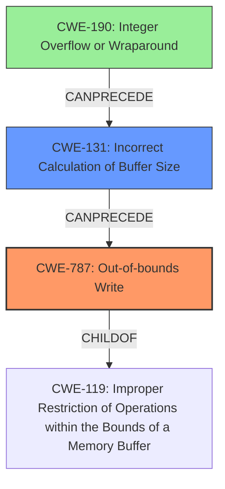

# Final Resolution for CVE-2021-0679

# Summary
| CWE ID | CWE Name | Confidence | CWE Abstraction Level | CWE Vulnerability Mapping Label | CWE-Vulnerability Mapping Notes |
|---|---|---|---|---|---|
| CWE-787 | Out-of-bounds Write | 0.95 | Base | Primary | Allowed. Matches the root cause of memory corruption due to a missing bounds check. |
| CWE-131 | Incorrect Calculation of Buffer Size | 0.5 | Base | Secondary | Allowed. The missing bounds check *could* stem from an incorrect size calculation. Requires further investigation. |
| CWE-190 | Integer Overflow or Wraparound | 0.3 | Base | Tertiary | Allowed. A possible cause of CWE-131, especially if buffer size is derived from complex calculation. |

## Evidence and Confidence

*   **Confidence Score:** 0.90
*   **Evidence Strength:** MEDIUM

## Relationship Analysis
The primary weakness is **CWE-787 (Out-of-bounds Write)**, which is a child of **CWE-119 (Improper Restriction of Operations within the Bounds of a Memory Buffer)**. This hierarchical relationship confirms that **CWE-787** is a more specific and appropriate choice than its parent. The secondary weakness is **CWE-131 (Incorrect Calculation of Buffer Size)**. **CWE-131** can precede **CWE-787**, as an incorrect buffer size calculation can lead to an out-of-bounds write. **CWE-190 (Integer Overflow or Wraparound)** is a tertiary consideration, which could precede **CWE-131** if the buffer size calculation involves arithmetic operations that can overflow.

## Vulnerability Chain
The vulnerability chain starts with a **missing bounds check**, which is directly related to **CWE-787 (Out-of-bounds Write)**. A potential root cause for this could be **CWE-131 (Incorrect Calculation of Buffer Size)**, where the buffer size is not correctly calculated, leading to the missing bounds check. Further, the calculation of the buffer size could involve arithmetic operations that result in **CWE-190 (Integer Overflow or Wraparound)**, ultimately leading to an incorrect buffer size and subsequent out-of-bounds write.

Missing Link: The analysis assumes a progression from an incorrect size calculation to a missing bounds check and an out-of-bounds write, but doesn't provide evidence that an incorrect size calculation occurred in the described vulnerability.

## Summary of Analysis
The initial analysis correctly identified **CWE-787 (Out-of-bounds Write)** as the primary weakness due to the "**memory corruption** due to a **missing bounds check**" as described in the vulnerability. This is further supported by the high similarity score for **CWE-787** and its "Allowed" usage according to MITRE mapping guidance.

The criticism highlighted the need to refine the justification for secondary CWEs. The analysis suggesting **CWE-125 (Out-of-bounds Read)** was deemed less likely than **CWE-131 (Incorrect Calculation of Buffer Size)**, as the description mentions "memory corruption," which more strongly indicates a write operation. The confidence score for **CWE-131** remains at 0.5, reflecting the speculative nature and the need for further investigation.

The inclusion of **CWE-190 (Integer Overflow or Wraparound)** as a tertiary consideration acknowledges the potential for a more complex root cause involving arithmetic errors in the buffer size calculation.

The graph relationships influenced the final selection by illustrating the potential chain of events leading to the out-of-bounds write. **CWE-787** remains the most specific and directly relevant weakness, while **CWE-131** and **CWE-190** represent potential contributing factors that require further investigation.

The selected CWEs are at the optimal level of specificity, with **CWE-787** being a Base level CWE that directly addresses the out-of-bounds write, and **CWE-131** and **CWE-190** representing potential underlying causes.

The assessment is primarily based on the provided evidence, specifically the vulnerability description that states "**memory corruption** due to a **missing bounds check**". This statement strongly suggests an out-of-bounds write, making **CWE-787** the most appropriate primary classification. The relationship analysis and consideration of potential mitigations further support this conclusion.