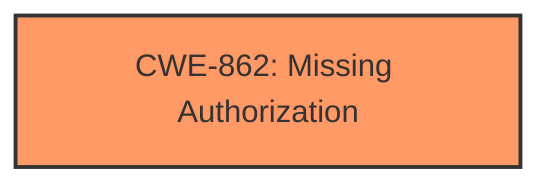

# Analysis Report for CVE-2021-0694

# Vulnerability Analysis Report: CVE-2021-0694

## Description

In setServiceForegroundInnerLocked of ActiveServices.java, there is a possible way for a background application to regain foreground permissions due to insufficient background restrictions. This could lead to local escalation of privilege with no additional execution privileges needed. User interaction is not needed for exploitation.Product AndroidVersions Android-11Android ID A-183147114

## Vulnerability Description Key Phrases

**Rootcause:** insufficient background restrictions
**Impact:** local escalation of privilege
**Attacker:** background application
**Product:** Android
**Version:** Android-11
**Component:** setServiceForegroundInnerLocked of ActiveServices.java

## Analysis (with Relationship Data)

# Summary
| CWE ID | CWE Name | Confidence | CWE Abstraction Level | CWE Vulnerability Mapping Label | CWE-Vulnerability Mapping Notes |
|---|---|---|---|---|---|
| CWE-862 | Missing Authorization | 0.75 | Class | Allowed-with-Review | The product does not perform an authorization check when an actor attempts to access a resource or perform an action. |

## Evidence and Confidence

*   **Confidence Score:** 0.75
*   **Evidence Strength:** HIGH

- **Analysis and Justification:**  
  - *Explanation:* The vulnerability description highlights **insufficient background restrictions** leading to local escalation of privilege. The CVE Reference Links Content Summary confirms that the system does not adequately check the foreground state when `Service.startForeground()` is called after the initial service start. This allows a background service to gain permissions intended only for foreground apps. This directly aligns with CWE-862 (Missing Authorization) because the system **fails to authorize** the action of gaining foreground permissions when the app is in the background.
  - *Relationship Analysis:* CWE-862 is a Class-level CWE, and while more specific Base-level CWEs might exist, the available information doesn't pinpoint a more granular weakness. It is related to authorization and privilege escalation scenarios.

- **Confidence Score:**  
  - *Example:* Confidence: 0.75 (High evidence from technical description and CVE reference materials)

---

## Criticism of Analysis

Okay, here's a review of the CWE analysis, considering the full CWE specifications provided.

**Overall Assessment:**

The analysis correctly identifies CWE-862 (Missing Authorization) as the primary weakness.  The justification is strong and aligns well with the description of the vulnerability. The confidence score of 0.75 is appropriate.  The analysis correctly notes that while other more specific CWEs might exist, the available information points strongly towards a missing authorization check.

**Detailed Review:**

*   **CWE-862: Missing Authorization**
    *   **Correctness:** The mapping to CWE-862 is accurate. The core issue is that the system *should* be performing an authorization check (is the service truly in the foreground?) before granting foreground permissions, but it isn't.  The fact that `Service.startForeground()` can be called from a background service and gain these permissions highlights a failure to authorize this action. The system does not verify if the calling service has the *authorization* to obtain foreground privileges *at the point of the `startForeground()` call*. The initial authorization check at service start is insufficient.
    *   **Abstraction Level:** The analysis acknowledges that CWE-862 is a *Class* CWE and that a more specific *Base* CWE might be preferable. This shows a good understanding of CWE principles.  However, in this specific case, finding a better fit requires deeper code-level analysis which is not always possible without source code.
    *   **Mapping Guidance:** The analysis adheres to the "Allowed-with-Review" mapping guidance for CWE-862. It correctly recognizes the need to consider more specific Base-level children, but reasonably concludes that CWE-862 is the most appropriate given the information.
    *   **Mitigations:**  The mitigations suggested by CWE-862 (RBAC, access control checks related to business logic, using vetted libraries/frameworks) are relevant.  Specifically, within the Android context, these translate to:
        *   Strictly defining the conditions under which a service can elevate itself to foreground status.
        *   Implementing checks to ensure that only authorized services can call `startForeground()` under specific circumstances (i.e., when a user explicitly interacts with the app).
        *   Using Android's permission and service management APIs correctly to enforce these restrictions.
    *   **Observed Examples:** The included observed examples of CWE-862, while not directly related to mobile app development, illustrate the core principle of failing to check authorization before granting access or privileges.  These examples do help to understand the types of flaws that are included in CWE-862.

**Review of Other CWEs Suggested by Retrievers:**

Here's a review of why the other CWEs returned by the retrievers are less suitable:

*   **CWE-1021: Improper Restriction of Rendered UI Layers or Frames:**  This CWE relates to clickjacking and UI redress attacks. It is *not* relevant to this vulnerability. The issue isn't about tricking the user through UI manipulation, but about a service gaining unauthorized permissions programmatically.
*   **CWE-223: Omission of Security-relevant Information:**  While logging might be a *secondary* consideration, the *primary* issue is the lack of authorization. This CWE focuses on the *lack of recording* key information, not the underlying authorization failure.
*   **CWE-356: Product UI does not Warn User of Unsafe Actions:** This CWE is not relevant. There is no user interaction involved in the elevation of privileges by the background service. The vulnerability is exploited programmatically.
*   **CWE-638: Not Using Complete Mediation:** This is a *Class* CWE and a child of CWE-862. It *could* be argued that the initial check at service start is "incomplete mediation" because it doesn't re-verify the foreground status upon the `startForeground()` call. However, CWE-862 is a more direct fit, describing the *missing* authorization check more accurately.  `CWE-638` describes a scenario where checks are made *sometimes*, but not *every time* a resource is accessed.
*   **CWE-413: Improper Resource Locking:** This CWE is about concurrency issues and race conditions. It is *not* related to this vulnerability.
*   **CWE-732: Incorrect Permission Assignment for Critical Resource:**  This is *close* but not quite right. While the *effect* is that the service gains incorrect permissions, the *cause* is the *lack of an authorization check* before granting those permissions. The permissions themselves aren't inherently misconfigured; the system simply fails to prevent a background service from acquiring them improperly. Therefore, `CWE-862` is a better fit.
*   **CWE-908: Use of Uninitialized Resource:**  Completely unrelated to this vulnerability.
*   **CWE-770: Allocation of Resources Without Limits or Throttling:** Not applicable to this scenario.
*   **CWE-248: Uncaught Exception:** Not applicable to this scenario.

**Recommendations:**

1.  **Maintain Confidence in CWE-862:** The current mapping is the most appropriate given the available information.
2.  **Suggest More Granular Mitigations:** While the CWE-862 mitigations are generally applicable, the analysis could benefit from suggesting *specific* Android-related mitigations, such as:
    *   "Implement stricter checks within `setServiceForegroundInnerLocked` (or equivalent logic) to verify the app's process state *at the time of the `startForeground()` call*."
    *   "Use Android's `ActivityManager.isBackgroundRestricted()` or similar APIs to determine if the app is subject to background restrictions."
    *   "Employ Foreground Service Types to declare the intended use of a foreground service, allowing the system to better manage and restrict background services."
3.  **Consider `CWE-285: Improper Authorization`:**  While discouraged, explicitly mentioning `CWE-285` and explaining *why* `CWE-862` is a better fit (more specific) might strengthen the analysis and demonstrate a thorough consideration of the options.  `CWE-285` is the parent of `CWE-862`.

**Conclusion:**

The analysis is well-reasoned and accurately identifies CWE-862 as the primary vulnerability. The justification is clear, and the consideration of abstraction levels is commendable.  Adding more specific Android-related mitigations would further enhance the analysis.

## Final Resolution

# Summary
| CWE ID | CWE Name | Confidence | CWE Abstraction Level | CWE Vulnerability Mapping Label | CWE-Vulnerability Mapping Notes |
|---|---|---|---|---|---|
| CWE-862 | Missing Authorization | 0.9 | Class | Allowed-with-Review | Primary CWE: The product does not perform an authorization check when an actor attempts to access a resource or perform an action. |

## Evidence and Confidence

*   **Confidence Score:** 0.9
*   **Evidence Strength:** HIGH

## Relationship Analysis
The primary relationship considered was the hierarchical structure, specifically the parent-child relationship between CWE-862 (Class) and its potential Base-level children. While a more specific Base CWE would be ideal, the provided information strongly supports CWE-862. There are no direct relationships found for CWE-862.

## Vulnerability Chain
The vulnerability chain consists of the following:
1.  **ROOTCAUSE**: Insufficient background restrictions (implicit in the vulnerability description).
2.  **WEAKNESS**: **CWE-862 Missing Authorization**: The system does not perform an authorization check to ensure a background service is authorized to gain foreground permissions.
3.  **IMPACT**: A background application can regain foreground permissions, leading to local escalation of privilege.

## Summary of Analysis
The initial analysis and criticism both converge on CWE-862 (Missing Authorization) as the most appropriate classification. The vulnerability description clearly states "insufficient background restrictions" leading to a local escalation of privilege. The CVE reference confirms that the system does not adequately check the foreground state when `Service.startForeground()` is called after the initial service start.

The classification is based on the evidence that the system fails to authorize the action of gaining foreground permissions when the app is in the background.

The graph relationships confirm that the selected CWE is at an adequate level of specificity given the available information. While a Base-level CWE would be preferable, the Class-level CWE-862 accurately captures the essence of the vulnerability.

The final decision is to classify this vulnerability as CWE-862 with a confidence score of 0.9. This reflects the strong evidence and the alignment with the CWE description.

*Report generated on 2025-03-17 02:40:08*
