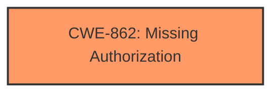

# Final Resolution for CVE-2021-0694

# Summary
| CWE ID | CWE Name | Confidence | CWE Abstraction Level | CWE Vulnerability Mapping Label | CWE-Vulnerability Mapping Notes |
|---|---|---|---|---|---|
| CWE-862 | Missing Authorization | 0.9 | Class | Allowed-with-Review | Primary CWE: The product does not perform an authorization check when an actor attempts to access a resource or perform an action. |

## Evidence and Confidence

*   **Confidence Score:** 0.9
*   **Evidence Strength:** HIGH

## Relationship Analysis
The primary relationship considered was the hierarchical structure, specifically the parent-child relationship between CWE-862 (Class) and its potential Base-level children. While a more specific Base CWE would be ideal, the provided information strongly supports CWE-862. There are no direct relationships found for CWE-862.

## Vulnerability Chain
The vulnerability chain consists of the following:
1.  **ROOTCAUSE**: Insufficient background restrictions (implicit in the vulnerability description).
2.  **WEAKNESS**: **CWE-862 Missing Authorization**: The system does not perform an authorization check to ensure a background service is authorized to gain foreground permissions.
3.  **IMPACT**: A background application can regain foreground permissions, leading to local escalation of privilege.

## Summary of Analysis
The initial analysis and criticism both converge on CWE-862 (Missing Authorization) as the most appropriate classification. The vulnerability description clearly states "insufficient background restrictions" leading to a local escalation of privilege. The CVE reference confirms that the system does not adequately check the foreground state when `Service.startForeground()` is called after the initial service start.

The classification is based on the evidence that the system fails to authorize the action of gaining foreground permissions when the app is in the background.

The graph relationships confirm that the selected CWE is at an adequate level of specificity given the available information. While a Base-level CWE would be preferable, the Class-level CWE-862 accurately captures the essence of the vulnerability.

The final decision is to classify this vulnerability as CWE-862 with a confidence score of 0.9. This reflects the strong evidence and the alignment with the CWE description.