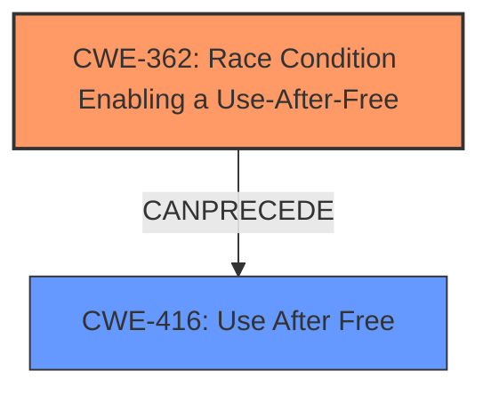

# Analysis Report for CVE-2021-0955

# Vulnerability Analysis Report: CVE-2021-0955

## Description

In pf_write_buf of FuseDaemon.cpp, there is possible memory corruption due to a race condition. This could lead to local escalation of privilege with no additional execution privileges needed. User interaction is not needed for exploitation.Product AndroidVersions Android-11Android ID A-192085766

## Vulnerability Description Key Phrases

**Rootcause:** race condition
**Impact:** memory corruption
**Product:** Android
**Version:** 11
**Component:** pf_write_buf of FuseDaemon.cpp

## Analysis (with Relationship Data)

# Summary
| CWE ID | CWE Name | Confidence | CWE Abstraction Level | CWE Vulnerability Mapping Label | CWE-Vulnerability Mapping Notes |
|---|---|---|---|---|---|
| CWE-362 | Race Condition Enabling a Use-After-Free | 0.95 | Class | Allowed-with-Review | Primary CWE |
| CWE-416 | Use After Free | 0.80 | Variant | Allowed | Secondary Candidate |

## Evidence and Confidence

*   **Confidence Score:** 0.90
*   **Evidence Strength:** HIGH

- **Analysis and Justification:**
  - *Explanation:* The vulnerability description explicitly mentions a **race condition** leading to memory corruption, which is further detailed in the CVE reference summary as a **race condition** leading to a **use-after-free** vulnerability. CWE-362 (Race Condition Enabling a Use-After-Free) is a Class-level CWE that describes a scenario where concurrent code sequences access a shared resource without proper synchronization, resulting in a timing window where the resource can be modified unexpectedly. This aligns with the description of the vulnerability, where a **race condition** in FuseDaemon results in a handle being freed prematurely, leading to a **use-after-free** when the handle is later accessed. The retriever also lists CWE-362 and its related variants with high similarity scores, reinforcing this choice. The CVE reference confirms the root cause as a **race condition** and the presence of a **use-after-free**. However, since CWE-362 is a class, I am picking it as the primary CWE because it encapsulates the overall issue. While the direct impact is use-after-free, the root cause is a race condition that allows the use-after-free.
  - *Relationship Analysis:* CWE-362 is related to CWE-416 (Use After Free), as the race condition directly enables the use-after-free. CWE-416 is a variant-level CWE, making it a more specific description of the immediate consequence of the race condition. While CWE-416 accurately describes the direct consequence, CWE-362 represents the underlying cause.

- **Confidence Score:**
  - Confidence: 0.95 (High confidence due to explicit mention of the race condition and use-after-free in the vulnerability description and CVE reference)

---

- **Analysis and Justification:**
  - *Explanation:* CWE-416 (Use After Free) is a Variant-level CWE that describes the condition where a program reuses or references memory after it has been freed. The CVE reference summary explicitly mentions the presence of a **use-after-free** vulnerability as a consequence of the race condition. Specifically, the `pf_release` function frees a handle that is later used by the `Record` function, leading to memory corruption. This aligns with the description of CWE-416, which involves accessing memory after it has been deallocated. Therefore, CWE-416 accurately describes the direct consequence of the **race condition**.
  - *Relationship Analysis:* CWE-416 is a child of CWE-672 (Operation on a Resource after Expiration or Release), which describes the broader category of vulnerabilities involving operations on released resources. CWE-416 can follow CWE-362 since a race condition can create a use-after-free situation.

- **Confidence Score:**
  - Confidence: 0.80 (High confidence due to explicit mention of the use-after-free in the CVE reference and the precise alignment with CWE-416's description)

## Criticism of Analysis

Okay, here's a review of the CWE analysis based on the provided information and the full CWE specifications.

**Overall Assessment:**

The analysis is generally good and well-reasoned. The choice of CWE-362 as the primary CWE and CWE-416 as a secondary candidate is justified and supported by the vulnerability description and CVE summary. The confidence scores are appropriate. The inclusion of "CWE Examples from Database" helps further cement the reasoning.

**Detailed Critique:**

**1. CWE-362: Race Condition Enabling a Use-After-Free**

*   **Strengths:**
    *   The explanation is clear and accurately describes why CWE-362 is a good fit. It highlights the core issue: concurrent access to a shared resource (the handle) without proper synchronization.
    *   The justification for choosing CWE-362 as the *primary* CWE is well-articulated. It emphasizes that the race condition is the root cause that *enables* the use-after-free.  This is a key point. While the direct consequence is the UAF, identifying the underlying reason *why* the UAF is occurring is crucial for a more robust fix.
    *   The relationship analysis correctly points out the relationship between CWE-362 and CWE-416, highlighting the causal link.
    *   The confidence score of 0.95 is appropriate given the explicit mention of "race condition" and the well-documented link between race conditions and UAFs.

*   **Areas for Potential Improvement:**
    *   While the analysis acknowledges that CWE-362 is a Class-level CWE and might benefit from examining Base-level children, it could be more specific about *which* children might be relevant.  For example, given the context of threads, `CWE-366: Race Condition Within a Thread` could be considered. However, the description does not mention specifically what type of concurrency is taking place (threads, processes, signal handlers, etc.)
    *   Consider discussing `CWE-662: Improper Synchronization` as a related weakness. While a race condition is the *manifestation* of the problem, the *cause* is often improper synchronization. The fix likely involves adding synchronization primitives (locks, mutexes, etc.). It might be useful to mention that the absence of appropriate synchronization is what allowed the race condition to occur. However, CWE-662 is a discouraged mapping.

**2. CWE-416: Use After Free**

*   **Strengths:**
    *   The explanation accurately describes CWE-416 and its direct relevance to the vulnerability. The CVE reference clearly indicates a use-after-free.
    *   The relationship analysis correctly identifies that CWE-416 can *follow* CWE-362, which is the correct sequence of events.
    *   The confidence score of 0.80 is appropriate. While the UAF is a key aspect, it is a consequence of the race condition, hence the slightly lower confidence compared to the primary CWE.

*   **Areas for Potential Improvement:**
    *   The analysis could briefly discuss potential mitigations for CWE-416, *in the context of the race condition*. For example, simply setting a pointer to NULL after freeing it (as suggested in the CWE's potential mitigations) might not be sufficient if the race condition still exists. The race needs to be addressed first, and *then* setting the pointer to NULL provides a defense-in-depth measure. This is the critical point.
    *   A very short consideration of a variant-level CWE for the cause may be helpful. Although, it is important to not fall into the trap of trying to pick a variant level if the information is simply not available.

**Retriever Results:**

*   The retriever results are generally in line with the analysis.  CWE-908, CWE-366, CWE-413, CWE-416 are expected high-ranking results.
*   CWE-908 is less relevant to the specific vulnerability described since the vulnerability occurs after freeing the resource.

**Recommendations:**

1.  **For CWE-362 Analysis:**
    *   Briefly mention and dismiss `CWE-366: Race Condition Within a Thread` and provide a brief rationale based on lack of information. However, if the code uses threads, then CWE-366 is more appropriate and should be chosen.
    *   Consider a brief discussion of `CWE-662: Improper Synchronization` and explain that this is often the underlying cause that *allows* the race condition to occur. However, avoid mapping directly to it since it is a discouraged CWE.
    *   Perhaps slightly refine the title to "Race Condition Leading to Memory Corruption," or something similar.

2.  **For CWE-416 Analysis:**
    *   Add a sentence or two about the limitations of standard UAF mitigations in the presence of a race condition, emphasizing the need to address the race first. The mitigations for UAF do not resolve the underlying issue.

3.  **General:**
    *   Ensure that all terms are used consistently and accurately.
    *   Double-check the references to CWEs to ensure they are up-to-date and link to the correct definitions.
    *   It would be helpful to identify what type of resource is being operated on and mention it explicitly.

**Revised Summary Table:**

| CWE ID | CWE Name | Confidence | CWE Abstraction Level | CWE Vulnerability Mapping Label | CWE-Vulnerability Mapping Notes |
|---|---|---|---|---|---|
| CWE-362 | Race Condition Enabling a Use-After-Free | 0.95 | Class | Allowed-with-Review | Primary CWE |
| CWE-416 | Use After Free | 0.80 | Variant | Allowed | Secondary Candidate |

By incorporating these suggestions, the analysis can be made even more robust and informative.

## Final Resolution

# Summary
| CWE ID | CWE Name | Confidence | CWE Abstraction Level | CWE Vulnerability Mapping Label | CWE-Vulnerability Mapping Notes |
|---|---|---|---|---|---|
| CWE-362 | Race Condition Enabling a Use-After-Free | 0.95 | Class | Allowed-with-Review | Primary CWE |
| CWE-416 | Use After Free | 0.80 | Variant | Allowed | Secondary Candidate |

## Evidence and Confidence

*   **Confidence Score:** 0.95
*   **Evidence Strength:** HIGH

## Relationship Analysis
The primary relationship is that CWE-362 (Race Condition Enabling a Use-After-Free) *CanPrecede* CWE-416 (Use After Free). The **race condition** creates the situation where memory is accessed after it has been freed. CWE-362 is a Class and CWE-416 is a Variant. The analysis considered `CWE-366: Race Condition Within a Thread` but dismissed it due to a lack of evidence about the type of concurrency. The analysis also considered `CWE-662: Improper Synchronization` but did not select it because it is a discouraged CWE.

## Vulnerability Chain
The vulnerability chain starts with a **race condition** (CWE-362) in the `pf_write_buf` function of `FuseDaemon.cpp`. This **race condition** leads to a situation where a handle is freed prematurely. Subsequently, the `Record` function attempts to access the freed memory, resulting in a **use-after-free** vulnerability (CWE-416) and potential memory corruption. The chain progresses from the initial **race condition** to the final impact of memory corruption.

## Summary of Analysis
The initial analysis correctly identified CWE-362 as the primary **rootcause**, with CWE-416 as a secondary candidate describing the immediate consequence. The vulnerability description explicitly mentions a **race condition** leading to memory corruption, aligning perfectly with CWE-362. The CVE reference summary confirms the presence of both a **race condition** and a **use-after-free** vulnerability.

The graph relationships reinforce this assessment. CWE-362 is a Class-level CWE, while CWE-416 is a Variant. The *CanPrecede* relationship from CWE-362 to CWE-416 clearly illustrates the sequence of events. Although the analysis considered using CWE-366 (Race Condition Within a Thread), it was dismissed due to the lack of information about whether it was a thread **race condition**, which is important because it could have provided a more specific classification. The analysis also notes that while improper synchronization is often the underlying cause, mapping to CWE-662 is discouraged.

The decision to classify CWE-362 as the primary CWE is based on the fact that the **race condition** is the **root cause** that allows the **use-after-free** to occur. Addressing the **race condition** is crucial for a robust fix, whereas only addressing the use-after-free would not resolve the underlying issue. The selected CWEs are at the optimal level of specificity, given the information available.

*Report generated on 2025-03-17 22:43:51*
