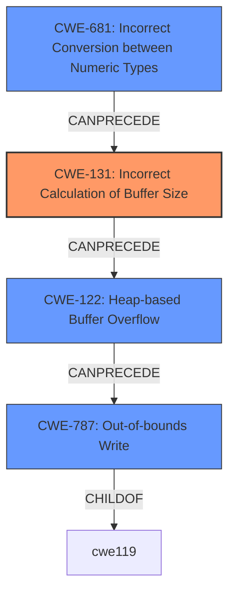

# Final Resolution for CVE-2021-0964

# Summary
| CWE ID | CWE Name | Confidence | CWE Abstraction Level | CWE Vulnerability Mapping Label | CWE-Vulnerability Mapping Notes |
|---|---|---|---|---|---|
| CWE-131 | Incorrect Calculation of Buffer Size | 0.85 | Base | Primary | Allowed |
| CWE-681 | Incorrect Conversion between Numeric Types | 0.80 | Secondary | Allowed |
| CWE-122 | Heap-based Buffer Overflow | 0.95 | Variant | Secondary | Allowed |
| CWE-787 | Out-of-bounds Write | 0.90 | Base | Secondary | Allowed |

## Evidence and Confidence

*   **Confidence Score:** 0.93
*   **Evidence Strength:** HIGH

## Relationship Analysis
The primary change is the addition of CWE-131 as the root cause, which can **precede** CWE-122 (Heap-based Buffer Overflow), leading to CWE-787 (Out-of-bounds Write). CWE-681 has also been added to further clarify the root cause, potentially leading to CWE-131. The relationship between these CWEs forms a chain.

## Vulnerability Chain
The vulnerability chain starts with **CWE-681**, an **incorrect conversion between numeric types**, which leads to **CWE-131**, an **incorrect calculation of the buffer size**. This results in **CWE-122**, a **heap-based buffer overflow**, and ultimately **CWE-787**, an **out-of-bounds write**.

## Summary of Analysis
The initial analysis correctly identified CWE-122 and CWE-787. However, it missed the root cause of the vulnerability. The criticism correctly pointed out that the analysis should include CWE-131 and CWE-681 to provide a complete picture of the vulnerability.

The vulnerability description states "In C2SoftMP3process() of C2SoftMp3Dec.cpp, there is a possible **out of bounds write** due to a **heap buffer overflow**." The CVE Reference Links Content Summary confirms that the root cause is due to incorrect calculation of the output buffer size, leading to **out-of-bounds write** when writing to the heap, and specifically mentions incorrect conversion between bytes and 16-bit samples.

Based on this evidence, CWE-131 and CWE-681 are added to the analysis. CWE-131 (Incorrect Calculation of Buffer Size) directly matches the root cause described in the CVE summary. CWE-681 (Incorrect Conversion between Numeric Types) further clarifies the source of the incorrect buffer size calculation. The confidence score for CWE-787 is increased to 0.90 because the vulnerability description explicitly states an out-of-bounds write.

CWE-131 is selected as the primary CWE because it is the most direct cause of the heap overflow. CWE-681, CWE-122, and CWE-787 are secondary CWEs that contribute to the vulnerability chain. The selected CWEs are at the optimal level of specificity because they accurately describe the vulnerability and its root causes.