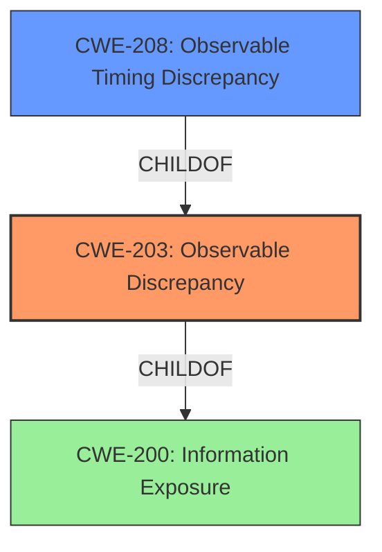

# Final Resolution for CVE-2021-0983

# Summary
| CWE ID | CWE Name | Confidence | CWE Abstraction Level | CWE Vulnerability Mapping Label | CWE-Vulnerability Mapping Notes |
|---|---|---|---|---|---|
| CWE-203 | Observable Discrepancy | 0.90 | Base | Allowed | Primary CWE |
| CWE-208 | Observable Timing Discrepancy | 0.70 | Base | Allowed | Secondary Candidate |

## Evidence and Confidence

*   **Confidence Score:** 0.9
*   **Evidence Strength:** HIGH

## Relationship Analysis
The primary weakness is **CWE-203 (Observable Discrepancy)**, a Base-level CWE that accurately captures the essence of information leakage through side channels. It sits under the broader Class **CWE-200 (Information Exposure)**. The review suggested exploring children of **CWE-203**, specifically **CWE-208 (Observable Timing Discrepancy)** and **CWE-205 (Observable Behavioral Discrepancy)**. While **CWE-205** is a valid consideration, the nature of side-channel attacks often involves timing variations, making **CWE-208** a strong secondary candidate to refine the classification. We are not including CWE-497 at all due to it not being descriptive enough and also not really capturing the root cause.

## Vulnerability Chain
The vulnerability chain starts with the **ROOTCAUSE** being a **side channel** in `createAdminSupportIntent` (**CWE-203**). This **WEAKNESS** leads to the disclosure of information about the installed device/profile owner package name. While the vulnerability description doesn't explicitly detail *how* the side channel works (timing, behavior, etc.), we can infer that observable discrepancies in the system's operation reveal sensitive information. The **IMPACT** is local information disclosure, which could potentially be used in further attacks.

## Summary of Analysis
The initial analysis correctly identified **CWE-203** as the primary **WEAKNESS**, based on the "side channel information disclosure" mentioned in the vulnerability description. The criticism correctly pointed out that **CWE-203** has more specific children. The evidence supports refining this to include **CWE-208 (Observable Timing Discrepancy)** as a secondary **WEAKNESS**, as side-channel attacks often exploit variations in timing. **CWE-497 (Improper Prevention of Sensitive System Information Access)** was deemed less relevant as it describes direct access issues rather than **side channel** effects.

The decision to include **CWE-208** is based on the understanding that **side channel** attacks frequently involve timing analysis. The vulnerability description, while not explicitly stating it, strongly implies that the information leakage is due to variations in the time it takes to perform certain operations. The chosen CWEs are at the optimal level of specificity, balancing the need for precision with the available evidence.