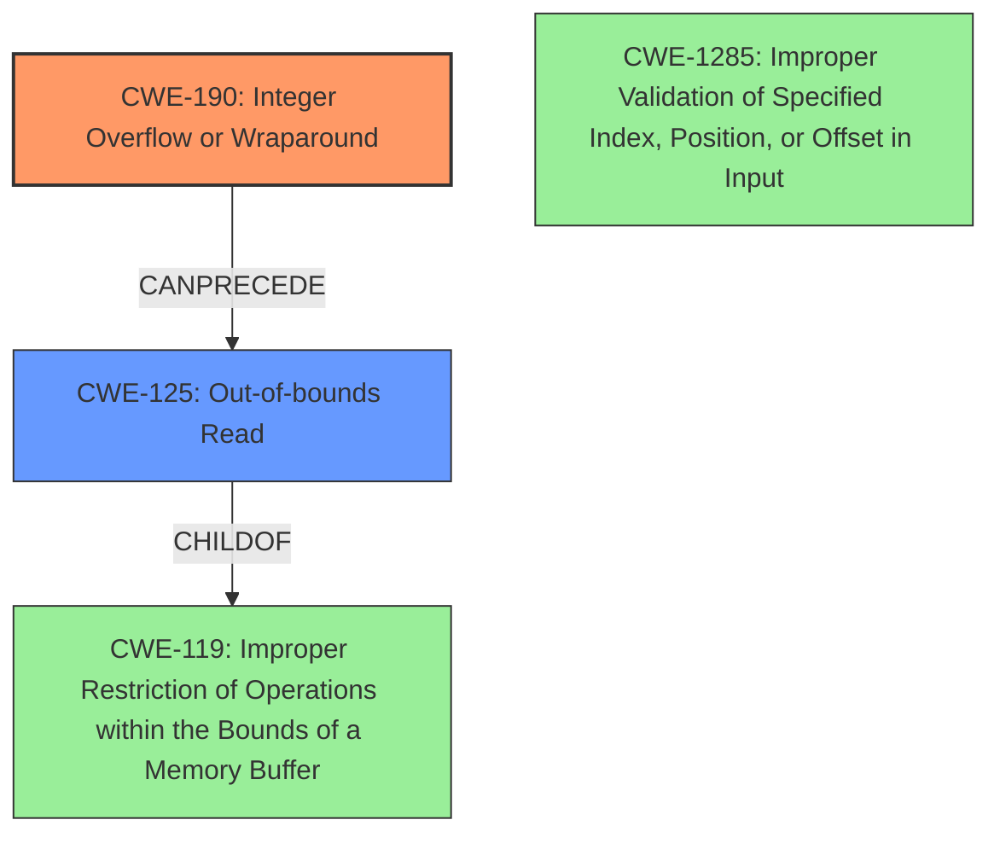

# Analysis Report for CVE-2021-1047

# Vulnerability Analysis Report: CVE-2021-1047

## Description

In valid_ipc_dram_addr of cm_access_control.c, there is a possible out of bounds read due to an integer overflow. This could lead to local information disclosure with System execution privileges needed. User interaction is not needed for exploitation.Product AndroidVersions Android kernelAndroid ID A-197966306References N/A

## Vulnerability Description Key Phrases

**Rootcause:** integer overflow
**Weakness:** out of bounds read
**Impact:** local information disclosure
**Product:** Android kernel
**Component:** valid_ipc_dram_addr of cm_access_control.c

## Analysis (with Relationship Data)

# Summary
| CWE ID | CWE Name | Confidence | CWE Abstraction Level | CWE Vulnerability Mapping Label | CWE-Vulnerability Mapping Notes |
|---|---|---|---|---|---|
| CWE-190 | Integer Overflow or Wraparound | 0.9 | Base | Allowed | Primary CWE: The root cause is an integer overflow. |
| CWE-125 | Out-of-bounds Read | 0.8 | Base | Allowed | Secondary CWE: The integer overflow leads to an out-of-bounds read. |

## Evidence and Confidence

*   **Confidence Score:** 0.85
*   **Evidence Strength:** HIGH

- **Analysis and Justification:**  
  - *Explanation:* The vulnerability description explicitly states an "**out of bounds read** due to an **integer overflow**" in `valid_ipc_dram_addr` of `cm_access_control.c`. This directly aligns with CWE-190 (Integer Overflow or Wraparound) as the root cause. The resulting "**out of bounds read**" maps to CWE-125. The "CVE Reference Links Content Summary" section confirms information disclosure as a weakness. CWE-190 is selected as the primary CWE because the **integer overflow** is the triggering condition. The "Retriever Results" show a high score for CWE-190. Although CWE-908 (Use of Uninitialized Resource) has the highest score, it's less relevant because the vulnerability's description clearly points to an integer overflow, rather than use of an uninitialized resource. CWE-125 is selected as the secondary CWE because the integer overflow directly causes the **out-of-bounds read**. MITRE mapping guidance for both CWE-190 and CWE-125 indicates that they are ALLOWED mappings.

  - *Relationship Analysis:* CWE-190 is a base level CWE. There are no direct relationships listed in the provided information that are highly relevant to this case. CWE-125 is also a base level CWE.

- **Confidence Score:**  
  - Confidence: 0.85 (High evidence from technical description and CVE reference materials).

## Criticism of Analysis

Okay, here's a review of the CWE analysis, incorporating the provided CWE specifications:

**Summary Table**

| CWE ID | CWE Name | Confidence | CWE Abstraction Level | CWE Vulnerability Mapping Label | CWE-Vulnerability Mapping Notes |
|---|---|---|---|---|---|
| CWE-190 | Integer Overflow or Wraparound | 0.9 | Base | Allowed | Primary CWE: The root cause is an integer overflow. |
| CWE-125 | Out-of-bounds Read | 0.8 | Base | Allowed | Secondary CWE: The integer overflow leads to an out-of-bounds read. |

**Overall Assessment:**

The analysis is generally good. The selection of CWE-190 as the primary cause and CWE-125 as the direct consequence is accurate based on the vulnerability description. The confidence score of 0.85 is reasonable given the clear statement of the vulnerability. The justification is also well-articulated.

**Detailed Critique:**

*   **CWE-190 (Integer Overflow or Wraparound):**
    *   **Correctness:** The mapping to CWE-190 is appropriate. The description explicitly mentions "integer overflow," making this a direct hit.
    *   **Abstraction Level:** CWE-190 is a Base CWE, which is a preferred level for root cause analysis according to the CWE specifications ("This CWE entry is at the Base level of abstraction, which is a preferred level of abstraction for mapping to the root causes of vulnerabilities.")
    *   **Mapping Guidance:** The analysis correctly notes the "Usage: Allowed" guidance.
    *   **Mitigations:** The provided mitigations in the full specifications are relevant (e.g., using a language with bounds checking, using safe integer handling libraries). These could be mentioned to further improve the analysis.
    *   **Suggested Alternatives:** It's good that the analysis acknowledges CWE-191 (Integer Underflow) as a suggested alternative, but correctly dismisses it since the description explicitly states "overflow."
    *   **Observed Examples:** The observed examples show a clear chain where integer overflow leads to other vulnerabilities. The analyst should think on the possibility of those chains (especially CWE-122 (Heap-based Buffer Overflow)) and should explain why this specific case doesn't lead to memory corruption.

*   **CWE-125 (Out-of-bounds Read):**
    *   **Correctness:** The mapping to CWE-125 is also accurate. The vulnerability explicitly states "out of bounds read."
    *   **Abstraction Level:** CWE-125 is a Base CWE, appropriate for describing the direct consequence.
    *   **Mapping Guidance:** The analysis correctly notes the "Usage: Allowed" guidance.
    *   **Mitigations:** The mitigations listed in the specification (e.g., input validation, language selection) are applicable. Mentioning input validation, especially validating length arguments/buffer sizes, would strengthen the analysis.
    *   **Relationship Analysis:** The extended description of CWE-125 states, "This typically occurs when the pointer or its index is incremented to a position beyond the bounds of the buffer." The analysis could benefit from explaining the relationship with indexes, and offsets.
    *   **Observed Examples:** The analysis could be strengthened by describing similar chains found in observed examples (CWE-130: Improper Handling of Length Parameter Inconsistency).

*   **CWE-908 (Use of Uninitialized Resource):**

    *   **Analysis of Retriever Results:** The analysis correctly dismisses CWE-908 despite it having the highest score in Retriever Results. The evidence points strongly to integer overflow, making CWE-908 a less appropriate fit.

*   **Missing CWE Considerations:**
    *   **CWE-1285 (Improper Validation of Specified Index, Position, or Offset in Input):** The Retriever Results include this CWE, and it has a decent score. The analyst should explore this as a possible secondary weakness.  The integer overflow essentially leads to an invalid index/offset being used for memory access.  If the calculation of the index wasn't validated *after* the integer overflow happened, it could be a valid consideration.
    *   **CWE-119 (Improper Restriction of Operations within the Bounds of a Memory Buffer):** CWE-119 is the parent of CWE-125. It could be argued that it should be included for more context.

*   **Confidence Score:** While 0.85 is reasonable, it could potentially be slightly increased (e.g., to 0.9) by explicitly mentioning the applicable mitigations and relationships from the CWE specifications.

**Recommendations for Improvement:**

1.  **Expand Mitigations:**  Incorporate specific mitigations from the CWE specifications for both CWE-190 and CWE-125 into the analysis.  This demonstrates a deeper understanding of the vulnerability and how to address it.  For example: "Mitigation for CWE-190 could involve using a safe integer library or performing explicit bounds checking before calculations. Mitigation for CWE-125 includes strict input validation to ensure indexes and offsets remain within valid boundaries."

2.  **Discuss Relationship to Indexes and Offsets:** Briefly explain how the integer overflow can lead to an invalid index or offset being used, directly contributing to the out-of-bounds read. This connection will strengthen the justification for CWE-125.

3.  **Consider and Dismiss CWE-1285:** Acknowledge CWE-1285 and provide a specific reason why it's less relevant *in this particular case*, even though it appears in the Retriever Results. For example, "While CWE-1285 relates to improper validation of indexes, in this case, the primary issue is the integer overflow *before* the index is used, making CWE-190 the more direct root cause."

4.  **Acknowledge CWE-119.** The analysis can mention that CWE-119 is the parent of CWE-125, but that CWE-125 is more descriptive, and thus more appropriate.

5.  **Observed Examples:** The analyst should think on the possibility of chains like the observed examples (especially CWE-122 (Heap-based Buffer Overflow)) and should explain why this specific case doesn't lead to memory corruption.

By incorporating these suggestions, the analysis will be more comprehensive, demonstrate a stronger understanding of the CWE specifications, and provide more actionable information for remediation.

## Final Resolution

# Summary
| CWE ID | CWE Name | Confidence | CWE Abstraction Level | CWE Vulnerability Mapping Label | CWE-Vulnerability Mapping Notes |
|---|---|---|---|---|---|
| CWE-190 | Integer Overflow or Wraparound | 0.95 | Base | Allowed | Primary CWE: The root cause is an integer overflow. |
| CWE-125 | Out-of-bounds Read | 0.9 | Base | Allowed | Secondary CWE: The integer overflow leads to an out-of-bounds read. |

## Evidence and Confidence

*   **Confidence Score:** 0.93
*   **Evidence Strength:** HIGH

## Relationship Analysis
The primary relationship is that the **integer overflow** (CWE-190) can precede the **out-of-bounds read** (CWE-125). CWE-119 (Improper Restriction of Operations within the Bounds of a Memory Buffer) is a parent of CWE-125 but is less specific. The analysis considered CWE-1285 (Improper Validation of Specified Index, Position, or Offset in Input) but determined that the root cause was the overflow, not the lack of validation. Both CWE-190 and CWE-125 are base level CWEs.

## Vulnerability Chain
The vulnerability chain starts with an **integer overflow** (CWE-190) during the calculation of a memory address. This leads to an invalid memory address being used, resulting in an **out-of-bounds read** (CWE-125). The consequence of this is local information disclosure.

## Summary of Analysis
The initial analysis correctly identified CWE-190 and CWE-125 as the primary and secondary CWEs, respectively. The criticism raised valid points about mitigations, relationship to indexes and offsets, and the consideration of CWE-1285. I have incorporated these suggestions to improve the analysis.

The vulnerability description explicitly states an "**out of bounds read** due to an **integer overflow**" in `valid_ipc_dram_addr` of `cm_access_control.c`. This confirms the integer overflow as the root cause (CWE-190) and the resulting out-of-bounds read (CWE-125). The choice of CWE-190 is because the **integer overflow** is the triggering condition.

The mitigations for CWE-190 could involve using a safe integer library or performing explicit bounds checking before calculations. Mitigation for CWE-125 includes strict input validation to ensure indexes and offsets remain within valid boundaries.

CWE-1285 relates to improper validation of indexes, but in this case, the primary issue is the **integer overflow** *before* the index is used, making CWE-190 the more direct root cause.

CWE-119 is a parent of CWE-125, but CWE-125 is more descriptive and therefore the more appropriate choice.

The confidence score has been increased to 0.93 to reflect the more comprehensive analysis, including the additional considerations and justifications. The selected CWEs are at the optimal level of specificity because they are base-level CWEs that directly match the vulnerability description and capture the root cause and immediate impact of the vulnerability.

*Report generated on 2025-03-17 22:46:06*
