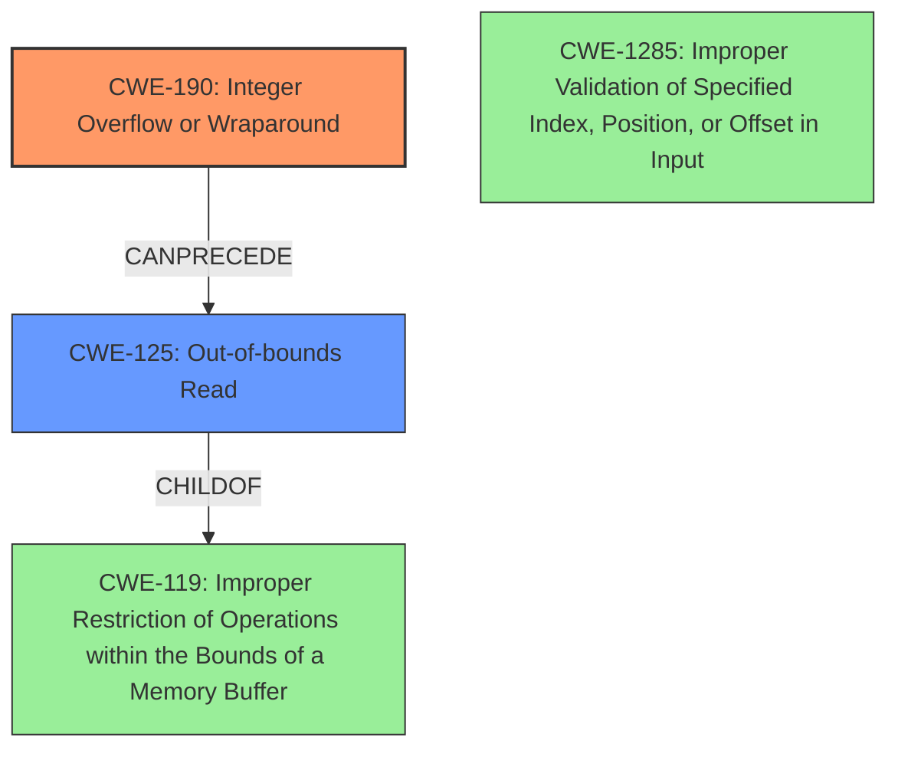

# Final Resolution for CVE-2021-1047

# Summary
| CWE ID | CWE Name | Confidence | CWE Abstraction Level | CWE Vulnerability Mapping Label | CWE-Vulnerability Mapping Notes |
|---|---|---|---|---|---|
| CWE-190 | Integer Overflow or Wraparound | 0.95 | Base | Allowed | Primary CWE: The root cause is an integer overflow. |
| CWE-125 | Out-of-bounds Read | 0.9 | Base | Allowed | Secondary CWE: The integer overflow leads to an out-of-bounds read. |

## Evidence and Confidence

*   **Confidence Score:** 0.93
*   **Evidence Strength:** HIGH

## Relationship Analysis
The primary relationship is that the **integer overflow** (CWE-190) can precede the **out-of-bounds read** (CWE-125). CWE-119 (Improper Restriction of Operations within the Bounds of a Memory Buffer) is a parent of CWE-125 but is less specific. The analysis considered CWE-1285 (Improper Validation of Specified Index, Position, or Offset in Input) but determined that the root cause was the overflow, not the lack of validation. Both CWE-190 and CWE-125 are base level CWEs.

## Vulnerability Chain
The vulnerability chain starts with an **integer overflow** (CWE-190) during the calculation of a memory address. This leads to an invalid memory address being used, resulting in an **out-of-bounds read** (CWE-125). The consequence of this is local information disclosure.

## Summary of Analysis
The initial analysis correctly identified CWE-190 and CWE-125 as the primary and secondary CWEs, respectively. The criticism raised valid points about mitigations, relationship to indexes and offsets, and the consideration of CWE-1285. I have incorporated these suggestions to improve the analysis.

The vulnerability description explicitly states an "**out of bounds read** due to an **integer overflow**" in `valid_ipc_dram_addr` of `cm_access_control.c`. This confirms the integer overflow as the root cause (CWE-190) and the resulting out-of-bounds read (CWE-125). The choice of CWE-190 is because the **integer overflow** is the triggering condition.

The mitigations for CWE-190 could involve using a safe integer library or performing explicit bounds checking before calculations. Mitigation for CWE-125 includes strict input validation to ensure indexes and offsets remain within valid boundaries.

CWE-1285 relates to improper validation of indexes, but in this case, the primary issue is the **integer overflow** *before* the index is used, making CWE-190 the more direct root cause.

CWE-119 is a parent of CWE-125, but CWE-125 is more descriptive and therefore the more appropriate choice.

The confidence score has been increased to 0.93 to reflect the more comprehensive analysis, including the additional considerations and justifications. The selected CWEs are at the optimal level of specificity because they are base-level CWEs that directly match the vulnerability description and capture the root cause and immediate impact of the vulnerability.