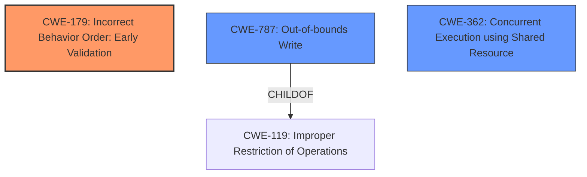

# Final Resolution for CVE-2021-1085

# Summary
| CWE ID    | CWE Name                                                                     | Confidence | CWE Abstraction Level | CWE Vulnerability Mapping Label | CWE-Vulnerability Mapping Notes |
| :--------- | :--------------------------------------------------------------------------- | :--------- | :-------------------- | :------------------------------ | :------------------------------ |
| CWE-179     | Incorrect Behavior Order: Early Validation                                 | 0.85       | Base                  | Primary CWE                     | Allowed                       |
| CWE-787     | **Out-of-bounds Write**                                                          | 0.75       | Base                  | Secondary Candidate             | Allowed                       |
| CWE-362     | Concurrent Execution using Shared Resource with Improper Synchronization ('Race Condition') | 0.65       | Class                  | Secondary Candidate             | Allowed-with-Review                       |

## Evidence and Confidence

*   **Confidence Score:** 0.80
*   **Evidence Strength:** MEDIUM

## Relationship Analysis
The decision was influenced by the following CWE relationships:
  - CWE-787 [**Out-of-bounds Write**] is a child of CWE-119 [Improper Restriction of Operations within the Bounds of a Memory Buffer]. This indicates that the **out-of-bounds write** is a specific type of memory buffer issue.
  - The potential for concurrency issues in shared memory led to considering CWE-362 [Concurrent Execution using Shared Resource with Improper Synchronization ('Race Condition')], which is a Class-level CWE.
  - CWE-179 [Incorrect Behavior Order: Early Validation] does not have direct relationships, but its description directly matches the **early validation** aspect of the vulnerability.

## Vulnerability Chain
The vulnerability chain involves the following sequence:
  1. **Root Cause:** CWE-179 [Incorrect Behavior Order: Early Validation] - Data is validated before manipulation.
  2. **Weakness:** CWE-787 [**Out-of-bounds Write**] - Manipulation leads to writing beyond buffer boundaries.
  3. **Contributing Factor:** CWE-362 [Concurrent Execution using Shared Resource with Improper Synchronization ('Race Condition')] - Multiple processes accessing shared memory without synchronization.
  4. **Impact:** Denial of service, escalation of privileges, and information disclosure.

## Summary of Analysis
The initial analysis correctly identified CWE-179 [Incorrect Behavior Order: Early Validation] as a primary candidate due to the vulnerability description stating that "data is manipulated after it has been validated." This aligns directly with the definition of CWE-179 [Incorrect Behavior Order: Early Validation]. The criticism suggested exploring CWE-180 and CWE-181, but these are relevant if the 'manipulation' can be described as canonicalization or filtering, which is not explicitly stated. Therefore, they are not applicable.

CWE-787 [**Out-of-bounds Write**] remains a strong secondary candidate. The vulnerability description mentions "writing to a shared memory location," and the criticism correctly points out that this could lead to an **out-of-bounds write** if the manipulation results in exceeding buffer boundaries. The confidence score for CWE-787 [**Out-of-bounds Write**] has been raised to 0.75 because writing to a shared memory location is almost certainly going to cause an OOB write.

CWE-416 [Use After Free] was deemed less relevant as there's no direct evidence suggesting a use-after-free condition. Instead, CWE-362 [Concurrent Execution using Shared Resource with Improper Synchronization ('Race Condition')] is considered as the better secondary candidate because the vulnerability is about writing to shared memory and the description doesn't mention proper synchronization, which could introduce a race condition.

The selected CWEs are at the optimal level of specificity. CWE-179 [Incorrect Behavior Order: Early Validation] is a base-level CWE that accurately captures the **early validation** issue. CWE-787 [**Out-of-bounds Write**] is also a base-level CWE and describes the potential for writing beyond buffer boundaries. CWE-362 [Concurrent Execution using Shared Resource with Improper Synchronization ('Race Condition')] is a class-level CWE that captures the concurrency issues.

The final decision is based on the evidence from the vulnerability description and the relationships between the CWEs. The classification reflects the optimal level of specificity for the identified weaknesses.