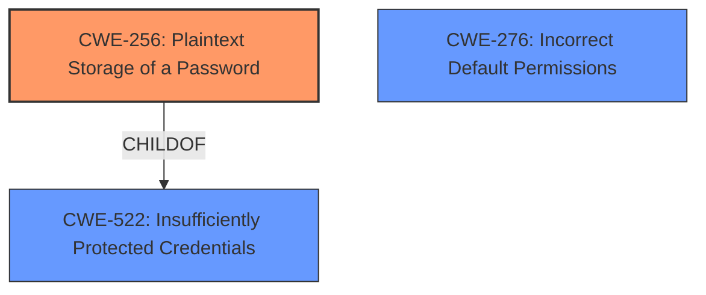

# Final Resolution for CVE-2021-1126

# Summary
| CWE ID | CWE Name | Confidence | CWE Abstraction Level | CWE Vulnerability Mapping Label | CWE-Vulnerability Mapping Notes |
|---|---|---|---|---|---|
| CWE-256 | Plaintext Storage of a Password | 0.95 | Base | Allowed | The vulnerability is due to the **clear-text storage** of credentials, making this the primary weakness. |
| CWE-276 | Incorrect Default Permissions | 0.85 | Base | Allowed | The vulnerability is due to **weak permissions** on configuration files, making this a secondary weakness. |

## Evidence and Confidence

*   **Confidence Score:** 0.93
*   **Evidence Strength:** HIGH

## Relationship Analysis
The primary relationship influencing the decision is the parent-child relationship between CWE-522 (Insufficiently Protected Credentials) and CWE-256 (Plaintext Storage of a Password). CWE-256 is a more specific instance of CWE-522, making it the more appropriate choice. CWE-276 (Incorrect Default Permissions) stands alone but complements CWE-256 in describing the complete vulnerability scenario. There are no strong chain relationships indicated here, but the two CWEs work in concert.

## Vulnerability Chain
The vulnerability chain starts with:
1.  **ROOTCAUSE:** **CWE-256 (Plaintext Storage of a Password)** - Credentials stored in **clear-text**.
2.  **WEAKNESS:** **CWE-276 (Incorrect Default Permissions)** - Configuration files with **weak permissions**
3.  **IMPACT:** An authenticated, local attacker can view credentials for a configured proxy server.
4.  **CONSEQUENCE:** The attacker can then use these credentials to access the proxy server.

## Summary of Analysis
The initial analysis and criticism both align well. The core issue is indeed the **clear-text storage** of credentials (CWE-256) compounded by **weak permissions** (CWE-276). The vulnerability description explicitly states "**clear-text storage**" and "**weak permissions**," providing strong evidence for both CWEs.

The graph relationships confirm that CWE-256 is the optimal level of specificity as it's a direct child of a more general category.

The suggestion to consider CWE-312 is also valid, and should be noted if any other sensitive information is stored in **clear-text** in the same configuration files. However, for this specific vulnerability related to proxy credentials, CWE-256 is the most appropriate.

The suggested improvements (salting, least privilege, defense in depth) are relevant and would strengthen the overall security posture, though they don't directly affect the CWE classification itself.

I'm basing my assessment on the provided evidence from the vulnerability description: "The vulnerability is due to **clear-text storage** and **weak permissions** of related configuration files."

The selected CWEs are at the optimal level of specificity because they directly address the root causes described in the vulnerability.