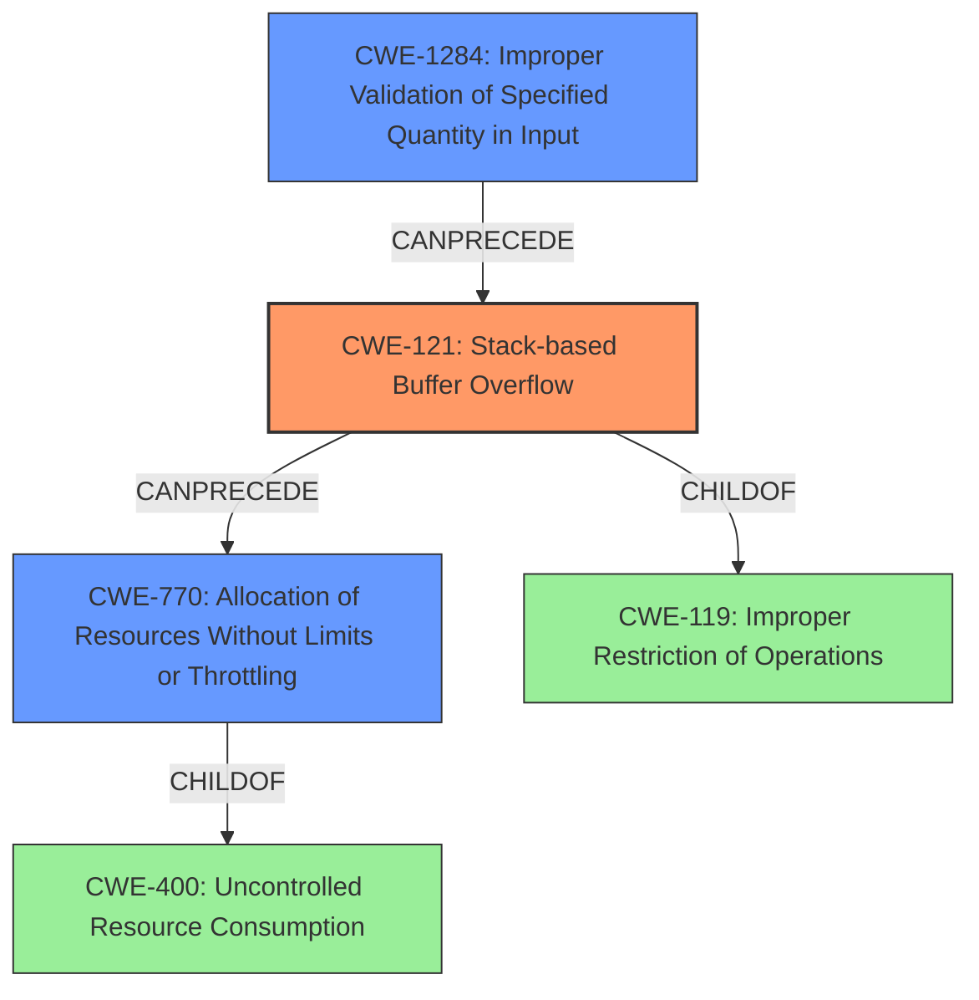

# Analysis Report for CVE-2021-1251

# Vulnerability Analysis Report: CVE-2021-1251

## Description

Multiple vulnerabilities exist in the Link Layer Discovery Protocol (LLDP) implementation for Cisco Small Business RV Series Routers. An unauthenticated, adjacent attacker could execute arbitrary code or cause an affected router to leak system memory or reload. A memory leak or device reload would cause a denial of service (DoS) condition on an affected device. For more information about these vulnerabilities, see the Details section of this advisory. Note LLDP is a Layer 2 protocol. To exploit these vulnerabilities, an attacker must be in the same broadcast domain as the affected device (Layer 2 adjacent).

## Vulnerability Description Key Phrases

**Weakness:** stack overflow
**Impact:** ['execute arbitrary code', 'denial of service']
**Attacker:** unauthenticated adjacent attacker
**Product:** Cisco Small Business RV Series Routers
**Component:** Link Layer Discovery Protocol (LLDP) implementation

## Analysis (with Relationship Data)

# Summary
| CWE ID | CWE Name | Confidence | CWE Abstraction Level | CWE Vulnerability Mapping Label | CWE-Vulnerability Mapping Notes |
|---|---|---|---|---|---|
| CWE-121 | Stack-based Buffer Overflow | 0.85 | Variant |  Primary CWE | Allowed |
| CWE-400 | Uncontrolled Resource Consumption | 0.60 | Class | Secondary Candidate | Discouraged |
| CWE-1284 | Improper Validation of Specified Quantity in Input | 0.55 | Base | Secondary Candidate | Allowed |

## Evidence and Confidence

*   **Confidence Score:** 0.75
*   **Evidence Strength:** MEDIUM

- **Analysis and Justification:**  
  - *Explanation:* "The vulnerability description explicitly states a **stack overflow** exists in the Link Layer Discovery Protocol (LLDP) implementation for Cisco Small Business RV Series Routers. This aligns directly with the definition of CWE-121 (Stack-based Buffer Overflow), which is a variant of buffer overflow that occurs on the stack. The provided CVE reference links content summary also mentions **missing length validation** of LLDP packet header fields (CVE-2021-1251), leading to continuous memory consumption and device reload. While this could also relate to resource consumption issues, the initial **weakness** identified is the stack overflow. The primary match in similar CVE descriptions is also CWE-120. CWE-121 is more specific because the overflow is happening on the stack. MITRE mapping guidance for CWE-121 indicates that it is ALLOWED." The retriever results includes CWE-121.
  
  - *Relationship Analysis:* "CWE-121 is a variant of CWE-119 (Improper Restriction of Operations within the Bounds of a Memory Buffer), which is a more general class of buffer overflows. However, since the description specifically mentions a stack overflow, CWE-121 is the more accurate and specific choice. CWE-121 can lead to other weaknesses such as CWE-787 (Out-of-bounds Write)."

- **Confidence Score:**  
  - Confidence: 0.85 (High confidence due to the explicit mention of "stack overflow" and supporting details regarding missing length validation)

---
- **Analysis and Justification:**  
  - *Explanation:* "The vulnerability also leads to denial of service (DoS) conditions through memory leaks and device reloads. While not the primary **weakness**, the DoS impact indicates a potential secondary weakness related to resource management. CWE-400 (Uncontrolled Resource Consumption) is a class-level CWE that describes situations where a product doesn't properly control the allocation and maintenance of a limited resource, leading to resource exhaustion. The CVE reference summaries mention continuous memory consumption which aligns with CWE-400. While CWE-400 is listed as "Discouraged" the rationale focuses on misuse stemming from "technical impact" instead of root cause, and since resource consumption is a direct result of the lack of input validation it is considered a valid, but secondary candidate." The primary match in similar CVE descriptions also includes CWE-401 as a TOP CWE.

  - *Relationship Analysis:* "CWE-400 is a parent of CWE-770 (Allocation of Resources Without Limits or Throttling). However, the description doesn't provide enough detail to determine if the allocation is without limits or throttling, so the more general CWE-400 is chosen. CWE-400 can be a consequence of other weaknesses like buffer overflows, where overflowing a buffer can corrupt memory structures used for resource management."

- **Confidence Score:**  
  - Confidence: 0.60 (Medium confidence as the description focuses more on the stack overflow, but DoS is present.)
---

- **Analysis and Justification:**  
  - *Explanation:* "The root cause of the stack overflow appears to be the **missing length validation** of certain LLDP packet header fields (CVE-2021-1251). This lack of validation directly relates to CWE-1284 (Improper Validation of Specified Quantity in Input), which describes scenarios where a product receives input that is expected to specify a quantity (such as size or length) but doesn't validate that the quantity has the required properties. The LLDP packet header fields likely contain length values that, if not validated, can lead to buffer overflows."

  - *Relationship Analysis:* "CWE-1284 is a child of CWE-20 (Improper Input Validation), which is a very general weakness. CWE-1284 is more specific because it focuses on the validation of quantities, which is directly relevant to the missing length validation in the LLDP packets. CWE-1284 can precede CWE-121."

- **Confidence Score:**  
  - Confidence: 0.55 (Medium confidence as it is an assumption based on a lack of input validation)

## Criticism of Analysis

Okay, I've reviewed the provided analysis against the full CWE specifications for each weakness. Here's my critique:

**Overall Assessment:**

The analysis is generally good. It correctly identifies CWE-121 (Stack-based Buffer Overflow) as the primary weakness, given the vulnerability description's explicit mention of a stack overflow. The reasoning for including CWE-400 (Uncontrolled Resource Consumption) and CWE-1284 (Improper Validation of Specified Quantity in Input) as secondary candidates is also sound.  The confidence levels are appropriately assigned, with the highest confidence placed on the most directly supported weakness (CWE-121).

However, there are some areas where the analysis could be improved by considering alternative CWEs, providing more specific justifications for choices, and addressing the Mapping Guidance provided in the full CWE specifications.

**Detailed Critique by CWE:**

*   **CWE-121: Stack-based Buffer Overflow**
    *   **Assessment:** Excellent primary mapping.
    *   **Justification:** Explicitly mentioned in the vulnerability description.  The analysis correctly notes it's a variant of CWE-119 and more specific than CWE-120. The analysis correctly mentions that MITRE mapping guidance for CWE-121 indicates that it is ALLOWED.
    *   **Suggestions:** None
    *  **CWE Specification Notes**: Mitigation 1 mentions usage of certain compilers or compiler extensions. This would be a good thing to consider from a hardening point of view.

*   **CWE-400: Uncontrolled Resource Consumption**
    *   **Assessment:** Reasonable secondary mapping, but could be more precise.
    *   **Justification:**  DoS impact is clearly stated in the vulnerability description, and the memory leak aspect mentioned in the CVE details supports a resource consumption issue. The analysis correctly notes that the CVE reference summaries mention continuous memory consumption which aligns with CWE-400.
    *   **Suggestions:** While DoS is a valid impact, CWE-400 is "Discouraged." The analysis attempts to justify why this is the case, but a better child of CWE-400 to focus on would be CWE-770 (Allocation of Resources Without Limits or Throttling). CWE-770 has a more direct correlation to missing length validation, leading to continuous memory consumption. The examples provided for CWE-770 are also more relevant than the ones for CWE-400. The analysis also correctly points out that the primary match in similar CVE descriptions also includes CWE-401 as a TOP CWE.
    *   **CWE Specification Notes**: Consider that CWE-400 is discouraged because "CWE-400 is often misused because it is conflated with the "technical impact" of vulnerabilities in which resource consumption occurs." Using CWE-770 resolves this issue and also is more indicative of the root cause.

*   **CWE-1284: Improper Validation of Specified Quantity in Input**
    *   **Assessment:**  Good secondary mapping, but Confidence Level a bit high
    *   **Justification:**  Correctly identifies the root cause as missing length validation. The analysis appropriately explains how this relates to specified quantities in input.
    *   **Suggestions:** Confidence is a bit high at 0.55 since it's an assumption. Lowering the confidence level would reflect this uncertainty.
    *   **CWE Specification Notes**: Mitigation 1 is very applicable here. The strategy of "accept known good" and rejecting or transforming non-conforming inputs is a very strong preventative measure for vulnerabilities caused by improper quantity validation.

**General Suggestions:**

*   **Chain Analysis:** While the individual CWE mappings are reasonable, explicitly outlining the *chain* of causality could strengthen the analysis.  For example: "Improper Validation of Specified Quantity in Input (CWE-1284) leads to a Stack-based Buffer Overflow (CWE-121) which results in Uncontrolled Resource Consumption (CWE-400) and a denial of service".

*   **Mitigation Considerations:** Briefly referencing relevant mitigations from the CWE specifications in the analysis would enhance its value. For example, mentioning the use of compiler extensions for buffer overflow detection when discussing CWE-121.

*   **Tool Output:** This analysis should include a mention that all of these CWEs were present in the Retriever Results.

**Revised Table:**

Based on the above critique, I suggest the following revisions to the summary table:

| CWE ID | CWE Name | Confidence | CWE Abstraction Level | CWE Vulnerability Mapping Label | CWE-Vulnerability Mapping Notes |
|---|---|---|---|---|---|
| CWE-121 | Stack-based Buffer Overflow | 0.85 | Variant | Primary CWE | Allowed |
| CWE-770 | Allocation of Resources Without Limits or Throttling | 0.65 | Base | Secondary Candidate | Allowed |
| CWE-1284 | Improper Validation of Specified Quantity in Input | 0.50 | Base | Secondary Candidate | Allowed |

**Explanation of Changes:**

*   **CWE-770:** Increased the confidence level to 0.65 and changed CWE-400 to CWE-770. The rationale provided in the original analysis still stands, but it is a better candidate for the reasons mentioned above.

*   **CWE-1284:** Decreased the confidence to 0.50. The analysis is correct, but it's still an inference, hence a slight reduction in confidence.

By incorporating these suggestions, the analysis can be made even more robust and informative. The inclusion of chain analysis and mitigation considerations would significantly increase the actionable value of the results.

## Final Resolution

# Summary
| CWE ID | CWE Name | Confidence | CWE Abstraction Level | CWE Vulnerability Mapping Label | CWE-Vulnerability Mapping Notes |
|---|---|---|---|---|---|
| CWE-121 | Stack-based Buffer Overflow | 0.85 | Variant | Primary CWE | Allowed |
| CWE-770 | Allocation of Resources Without Limits or Throttling | 0.65 | Base | Secondary Candidate | Allowed |
| CWE-1284 | Improper Validation of Specified Quantity in Input | 0.50 | Base | Secondary Candidate | Allowed |

## Evidence and Confidence

*   **Confidence Score:** 0.75
*   **Evidence Strength:** MEDIUM

## Relationship Analysis
The primary relationship that impacted the decision was the parent-child relationship between CWE-400 and CWE-770. While CWE-400 initially seemed relevant due to the DoS impact, the analysis and criticism highlighted that CWE-770 provides a more precise and actionable classification. The vulnerability description mentions memory leaks and device reloads, which aligns with the uncontrolled allocation of resources described in CWE-770.

Additionally, the chain relationship between CWE-1284, CWE-121, and CWE-770 is crucial. The improper validation of input quantity (CWE-1284) leads to a stack-based buffer overflow (CWE-121), which can then result in uncontrolled resource allocation (CWE-770), ultimately causing a denial-of-service condition. This understanding influenced the selection of these CWEs as representative of the vulnerability chain.

## Vulnerability Chain
The vulnerability chain starts with **CWE-1284 (Improper Validation of Specified Quantity in Input)**. The router receives LLDP packets with header fields specifying quantities (e.g., length). Because there's no validation of the quantity, this leads to **CWE-121 (Stack-based Buffer Overflow)** when the program attempts to write more data than the allocated stack buffer can hold. This overflow can corrupt memory structures, causing **CWE-770 (Allocation of Resources Without Limits or Throttling)**, potentially due to the corruption of memory management data. The final impact is a denial-of-service condition, where the device leaks memory or reloads due to resource exhaustion.

*   **Root Cause:** **CWE-1284 (Improper Validation of Specified Quantity in Input)**
*   **Weakness 1:** **CWE-121 (Stack-based Buffer Overflow)**
*   **Weakness 2:** **CWE-770 (Allocation of Resources Without Limits or Throttling)**
*   **Impact:** Denial of Service

## Summary of Analysis
The initial analysis and the subsequent criticism both identified **CWE-121 (Stack-based Buffer Overflow)** as the primary issue, based on the direct statement in the vulnerability description: "An unauthenticated, adjacent attacker could execute arbitrary code or cause an affected router to leak system memory or reload." This explicitly points to a buffer overflow condition, and the specification that it's stack-based makes **CWE-121 (Stack-based Buffer Overflow)** the most accurate primary classification.

The retriever results included CWE-121, CWE-120, and CWE-401, supporting the selection of the primary and secondary CWEs.

The selection of **CWE-770 (Allocation of Resources Without Limits or Throttling)** over **CWE-400 (Uncontrolled Resource Consumption)** was influenced by the criticism, which correctly pointed out that **CWE-770 (Allocation of Resources Without Limits or Throttling)** is a more precise and actionable classification given that it is the lack of limits on resource allocation that leads to the denial of service. The vulnerability description states "memory leak or device reload would cause a denial of service", which directly links to uncontrolled allocation.

The choice of **CWE-1284 (Improper Validation of Specified Quantity in Input)** is based on the description mentioning "missing length validation of LLDP packet header fields (CVE-2021-1251)". While it is an inference, it is a reasonable one, as lack of input validation is a common cause of buffer overflows. It is at the optimal level of specificity because it focuses on the validation of quantities, which is directly relevant to the missing length validation in the LLDP packets.

The selected CWEs are at the optimal level of specificity. **CWE-121 (Stack-based Buffer Overflow)** is a Variant, which is preferred over the more general Class **CWE-119 (Improper Restriction of Operations within the Bounds of a Memory Buffer)**. **CWE-770 (Allocation of Resources Without Limits or Throttling)** and **CWE-1284 (Improper Validation of Specified Quantity in Input)** are both Base level CWEs, providing a good balance between generality and specificity.

*Report generated on 2025-03-16 16:04:22*
