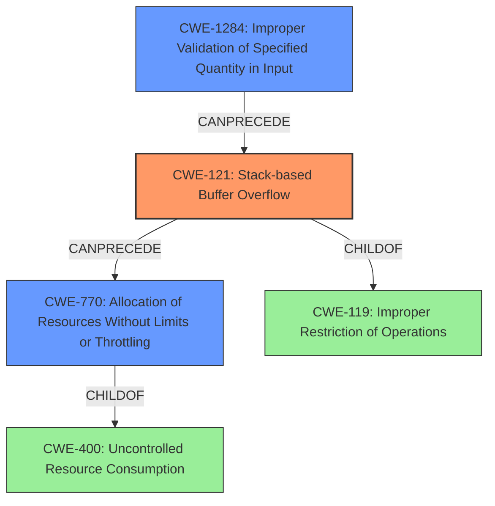

# Final Resolution for CVE-2021-1251

# Summary
| CWE ID | CWE Name | Confidence | CWE Abstraction Level | CWE Vulnerability Mapping Label | CWE-Vulnerability Mapping Notes |
|---|---|---|---|---|---|
| CWE-121 | Stack-based Buffer Overflow | 0.85 | Variant | Primary CWE | Allowed |
| CWE-770 | Allocation of Resources Without Limits or Throttling | 0.65 | Base | Secondary Candidate | Allowed |
| CWE-1284 | Improper Validation of Specified Quantity in Input | 0.50 | Base | Secondary Candidate | Allowed |

## Evidence and Confidence

*   **Confidence Score:** 0.75
*   **Evidence Strength:** MEDIUM

## Relationship Analysis
The primary relationship that impacted the decision was the parent-child relationship between CWE-400 and CWE-770. While CWE-400 initially seemed relevant due to the DoS impact, the analysis and criticism highlighted that CWE-770 provides a more precise and actionable classification. The vulnerability description mentions memory leaks and device reloads, which aligns with the uncontrolled allocation of resources described in CWE-770.

Additionally, the chain relationship between CWE-1284, CWE-121, and CWE-770 is crucial. The improper validation of input quantity (CWE-1284) leads to a stack-based buffer overflow (CWE-121), which can then result in uncontrolled resource allocation (CWE-770), ultimately causing a denial-of-service condition. This understanding influenced the selection of these CWEs as representative of the vulnerability chain.

## Vulnerability Chain
The vulnerability chain starts with **CWE-1284 (Improper Validation of Specified Quantity in Input)**. The router receives LLDP packets with header fields specifying quantities (e.g., length). Because there's no validation of the quantity, this leads to **CWE-121 (Stack-based Buffer Overflow)** when the program attempts to write more data than the allocated stack buffer can hold. This overflow can corrupt memory structures, causing **CWE-770 (Allocation of Resources Without Limits or Throttling)**, potentially due to the corruption of memory management data. The final impact is a denial-of-service condition, where the device leaks memory or reloads due to resource exhaustion.

*   **Root Cause:** **CWE-1284 (Improper Validation of Specified Quantity in Input)**
*   **Weakness 1:** **CWE-121 (Stack-based Buffer Overflow)**
*   **Weakness 2:** **CWE-770 (Allocation of Resources Without Limits or Throttling)**
*   **Impact:** Denial of Service

## Summary of Analysis
The initial analysis and the subsequent criticism both identified **CWE-121 (Stack-based Buffer Overflow)** as the primary issue, based on the direct statement in the vulnerability description: "An unauthenticated, adjacent attacker could execute arbitrary code or cause an affected router to leak system memory or reload." This explicitly points to a buffer overflow condition, and the specification that it's stack-based makes **CWE-121 (Stack-based Buffer Overflow)** the most accurate primary classification.

The retriever results included CWE-121, CWE-120, and CWE-401, supporting the selection of the primary and secondary CWEs.

The selection of **CWE-770 (Allocation of Resources Without Limits or Throttling)** over **CWE-400 (Uncontrolled Resource Consumption)** was influenced by the criticism, which correctly pointed out that **CWE-770 (Allocation of Resources Without Limits or Throttling)** is a more precise and actionable classification given that it is the lack of limits on resource allocation that leads to the denial of service. The vulnerability description states "memory leak or device reload would cause a denial of service", which directly links to uncontrolled allocation.

The choice of **CWE-1284 (Improper Validation of Specified Quantity in Input)** is based on the description mentioning "missing length validation of LLDP packet header fields (CVE-2021-1251)". While it is an inference, it is a reasonable one, as lack of input validation is a common cause of buffer overflows. It is at the optimal level of specificity because it focuses on the validation of quantities, which is directly relevant to the missing length validation in the LLDP packets.

The selected CWEs are at the optimal level of specificity. **CWE-121 (Stack-based Buffer Overflow)** is a Variant, which is preferred over the more general Class **CWE-119 (Improper Restriction of Operations within the Bounds of a Memory Buffer)**. **CWE-770 (Allocation of Resources Without Limits or Throttling)** and **CWE-1284 (Improper Validation of Specified Quantity in Input)** are both Base level CWEs, providing a good balance between generality and specificity.