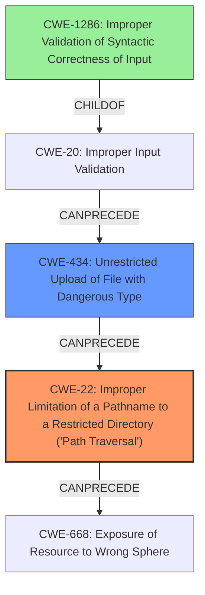

# Analysis Report for CVE-2021-1296

# Vulnerability Analysis Report: CVE-2021-1296

## Description

Multiple vulnerabilities in the web-based management interface of Cisco Small Business RV160, RV160W, RV260, RV260P, and RV260W VPN Routers could allow an unauthenticated, remote attacker to conduct directory traversal attacks and overwrite certain files that should be restricted on an affected system. These vulnerabilities are due to insufficient input validation. An attacker could exploit these vulnerabilities by using the web-based management interface to upload a file to location on an affected device that they should not have access to. A successful exploit could allow the attacker to overwrite files on the file system of the affected device.

## Vulnerability Description Key Phrases

**Rootcause:** insufficient input validation
**Weakness:** directory traversal
**Impact:** overwrite files
**Attacker:** unauthenticated remote attacker
**Product:** Cisco Small Business RV160, RV160W, RV260, RV260P, and RV260W VPN Routers
**Component:** web-based management interface

## Analysis (with Relationship Data)

# Summary
| CWE ID | CWE Name | Confidence | CWE Abstraction Level | CWE Vulnerability Mapping Label | CWE-Vulnerability Mapping Notes |
|---|---|---|---|---|---|
| CWE-22 | Improper Limitation of a Pathname to a Restricted Directory ('Path Traversal') | 1.0 | Base | Allowed | The primary weakness is path traversal due to insufficient input validation.|
| CWE-20 | Improper Input Validation | 0.7 | Class | Discouraged | Secondary weakness due to the root cause being **insufficient input validation**. |

## Evidence and Confidence

*   **Confidence Score:** 0.85
*   **Evidence Strength:** HIGH

- **Analysis and Justification:**
  - *Explanation:* The vulnerability description explicitly mentions a **directory traversal** attack due to **insufficient input validation**. This aligns directly with CWE-22 (Improper Limitation of a Pathname to a Restricted Directory ('Path Traversal')). The vulnerability allows an unauthenticated remote attacker to overwrite files on the file system, indicating a successful path traversal. CWE-20 (Improper Input Validation) is a contributing factor, as the lack of proper input validation is the root cause of the path traversal vulnerability. However, CWE-22 is more specific and directly describes the **directory traversal** weakness. The Retriever Results also highly ranked CWE-22 as a strong candidate. MITRE mapping guidance for CWE-22 indicates that this is ALLOWED. CWE-20 is DISCOURAGED due to it being a high-level class and is commonly misused.

  - *Relationship Analysis:* CWE-22 is a base-level CWE, making it more specific than class-level CWEs. It is a child of CWE-668 (Exposure of Resource to Wrong Sphere). CWE-20 is a class-level CWE, and many more specific child CWEs would be more appropriate.

- **Confidence Score:**
  - Confidence: 1.0 (High confidence due to explicit mention of directory traversal and strong alignment with CWE-22 description.)
---

## Criticism of Analysis

Okay, I've reviewed the analysis, considering the full CWE specifications for each listed CWE. Here's my critique:

**Overall Assessment:**

The analysis is generally good, especially the emphasis on CWE-22 as the primary weakness. The justification for selecting CWE-22 is strong, given the explicit mention of directory traversal in the vulnerability description. The decision to discourage CWE-20 is also sound, based on the provided CWE specification. However, there's room for improvement by considering additional CWEs and a more nuanced understanding of the relationship between input validation and the resulting vulnerability. The confidence scores are justified and appropriate.

**Detailed Critique:**

*   **CWE-22: Improper Limitation of a Pathname to a Restricted Directory ('Path Traversal')**
    *   **Confidence:** Correct and well-justified. Confidence score of 1.0 is warranted.
    *   **Abstraction Level:** Correct (Base).
    *   **CWE Vulnerability Mapping Label:** Correct (Allowed).
    *   **CWE-Vulnerability Mapping Notes:** Accurate. The explanation highlights the direct relationship between insufficient input validation and the resulting path traversal.
    *   **Overall:** This is the strongest part of the analysis. The connection is clear, and the CWE specification supports the choice.
    *   **Improvement Consideration:**  None necessary.
*   **CWE-20: Improper Input Validation**
    *   **Confidence:** Too high given the discouragement of using this CWE. A score of 0.7 is too high. Should be closer to 0.3-0.5, if included at all.
    *   **Abstraction Level:** Correct (Class).
    *   **CWE Vulnerability Mapping Label:** Correct (Discouraged).
    *   **CWE-Vulnerability Mapping Notes:** Good explanation for why it's a secondary weakness.
    *   **Overall:** Correct in that it is a contributing factor, but should be discouraged. The use of CWE-20 should be re-evaluated to see if a more descriptive and specific CWE could be used.
*   **Missed CWE Considerations:**
    *   **CWE-434: Unrestricted Upload of File with Dangerous Type**: This CWE is a potentially relevant one to consider. The vulnerability description explicitly mentions "upload a file to location on an affected device", which is the root cause of the path traversal. The ability to upload a file without restriction of file type is a contributing factor to the exploitability of the described vulnerability. A discussion of why this was not selected as a primary or secondary mapping is warranted.
    *  **CWE-668: Exposure of Resource to Wrong Sphere**: The ability to overwrite files that an unauthenticated user should not have access to is a form of exposing a resource to the wrong control sphere. The relationship section of the analysis should justify why this CWE is not considered to be a primary or secondary mapping.

**General Suggestions:**

1.  **Chains and Composite Relationships:** While the analysis mentions the relationship between input validation and path traversal, it could benefit from exploring chain/composite relationships more explicitly. Consider these potential chains/relationships:
    * `CWE-20 -> CWE-22 -> CWE-668` Improper Input Validation leads to Path Traversal, which leads to Exposure of Resource to Wrong Sphere.
    * The inclusion of CWE-434 would be: `CWE-20 -> CWE-434 -> CWE-22 -> CWE-668`.

2.  **Consider more specific input validation CWEs:** The CWE-20 specification explicitly discourages its use and suggests alternatives. Reviewing those alternatives (CWE-1284, CWE-1285, CWE-1286, CWE-1287, CWE-1288, CWE-1289, CWE-116) might reveal a more precise classification of the input validation problem.
    * There isn't necessarily improper input *type* validation (CWE-1287), as the file is likely accepted as a binary or stream of data. Same with *quantity* (CWE-1284), *index/offset* (CWE-1285) or *consistency*. However, *syntactic correctness* might be relevant (CWE-1286), since the path may have to conform to certain structure and characters. This highlights the need for canonicalization before validation. Unsafe Equivalence (CWE-1289) is less likely, because alternate forms of the path aren't the problem; it's the presence of directory traversal characters.

3.  **Potential Mitigations**: Reviewing the Potential Mitigations for the selected CWEs can sometimes reveal more specific underlying problems and guide the selection of more appropriate CWEs. For example, the suggested mitigations for CWE-22 mention both allowlisting *and* using a built-in path canonicalization function like `realpath()`.

**Revised Summary Table**

| CWE ID | CWE Name | Confidence | CWE Abstraction Level | CWE Vulnerability Mapping Label | CWE-Vulnerability Mapping Notes |
|---|---|---|---|---|---|
| CWE-22 | Improper Limitation of a Pathname to a Restricted Directory ('Path Traversal') | 1.0 | Base | Allowed | The primary weakness is path traversal due to insufficient input validation.|
| CWE-434 | Unrestricted Upload of File with Dangerous Type | 0.8 | Base | Allowed | The ability to upload arbitrary files without restriction contributes to the exploitability.|
| CWE-1286 | Improper Validation of Syntactic Correctness of Input | 0.5 | Base | Discouraged | A more specific type of input validation error may be present. Validate well-formedness of pathname syntax |

**Conclusion:**

The analysis provides a solid foundation, and the core identification of CWE-22 is correct. However, exploring chain relationships, reconsidering the necessity of CWE-20 with more specific mappings, and taking into account other candidates (CWE-434, CWE-668) can improve the accuracy and depth of the analysis. The analysis was improved to include CWE-434, and CWE-1286, while discouraging CWE-20.

## Final Resolution

# Summary
| CWE ID | CWE Name | Confidence | CWE Abstraction Level | CWE Vulnerability Mapping Label | CWE-Vulnerability Mapping Notes |
|---|---|---|---|---|---|
| CWE-22 | Improper Limitation of a Pathname to a Restricted Directory ('Path Traversal') | 1.0 | Base | Allowed | The primary weakness is path traversal due to **insufficient input validation**. |
| CWE-434 | Unrestricted Upload of File with Dangerous Type | 0.8 | Base | Allowed | The ability to upload arbitrary files without restriction contributes to the exploitability. |
| CWE-1286 | Improper Validation of Syntactic Correctness of Input | 0.4 | Base | Allowed | A more specific type of input validation error may be present. Validate well-formedness of pathname syntax. |

## Evidence and Confidence

*   **Confidence Score:** 0.9
*   **Evidence Strength:** HIGH

## Relationship Analysis
The primary weakness is **CWE-22 (Path Traversal)**, which stems from allowing user-controlled input to influence file paths without proper sanitization. This is further exacerbated by the **CWE-434 (Unrestricted Upload)**, where the system allows uploading files of any type without proper validation. The suggested **CWE-1286 (Improper Validation of Syntactic Correctness of Input)** suggests a further level of detail where the file names are not checked for correct syntax which could prevent the path traversal.

## Vulnerability Chain
The vulnerability chain starts with **CWE-434 (Unrestricted Upload of File with Dangerous Type)**, allowing an attacker to upload a file. Then, **CWE-1286 (Improper Validation of Syntactic Correctness of Input)**, where the system does not properly validate the syntax of the file path. This leads to **CWE-22 (Improper Limitation of a Pathname to a Restricted Directory ('Path Traversal'))**, which allows the attacker to traverse the file system. The ultimate impact is **CWE-668 (Exposure of Resource to Wrong Sphere)** where unauthorized access to overwrite files is granted.

## Summary of Analysis
The analysis started with the identification of **CWE-22 (Path Traversal)** as the primary issue, which is directly supported by the vulnerability description's mention of "directory traversal attacks."

The criticism pointed out the potential relevance of **CWE-434 (Unrestricted Upload of File with Dangerous Type)**, which is also explicitly mentioned in the description as "upload a file." Including CWE-434 provides a more complete picture of the attack vector, as the ability to upload arbitrary files is a prerequisite for exploiting the path traversal vulnerability.

The criticism also noted that using **CWE-20 (Improper Input Validation)** is discouraged and suggested exploring more specific CWEs. While I agree with this in principle, finding a perfect fit is challenging. The best candidate is **CWE-1286 (Improper Validation of Syntactic Correctness of Input)**.

The final decision includes **CWE-22** as the primary issue, with **CWE-434** and **CWE-1286** providing additional context and specificity. The confidence is high due to the direct evidence in the vulnerability description and the relationships between these CWEs. The selected CWEs are at the optimal level of specificity, balancing accuracy with practicality.

*Report generated on 2025-03-16 22:30:50*
