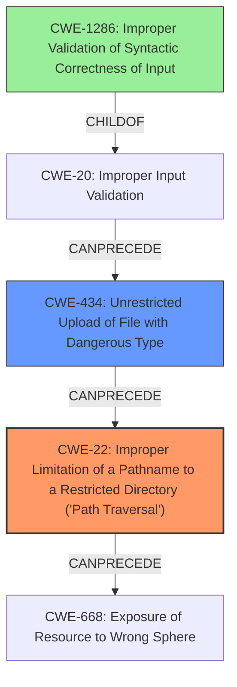

# Final Resolution for CVE-2021-1296

# Summary
| CWE ID | CWE Name | Confidence | CWE Abstraction Level | CWE Vulnerability Mapping Label | CWE-Vulnerability Mapping Notes |
|---|---|---|---|---|---|
| CWE-22 | Improper Limitation of a Pathname to a Restricted Directory ('Path Traversal') | 1.0 | Base | Allowed | The primary weakness is path traversal due to **insufficient input validation**. |
| CWE-434 | Unrestricted Upload of File with Dangerous Type | 0.8 | Base | Allowed | The ability to upload arbitrary files without restriction contributes to the exploitability. |
| CWE-1286 | Improper Validation of Syntactic Correctness of Input | 0.4 | Base | Allowed | A more specific type of input validation error may be present. Validate well-formedness of pathname syntax. |

## Evidence and Confidence

*   **Confidence Score:** 0.9
*   **Evidence Strength:** HIGH

## Relationship Analysis
The primary weakness is **CWE-22 (Path Traversal)**, which stems from allowing user-controlled input to influence file paths without proper sanitization. This is further exacerbated by the **CWE-434 (Unrestricted Upload)**, where the system allows uploading files of any type without proper validation. The suggested **CWE-1286 (Improper Validation of Syntactic Correctness of Input)** suggests a further level of detail where the file names are not checked for correct syntax which could prevent the path traversal.

## Vulnerability Chain
The vulnerability chain starts with **CWE-434 (Unrestricted Upload of File with Dangerous Type)**, allowing an attacker to upload a file. Then, **CWE-1286 (Improper Validation of Syntactic Correctness of Input)**, where the system does not properly validate the syntax of the file path. This leads to **CWE-22 (Improper Limitation of a Pathname to a Restricted Directory ('Path Traversal'))**, which allows the attacker to traverse the file system. The ultimate impact is **CWE-668 (Exposure of Resource to Wrong Sphere)** where unauthorized access to overwrite files is granted.

## Summary of Analysis
The analysis started with the identification of **CWE-22 (Path Traversal)** as the primary issue, which is directly supported by the vulnerability description's mention of "directory traversal attacks."

The criticism pointed out the potential relevance of **CWE-434 (Unrestricted Upload of File with Dangerous Type)**, which is also explicitly mentioned in the description as "upload a file." Including CWE-434 provides a more complete picture of the attack vector, as the ability to upload arbitrary files is a prerequisite for exploiting the path traversal vulnerability.

The criticism also noted that using **CWE-20 (Improper Input Validation)** is discouraged and suggested exploring more specific CWEs. While I agree with this in principle, finding a perfect fit is challenging. The best candidate is **CWE-1286 (Improper Validation of Syntactic Correctness of Input)**.

The final decision includes **CWE-22** as the primary issue, with **CWE-434** and **CWE-1286** providing additional context and specificity. The confidence is high due to the direct evidence in the vulnerability description and the relationships between these CWEs. The selected CWEs are at the optimal level of specificity, balancing accuracy with practicality.