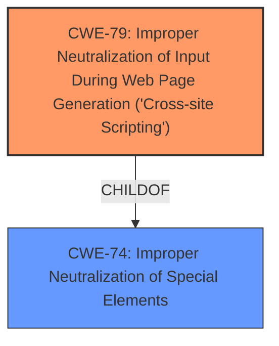

# Final Resolution for CVE-2021-1351

# Summary
| CWE ID  | CWE Name | Confidence | CWE Abstraction Level | CWE Vulnerability Mapping Label | CWE-Vulnerability Mapping Notes |
|--------------------|----------------------------------------------------------------------------------------------------|-------------------|-------------------------|------------------------------------|-----------------------------------------------------------------------------------------------------------------------------------|
| CWE-79 | Improper Neutralization of Input During Web Page Generation ('Cross-site Scripting') | 1.0 | Base | Allowed | The primary weakness is XSS due to insufficient input validation. |

## Evidence and Confidence

*   **Confidence Score:** 1.0
*   **Evidence Strength:** HIGH

## Relationship Analysis
The primary relationship that influenced the decision was the parent-child relationship between CWE-74 (Improper Neutralization of Special Elements in Output Used by a Downstream Component ('Injection')) and CWE-79 (Improper Neutralization of Input During Web Page Generation ('Cross-site Scripting')). While CWE-74 is a parent, it is a more general case. CWE-79 is the most specific and accurate.

## Vulnerability Chain
The vulnerability chain starts with **insufficient input validation** which leads to the **weakness** being Cross-Site Scripting.
  - **Root Cause:** Insufficient Input Validation
  - **Weakness:** CWE-79: Improper Neutralization of Input During Web Page Generation ('Cross-site Scripting')
  - **Impact:** Arbitrary script code execution, Access to sensitive browser-based information.

## Summary of Analysis
The initial analysis and criticism are both aligned in that the primary **weakness** is CWE-79 (Improper Neutralization of Input During Web Page Generation ('Cross-site Scripting')).

The vulnerability description explicitly mentions "**insufficient validation of user-supplied input**" leading to a "**cross-site scripting (XSS)** attack". This provides direct evidence for selecting CWE-79.

The graph relationships confirm that CWE-79 is more specific than its parent, CWE-74. This specificity is crucial for accurate classification.

CWE-79 is at the optimal level of specificity because it directly addresses the **XSS vulnerability** resulting from **insufficient input validation**. The vulnerability description aligns perfectly with the definition of CWE-79, making it the most appropriate choice.